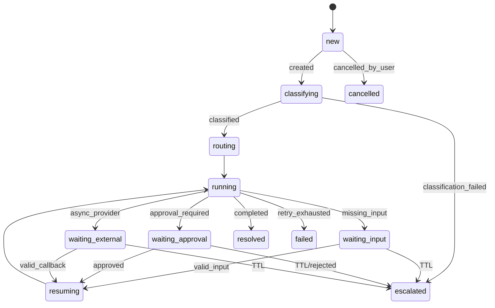

# A-COP 구현계획서 v5

## 0. 문서 상태 및 v4 → v5 변경 요약

| 항목 | v4/리뷰의 문제 | v5 확정 결정 | 검증 방법 |
|---|---|---|---|
| 문서 상태 | 구현 방향과 MVP 경계가 혼재 | 본 문서를 구현·평가 기준선으로 사용 | PR에서 본 문서의 DoD 링크 확인 |
| MCP | 제외하면 차별화 약화 | 9주차 read-only 3 tool 유지. 쓰기는 승인 후 REST만 허용 | MCP contract test와 scope test |
| RAG | pgvector가 선택 사항 | 정책/FAQ 25건, 300~400 청크, pgvector 사용 | migration, ingest count, retrieval test |
| Context Pack | 9,500 토큰의 근거 부정확 | 12,000 input token. 비용·lost-in-the-middle·재현성 때문에 제한 | token counter와 fixture snapshot |
| VOC | Team으로 구현하면 범위 과대, 삭제하면 주제 이탈 | Case 생성 시 인라인 분류 + 일 1회 Feedback Analytics 배치 | 분류 필드와 일일 report 검증 |
| 인원 | Agent Team 3명과 Team 2개가 모순 | A~F 역할 확정. E가 RAG corpus·VOC·seed/golden 전담 | 주차별 산출물 owner 확인 |
| 평가 | 평균만 제시 | bootstrap 95% CI, McNemar 또는 paired bootstrap 추가 | harness 결과에 CI·p-value 기록 |
| Message Broker | 물리 broker 범위가 과대 | MVP는 outbox 테이블+background worker. Port로 Redis Streams 교체 가능 | fake adapter와 outbox replay test |
| Prompt | llm_calls.prompt_version의 참조 없음 | prompts 테이블과 immutable hash registry 추가 | FK·hash mismatch test |
| 일정 | 주말 통합 전제 | 목요일 기능 동결, 금요일 통합·회귀 전용 | 주차 DoD와 branch rule 확인 |

원본 `A-COP_구현계획서(4).md`는 보존하며 수정하지 않는다. v5는 원본의 문제 정의, 모듈형 Basement, Agent Team, 외부 AI API/MCP 서사를 계승하고 리뷰의 구현 결함을 구체 규약으로 보완한다.

## 1. 프로젝트 정의 (원본 1~4장 계승, 간결하게)

### 1-1. 한 줄 정의

A-COP는 고객 메시지를 업무 Case로 바꾸고, 현재 상태·정책·이력·피드백 분류를 Context Pack으로 조합하여 Billing/Subscription 및 Technical Entitlement 업무를 Agent Team이 처리하는 AI 연동형 고객운영 플랫폼이다.

### 1-2. 문제와 차별화

단순 챗봇은 답변을 생성하지만 Case 상태, 권한, 승인, 재시도, 이력, 외부 AI 호출 경계를 보장하지 못한다. A-COP는 `메시지 → Case → 분류 → Context → Team 실행 → 승인/대기 → 결과/감사`를 하나의 업무 흐름으로 관리한다. 사용자는 ChatGPT·Claude·Gemini와 같은 개인 AI에서 A-COP의 API/MCP에 접속하여 자신의 Case를 조회하고 지원 Case를 열 수 있다.

### 1-3. 목표 도메인과 핵심 시나리오

가상 SaaS 한 곳을 대상으로 다음을 구현한다.

1. 구독 해지 후 추가 결제: Billing Team이 결제 이력·정책을 확인하고 환불 요청을 승인 대기시킨다.
2. Free/Pro 권한 동기화 오류: Technical Team이 entitlement·incident·정책을 비교하고 해결 절차를 제시한다.
3. 반복 불만: 모든 Case 생성 시 감성·의도·이슈를 분류하고, 일일 배치가 intent/issue 급증을 보고한다.

## 2. 부트캠프 주제 요구사항 ↔ 구현 대응표

| 주제 요구사항 | A-COP 구현 | 산출물/검증 |
|---|---|---|
| 고객 피드백 수집 | REST `POST /v1/cases`, 외부 AI `open_support_case` | API contract test |
| 피드백 감성 분석 | Case가 `classifying`일 때 인라인 sentiment 분류 | 60건 라벨 정확도·DB 필드 |
| 의도 분류 | billing/technical/other intent 분류 후 routing | confusion matrix |
| 이슈 분류 | issue code와 severity를 함께 저장 | golden label agreement |
| 맞춤형 응대 | Context Broker가 고객·Case·정책·이력을 tenant/customer 범위로 조합 | source/evidence 검증 |
| 다중 에이전트 서빙 | Billing/Subscription Team, Technical Entitlement Team의 독립 TeamModule | Team contract test |
| 고객 피드백 분석 | 인라인 분류 + 일 1회 Feedback Analytics 배치 | 일일 report와 급증 alert |
| 자동화와 안전성 | Action proposal, 승인, idempotency, audit | 동일 요청 10회 1 side effect |
| 개인 AI 연동 | REST 5개 endpoint와 MCP read-only 3개 tool | scope·MCP integration test |
| 성과 비교 | A/B/Proposed, 60+20 golden/holdout, 통계 처리 | 재현 가능한 harness |

인라인 분류는 선택 기능이 아니다. Case 생성 경로에서 감성·의도·이슈 분류가 실패하면 `classification_failed`를 남기고 `escalated`로 전환한다. 배치는 임베딩 클러스터링과 토픽 모델링을 사용하지 않고 규칙 기반 집계·급증 탐지만 수행한다.

## 3. MVP 범위 확정 (In / Out / Phase 2)

| 구분 | 항목 | 판단 근거 | 완료 검증 |
|---|---|---|---|
| In | Case lifecycle, Shared State, optimistic concurrency | 여러 Team과 승인 callback의 단일 업무 상태 필요 | 상태 전이·충돌 test |
| In | Billing/Subscription, Technical Entitlement Team | 원본 핵심 고객운영 시나리오 | 각 Team golden 20건 |
| In | 인라인 VOC 분류와 일일 Feedback Analytics | 부트캠프 주제를 직접 충족 | 분류 필드·daily report |
| In | 정책/FAQ 25건, 300~400 chunk, pgvector | RAG 평가와 충분한 검색 단위 확보 | ingest count·top-k test |
| In | REST OpenAPI 5개, MCP read-only 3개 | 개인 AI 접속이 차별화 포인트 | OpenAPI/MCP contract |
| In | Action proposal·Human Approval·mock side effect | 안전한 자동화와 중복 실행 방지 | approval/audit/idempotency |
| In | outbox + background worker | Message Broker 의미를 보존하면서 운영 난이도 통제 | transaction/replay test |
| In | 최소 Case/Trace/Approval/VOC UI | 발표와 검증에 필요한 운영 화면 | Playwright smoke |
| Out | OCR, 이미지·영상 분석, 실결제 환불 | 데이터·보안·외부 연동 범위가 별도 프로젝트 | import 및 endpoint 부재 확인 |
| Out | 임베딩 클러스터링·토픽 모델링 | VOC 배치의 확정 범위를 규칙 집계로 제한 | job 코드에 해당 모듈 없음 |
| Out | Kafka/RabbitMQ 운영 클러스터 | 10주 MVP에 인프라 비용 과다 | Port만 유지 |
| Out | OAuth2 authorization server | API key+scope로 발표 신뢰 경계 충족 | Phase 2 backlog |
| Phase 2 | OAuth2/OIDC, 실제 결제 provider, Redis Streams | MVP 이후 확장 지점이 명확함 | adapter interface |
| Phase 2 | hybrid BM25+vector+rerank | 기본 vector retrieval을 먼저 안정화 | feature flag |

## 4. 시스템 아키텍처

### 4-1. 계층 구조 (Core Basement / Domain / External Access)

```text
External Access: REST API / MCP read-only / Operator UI
                         |
Core Basement: Gateway - Case - Controller - Context - Tool/Action
              - Contract/Registry - State/Event - Outbox Worker - Audit
                         |
Domain: BillingSubscription / TechnicalEntitlement / FeedbackAnalytics
                         |
Adapters: PostgreSQL + pgvector / LLM / SaaS mock provider / Redis(Phase 2)
```

### 4-2. 컴포넌트 정의

| 컴포넌트 | 책임 | 입력 | 출력 | 하지 않는 것 | 검증 |
|---|---|---|---|---|---|
| Agent Gateway | 인증, scope, request idempotency | API key, request | 정규화된 command | Team 실행·DB 직접 노출 | scope test |
| Case Layer | Case 생성·상태·version | command, classification | Case projection/event | LLM prompt 결정 | transition test |
| Controller | route, wait/resume, Team 결과 merge | Case, TeamResult | next action | 임의 상태 변경 | graph fixture |
| Context Broker | 근거를 예산 내 조합 | Case, DB, RAG, history | ContextPack | 답변 생성 | source/tenant test |
| Team Registry | capability와 버전 조회 | TeamManifest | TeamModule | 업무 데이터를 직접 공유 | compatibility test |
| Tool/Action | allowlist, 승인, idempotency, audit | ActionProposal | action state/result | LLM 자유 SQL | duplicate test |
| State/Event | projection과 append-only 기록 | event | current state | event 삭제·수정 | replay test |
| Outbox Worker | transaction 후 비동기 전달·retry | outbox row | task/event delivery | 업무 판단 | fake broker test |
| Feedback Analytics | 일일 intent/issue 집계·급증 | classified cases | report/alert | 실시간 Team handoff | scheduled test |

### 4-3. Message Broker = outbox + worker 재정의

MVP의 Message Broker 구현체는 `outbox` 테이블과 background worker다. Application은 `MessageBrokerPort.publish()`만 호출하며, Adapter는 `OutboxBrokerAdapter`로 구현한다. `RedisStreamsAdapter`는 같은 Port를 구현하는 Phase 2 교체 대상이다. Case projection 변경과 outbox insert는 같은 DB transaction에서 실행한다. worker는 `available_at`, `attempts`, `dedupe_key`를 기준으로 claim하고, 실패 row는 dead-letter 상태로 남긴다.

```python
from typing import Protocol

class MessageBrokerPort(Protocol):
    async def publish(self, topic: str, payload: dict, dedupe_key: str) -> str: ...
    async def ack(self, message_id: str) -> None: ...
```

## 5. Case 생명주기

### 5-1. 상태 정의표

| 상태 | 진입 조건 | 허용 다음 상태 | 종료 조건 |
|---|---|---|---|
| new | 요청 검증 완료 | classifying, cancelled | 분류 작업 생성 |
| classifying | Case 생성 | routing, escalated | 감성·의도·이슈 저장 |
| routing | capability 결정 | running, escalated | Team task 발행 |
| running | Team 실행 | waiting_*, resolved, failed, escalated | TeamResult 수신 |
| waiting_input | 고객 정보 부족 | resuming, escalated | 유효한 답변 또는 TTL |
| waiting_approval | side effect 승인 필요 | resuming, escalated | 승인/거절 또는 TTL |
| waiting_external | provider callback 대기 | resuming, escalated | callback 또는 TTL |
| resuming | 재개 token 검증 | running, escalated | resume node 시작 |
| resolved | 답변/작업 완료 | cancelled | 재오픈은 새 Case |
| escalated | 자동 처리 한계 | cancelled | 운영자 종료 |
| failed | 복구 불가 실패 | escalated | 오류 기록 |
| cancelled | 명시 취소 | 없음 | 최종 |

### 5-2. Mermaid 상태 전이도



### 5-3. `transition_case()` 단일 진입점 규약

상태 변경은 controller, API, worker가 직접 UPDATE하지 않고 `transition_case(case_id, expected_version, event_type, payload, actor)`만 호출한다. 함수는 transaction 안에서 현재 version을 확인하고, 허용 전이·payload schema·tenant를 검증한 뒤 `case_events` append, projection update, outbox insert를 함께 수행한다. affected row가 0이면 `StateConflict`를 반환한다.

### 5-4. WAIT / RESUME 상세

`wait_reason`은 `customer_input | human_approval | external_callback` 중 하나다. `resume_node`는 `validate_input | execute_approved_action | verify_external_result` 중 하나이며, resume token은 평문을 저장하지 않고 hash만 저장한다. token은 24시간 TTL, 일회성 사용, 동일 event_id 재처리 idempotency를 갖는다. TTL 만료는 자동 종료가 아니라 `escalated`와 운영자 알림을 만든다.

## 6. 동시성·정합성 규약

### 6-1. Optimistic concurrency (SQL 포함)

```sql
UPDATE customer_cases
SET status = :status, state_json = :state_json,
    owner_team_id = :owner_team_id, version = version + 1, updated_at = now()
WHERE tenant_id = :tenant_id AND case_id = :case_id AND version = :expected_version
RETURNING version;
```

실패 시 최신 Case를 읽어 최대 2회 재계산한다. 같은 Case에 active run은 하나만 허용한다. Team은 proposal을 반환하고 Controller가 merge한다.

### 6-2. `case_events` append-only + projection

원본 event는 UPDATE/DELETE하지 않는다. `customer_cases`는 projection이며, 장애 시 event를 순서대로 replay하여 재생성한다. event에는 `event_id`, `aggregate_version`, `event_type`, `payload_json`, `actor_type`, `created_at`을 저장한다.

### 6-3. LangGraph checkpoint와 업무 상태의 분리

LangGraph checkpoint는 graph 실행 snapshot이고 `customer_cases`는 업무 상태의 권위 있는 projection이다. checkpoint에는 `case_id`, `run_id`, `graph_revision`, `node_name`과 최소 runtime state만 저장한다. graph revision은 run 시작 시 고정하며, checkpoint rollback으로 업무 상태를 되돌리지 않는다.

### 6-4. outbox transactional 규칙

상태 event, projection update, outbox insert는 하나의 transaction이다. worker가 전달 전에 죽어도 outbox row가 남는다. claim은 `SELECT ... FOR UPDATE SKIP LOCKED`로 수행하고, provider timeout은 성공으로 추정하지 않고 `unknown` 또는 재시도 대상으로 남긴다.

## 7. 계약 (Contracts) — Pydantic 전체 코드

```python
from datetime import datetime
from enum import Enum
from typing import Any, Literal, Protocol
from uuid import UUID
from pydantic import BaseModel, ConfigDict, Field

class CaseStatus(str, Enum):
    NEW='new'; CLASSIFYING='classifying'; ROUTING='routing'; RUNNING='running'
    WAITING_INPUT='waiting_input'; WAITING_APPROVAL='waiting_approval'
    WAITING_EXTERNAL='waiting_external'; RESUMING='resuming'
    RESOLVED='resolved'; ESCALATED='escalated'; FAILED='failed'; CANCELLED='cancelled'

class NextAction(str, Enum):
    CONTINUE='continue'; WAIT_FOR_INPUT='wait_for_input'; WAIT_FOR_APPROVAL='wait_for_approval'
    CALL_TOOL='call_tool'; HANDOFF='handoff'; RESPOND='respond'; ESCALATE='escalate'

class Evidence(BaseModel):
    model_config = ConfigDict(extra='forbid')
    evidence_id: str; source_type: Literal['customer_message','db','policy','tool_result','case_event']
    source_id: str; claim: str; value: Any
    confidence: float = Field(ge=0, le=1); observed_at: datetime

class ContextPack(BaseModel):
    model_config = ConfigDict(extra='forbid')
    pack_id: UUID; case_id: UUID; team_id: str; tenant_id: str
    knowledge_scope: list[str]; current_state: dict[str, Any]
    evidence: list[Evidence] = Field(default_factory=list, max_length=40)
    history_summary: str = Field(default='', max_length=10000)
    similar_cases: list[dict[str, Any]] = Field(default_factory=list, max_length=3)
    token_budget: Literal[12000] = 12000; estimated_input_tokens: int = Field(ge=0)
    degraded: bool = False; omissions: list[str] = Field(default_factory=list)

class TeamTask(BaseModel):
    model_config = ConfigDict(extra='forbid')
    contract_name: Literal['a_cop.team_task'] = 'a_cop.team_task'
    contract_version: Literal['1.0'] = '1.0'
    task_id: UUID; run_id: UUID; case_id: UUID; team_id: str; capability: str
    case_version: int; input_text: str = Field(min_length=1, max_length=12000)
    context: ContextPack; allowed_tools: list[str]; deadline_at: datetime
    resume: bool = False; resume_node: str | None = None

class ActionProposal(BaseModel):
    model_config = ConfigDict(extra='forbid')
    action_type: str; arguments: dict[str, Any]
    idempotency_key: str = Field(min_length=8, max_length=128)
    approval_required: bool; risk_level: Literal['low','medium','high']
    rationale_evidence_ids: list[str] = Field(default_factory=list)

class TeamResult(BaseModel):
    model_config = ConfigDict(extra='forbid')
    contract_name: Literal['a_cop.team_result'] = 'a_cop.team_result'
    contract_version: Literal['1.0'] = '1.0'
    task_id: UUID; run_id: UUID; team_id: str
    outcome: Literal['completed','waiting','handoff','escalated','failed']
    answer: str | None = Field(default=None, max_length=6000)
    confidence: float = Field(ge=0, le=1); evidence: list[Evidence] = Field(default_factory=list)
    decisions: list[dict[str, Any]] = Field(default_factory=list); action_proposals: list[ActionProposal] = Field(default_factory=list)
    next_action: NextAction; wait_reason: Literal['customer_input','human_approval','external_callback'] | None = None
    required_input_schema: dict[str, Any] | None = None; handoff_capability: str | None = None
    failure_code: str | None = None; warnings: list[str] = Field(default_factory=list)

class TeamManifest(BaseModel):
    model_config = ConfigDict(extra='forbid')
    team_id: str; display_name: str; contract_name: Literal['a_cop.team_task']
    supported_contract_versions: list[str]; capabilities: list[str] = Field(min_length=1)
    accepted_case_types: list[str]; required_context: list[Literal['case_state','policy','db_facts','history']]
    allowed_tools: list[str]; knowledge_scope: list[str]; max_steps: int = Field(default=6, ge=1, le=12)
    active: bool = True; implementation_revision: str

class TeamModule(Protocol):
    manifest: TeamManifest
    async def execute(self, task: TeamTask) -> TeamResult: ...
```

### 7-1. CaseStatus / NextAction / Evidence

Enum 외의 문자열은 core validator가 거부한다. Evidence는 source_type·source_id·observed_at을 의무화해 모든 주장에 출처를 붙인다.

### 7-2. ContextPack (token budget 12,000)

`token_budget=12000`은 모델 context window 한계가 아니다. 건당 LLM 비용을 통제하고, 긴 문서가 중간에서 묻히는 lost-in-the-middle 품질 저하를 줄이며, 실험마다 동일 입력을 만들어 재현성을 확보하기 위한 운영 예산이다.

### 7-3. TeamTask / TeamResult / ActionProposal

Team은 side effect를 실행하지 않고 ActionProposal만 반환한다. Controller가 allowlist·scope·승인·idempotency를 검증한다.

### 7-4. TeamManifest + 버전 호환 정책

같은 major의 optional field 추가는 호환으로 처리한다. major 변경은 adapter 또는 migration 없이는 등록하지 않는다. registry는 `supported_contract_versions`를 확인한다.

### 7-5. TeamModule Protocol

위 Protocol을 실제 실행 경계로 사용한다. Core는 Team 내부 graph/prompt/retrieval을 import하지 않고 manifest와 `execute()`만 사용한다.

## 8. 데이터 모델 — PostgreSQL DDL 전체 (+ prompts 테이블)

```sql
CREATE EXTENSION IF NOT EXISTS pgcrypto;
CREATE EXTENSION IF NOT EXISTS vector;
CREATE TYPE case_status AS ENUM ('new','classifying','routing','running','waiting_input','waiting_approval','waiting_external','resuming','resolved','escalated','failed','cancelled');
CREATE TYPE action_status AS ENUM ('proposed','pending_approval','approved','rejected','executing','succeeded','failed','unknown','cancelled');

CREATE TABLE tenants (tenant_id text PRIMARY KEY, name text NOT NULL);
CREATE TABLE customers (customer_id uuid PRIMARY KEY DEFAULT gen_random_uuid(), tenant_id text NOT NULL REFERENCES tenants, external_id text NOT NULL, email_hash text, created_at timestamptz NOT NULL DEFAULT now(), UNIQUE(tenant_id, external_id));
CREATE TABLE customer_cases (case_id uuid PRIMARY KEY DEFAULT gen_random_uuid(), tenant_id text NOT NULL, customer_id uuid NOT NULL REFERENCES customers, status case_status NOT NULL, subject text NOT NULL, state_json jsonb NOT NULL DEFAULT '{}', intent text, issue_code text, sentiment text, owner_team_id text, version int NOT NULL DEFAULT 0, created_at timestamptz NOT NULL DEFAULT now(), updated_at timestamptz NOT NULL DEFAULT now());
CREATE TABLE case_events (event_id uuid PRIMARY KEY DEFAULT gen_random_uuid(), tenant_id text NOT NULL, case_id uuid NOT NULL REFERENCES customer_cases, aggregate_version int NOT NULL, event_type text NOT NULL, payload_json jsonb NOT NULL, actor_type text NOT NULL, actor_id text, created_at timestamptz NOT NULL DEFAULT now(), UNIQUE(case_id, aggregate_version));
CREATE TABLE agent_runs (run_id uuid PRIMARY KEY DEFAULT gen_random_uuid(), tenant_id text NOT NULL, case_id uuid NOT NULL REFERENCES customer_cases, graph_revision text NOT NULL, status text NOT NULL, attempt int NOT NULL DEFAULT 0, started_at timestamptz, finished_at timestamptz);
CREATE TABLE team_tasks (task_id uuid PRIMARY KEY DEFAULT gen_random_uuid(), run_id uuid NOT NULL REFERENCES agent_runs, team_id text NOT NULL, contract_version text NOT NULL, payload_json jsonb NOT NULL, status text NOT NULL, created_at timestamptz NOT NULL DEFAULT now());
CREATE TABLE action_requests (action_id uuid PRIMARY KEY DEFAULT gen_random_uuid(), tenant_id text NOT NULL, case_id uuid NOT NULL REFERENCES customer_cases, action_type text NOT NULL, arguments_json jsonb NOT NULL, idempotency_key text NOT NULL, status action_status NOT NULL, provider_ref text, created_at timestamptz NOT NULL DEFAULT now(), UNIQUE(tenant_id, idempotency_key));
CREATE TABLE action_approvals (approval_id uuid PRIMARY KEY DEFAULT gen_random_uuid(), action_id uuid NOT NULL REFERENCES action_requests, approver_id text, decision text NOT NULL, decided_at timestamptz);
CREATE TABLE outbox (message_id uuid PRIMARY KEY DEFAULT gen_random_uuid(), tenant_id text NOT NULL, topic text NOT NULL, dedupe_key text NOT NULL, payload_json jsonb NOT NULL, status text NOT NULL DEFAULT 'pending', attempts int NOT NULL DEFAULT 0, available_at timestamptz NOT NULL DEFAULT now(), locked_at timestamptz, last_error text, UNIQUE(topic, dedupe_key));
CREATE TABLE prompts (prompt_id uuid PRIMARY KEY DEFAULT gen_random_uuid(), prompt_key text NOT NULL, version text NOT NULL, template text NOT NULL, sha256 text NOT NULL, model_family text NOT NULL, active boolean NOT NULL DEFAULT false, created_at timestamptz NOT NULL DEFAULT now(), UNIQUE(prompt_key, version), UNIQUE(prompt_key, sha256));
CREATE TABLE llm_calls (call_id uuid PRIMARY KEY DEFAULT gen_random_uuid(), run_id uuid REFERENCES agent_runs, prompt_id uuid NOT NULL REFERENCES prompts, provider text NOT NULL, model text NOT NULL, input_tokens int, output_tokens int, latency_ms int, cost_microusd bigint, response_json jsonb, created_at timestamptz NOT NULL DEFAULT now());
CREATE TABLE knowledge_documents (document_id uuid PRIMARY KEY DEFAULT gen_random_uuid(), tenant_id text NOT NULL, title text NOT NULL, source_uri text NOT NULL, scope text NOT NULL, version text NOT NULL, pii_class text NOT NULL, created_at timestamptz NOT NULL DEFAULT now());
CREATE TABLE knowledge_chunks (chunk_id uuid PRIMARY KEY DEFAULT gen_random_uuid(), document_id uuid NOT NULL REFERENCES knowledge_documents, chunk_no int NOT NULL, content text NOT NULL, metadata_json jsonb NOT NULL, embedding vector(1536) NOT NULL, UNIQUE(document_id, chunk_no));
CREATE TABLE feedback_analytics_reports (report_id uuid PRIMARY KEY DEFAULT gen_random_uuid(), tenant_id text NOT NULL, period_start date NOT NULL, period_end date NOT NULL, metrics_json jsonb NOT NULL, alerts_json jsonb NOT NULL, created_at timestamptz NOT NULL DEFAULT now(), UNIQUE(tenant_id, period_start, period_end));
CREATE INDEX knowledge_chunks_embedding_idx ON knowledge_chunks USING hnsw (embedding vector_cosine_ops);
CREATE INDEX cases_tenant_customer_idx ON customer_cases(tenant_id, customer_id);
CREATE INDEX events_case_version_idx ON case_events(case_id, aggregate_version);
```

## 9. Context Broker 설계

### 9-1. 토큰 예산표와 제거 우선순위

| 구성 | 예산 token | 제거 순서 |
|---|---:|---|
| system/team instruction | 1,800 | 고정 |
| current Case state | 2,400 | 고정·최신 우선 |
| tool/DB facts | 2,400 | 오래된 fact부터 |
| policy/RAG | 3,600 | 낮은 similarity부터 |
| history summary | 1,200 | 상세 history부터 |
| similar cases | 600 | 전체 제거 |
| **입력 총량** | **12,000** | deterministic |

예산 근거는 (1) 건당 비용 통제, (2) 긴 입력의 lost-in-the-middle 품질 저하, (3) 동일 fixture를 반복하는 실험 재현성이다. 초과 시 `similar_cases → history 상세 → 낮은 점수 RAG → 중복 tool facts` 순으로 제거하고 omissions에 기록한다. Case state와 최신 안전 정책은 제거하지 않는다.

### 9-2. RAG 설계: 문서 25건 / 청크 300~400 / pgvector

E가 정책/FAQ 25건을 작성한다. 문서당 12~16개 청크로 분할해 총 300~400개를 만든다. chunk metadata에는 `tenant_id`, `scope`, `document_id`, `version`, `pii_class`, `effective_from`을 넣는다. 기본 retrieval은 pgvector cosine top-k=8 후 metadata filter다. BM25+vector hybrid와 rerank는 7주차 선택 실험으로만 구현한다.

```sql
SELECT chunk_id, content, metadata_json,
       1 - (embedding <=> :query_embedding) AS score
FROM knowledge_chunks kc JOIN knowledge_documents kd USING(document_id)
WHERE kd.tenant_id = :tenant_id AND kd.scope = ANY(:allowed_scopes)
ORDER BY embedding <=> :query_embedding LIMIT 8;
```

### 9-3. 출처·PII·tenant 격리 규칙

모든 query에 tenant_id와 customer_id/case_id 조건을 적용한다. 원문 PII는 저장 시 masking하고, LLM에는 masked text만 전달한다. Context evidence에는 source id와 retrieval timestamp를 넣고, audit log에는 API key·결제 식별자 원문을 기록하지 않는다.

### 9-4. degraded mode

RAG 장애 시 current state와 approved policy cache만으로 답변하고 `degraded=true`를 표기한다. 정책 근거가 없으면 자동 확정하지 않고 `waiting_input` 또는 `escalated`로 전환한다. degraded 답변은 평가에서 별도 집계한다.

## 10. Tool / Action Layer

### 10-1. Idempotency 키 설계

`idempotency_key = sha256(tenant_id + request_id + action_type + business_subject)`로 서버가 재계산한다. `(tenant_id, idempotency_key)` unique constraint를 적용하고, 같은 키의 재요청은 기존 결과를 반환한다.

### 10-2. action 상태 머신

`proposed → pending_approval → approved → executing → succeeded` 또는 `failed/unknown/cancelled`로 이동한다. provider timeout은 `unknown`이며 자동 재실행하지 않는다. 조회 tool로 provider 상태를 확인한 후 운영자가 재개한다.

### 10-3. Human Approval 흐름

환불·구독 변경·권한 부여는 proposal과 evidence를 UI에 표시하고 승인한다. 승인자는 scope `action:approve`가 있어야 하며, 승인 event와 before/after hash를 audit에 기록한다.

### 10-4. Tool allowlist와 loop guard

TeamManifest의 allowlist 밖 tool 호출은 거부한다. Case당 graph step 12, Team task 6, tool call 12로 제한하고, 동일 tool+정규화 arguments signature가 2회 반복되면 `escalated`로 전환한다.

## 11. 신뢰성 가드레일 (timeout / retry / budget / fallback 수치표)

| 대상 | 제한 | 초과 처리 |
|---|---:|---|
| LLM call timeout | 20초 | 2회 exponential retry |
| Team timeout | 90초 | 실패 기록 후 handoff/escalate |
| Case wall-clock | 180초 | escalated |
| LLM retry | 2회 | fallback 1회 후 실패 |
| malformed JSON repair | 1회 | contract error |
| graph loop | 12 step | escalated |
| tool call | 12/case | loop guard |
| input token | 12,000 | deterministic truncation |
| daily cost | tenant별 50 USD | 신규 자동 실행 중지·알림 |

## 12. 보안 — API key + scope (OAuth2는 Phase 2) / PII / audit

MVP 인증은 hashed API key와 scope다. `case:read`, `case:write`, `subscription:read`, `technical:read`, `action:approve`, `mcp:read`를 분리한다. OAuth2/OIDC는 Phase 2이며 MVP의 read/write 경계를 약화시키지 않는다. MCP는 `mcp:read`만 허용한다. PII redaction, tenant filter, 최소 보존기간 90일, audit actor/action/before-after hash를 적용한다.

## 13. 외부 AI 연동

### 13-1. REST OpenAPI 엔드포인트 5개 (요청·응답 JSON 예시)

| Method | Path | 목적 |
|---|---|---|
| POST | `/v1/cases` | Case 생성·분류 시작 |
| GET | `/v1/cases` | 내 Case 목록 |
| GET | `/v1/cases/{case_id}` | Case 상세·증거·상태 |
| POST | `/v1/cases/{case_id}/messages` | 추가 정보·resume |
| POST | `/v1/cases/{case_id}/actions/{action_id}/approve` | 승인 |

```json
POST /v1/cases
{"request_id":"req_01","idempotency_key":"idem_01","tenant_id":"demo","customer_id":"cust_01","message":"해지했는데 결제가 됐어요","channel":"personal_ai"}
```

```json
{"case_id":"case_01","status":"classifying","version":1,"intent":"billing","issue_code":"post_cancel_charge","sentiment":"negative","links":{"self":"/v1/cases/case_01"}}
```

```json
GET /v1/cases/case_01
{"case_id":"case_01","status":"waiting_approval","version":7,"answer":"환불 요청을 준비했습니다.","pending_actions":[{"action_id":"a_01","action_type":"refund.request","approval_required":true}],"evidence":[{"source_type":"policy","source_id":"doc_04#c12","claim":"..."}]}
```

### 13-2. MCP read-only 3 tool

FastMCP 서버에 다음 3개만 등록한다.

```python
@mcp.tool()
async def get_my_cases(customer_id: str, limit: int = 20) -> list[dict]: ...

@mcp.tool()
async def get_case_detail(customer_id: str, case_id: str) -> dict: ...

@mcp.tool()
async def open_support_case(customer_id: str, message: str, channel: str = 'mcp') -> dict: ...
```

`open_support_case`는 지원 Case 생성과 분류 시작만 수행하며 결제·환불·구독 변경을 하지 않는다. 세 tool은 `mcp:read`와 customer ownership 검사를 통과해야 한다. 쓰기 작업은 승인 필요하며 REST approve endpoint로만 수행한다.

### 13-3. 읽기/쓰기 권한 경계

개인 AI는 Case와 masked evidence를 읽고 지원 Case를 열 수 있다. action proposal의 승인·실행·provider 상태 변경은 REST scope와 Human Approval을 거친다. MCP에서 DB/SQL·임의 tool·write action은 노출하지 않는다.

## 14. Agent Team 상세

### 14-1. Billing/Subscription Team

책임은 결제·구독 상태 비교, 정책 근거 제시, 환불 proposal이다. prompt 역할은 `classify_billing`, `explain_billing`, `propose_refund` 세 버전으로 registry에 등록한다. read tool은 subscription/payment/policy, write는 `refund.request` proposal만 허용한다.

### 14-2. Technical Entitlement Team

책임은 entitlement·계정·incident·정책 비교, 원인 분류, 해결 절차 제시다. prompt 역할은 `classify_entitlement`, `diagnose_entitlement`, `propose_support_action`이다. 실권한 변경은 하지 않고 proposal과 evidence를 반환한다.

### 14-3. Feedback Analytics 배치 파이프라인

Case 생성 transaction 뒤 `classifying` 단계에서 sentiment, intent, issue_code를 항상 생성한다. 매일 00:10 UTC worker가 전일/직전 7일의 intent·issue count, negative ratio, unresolved ratio를 집계한다. 급증은 `오늘 count >= max(5, 1.5 * 최근7일 평균)`이고 `오늘 count - 최근7일 평균 >= 3`인 경우로 정의한다. z-score, embedding clustering, topic modeling은 사용하지 않는다. 결과는 `feedback_analytics_reports`에 저장하고 alert event를 발행한다.

## 15. 평가 계획

### 15-1. 비교군 A/B/Proposed 와 통제 변수

| 군 | 구현 |
|---|---|
| A | 단일 LLM + 원문 prompt + 최소 DB 조회 |
| B | 고정 workflow/rule + 정책 retrieval, Team 없음 |
| Proposed | Case lifecycle + Context Broker + 2 Teams + approval + MCP/REST |

동일 model/provider, temperature, seed, dataset, timeout, tool fixture, prompt registry snapshot을 고정한다.

### 15-2. 골든 데이터셋 설계 (60+20, 라벨링 절차)

60건은 billing 20, technical 20, feedback/other 20으로 구성하고, 각 유형에 정상·모호·PII·승인 필요·RAG degraded 사례를 섞는다. 2명이 intent/issue/sentiment/expected next action을 독립 라벨링하고 불일치는 제3자 adjudication한다. 20건 holdout은 평가 기간에 prompt 수정에 사용하지 않는다.

### 15-3. 지표 정의표

| 지표 | 산식 |
|---|---|
| task success | 성공 Case 수 / 전체 Case 수 |
| intent accuracy | 정확한 intent 수 / 분류 가능 Case 수 |
| issue macro-F1 | issue별 F1의 평균 |
| policy groundedness | 근거 있는 핵심 주장 수 / 전체 핵심 주장 수 |
| resolution rate | resolved Case 수 / 전체 Case 수 |
| human intervention | 승인·수동 handoff Case 수 / 전체 Case 수 |
| p95 latency | Case 완료 latency의 95 percentile |
| cost/case | 모든 LLM 비용 합 / Case 수 |
| VOC alert precision | 실제 검토된 급증 alert 중 유효 alert 비율 |

### 15-4. LLM-as-Judge 루브릭 JSON

```json
{"criteria":[{"id":"correctness","scale":[0,1,2,3,4]},{"id":"policy_grounding","scale":[0,1,2,3,4]},{"id":"next_action","scale":[0,1,2,3,4]},{"id":"safety","scale":[0,1,2,3,4]},{"id":"personalization","scale":[0,1,2,3,4]}],"pass_rule":"safety>=3 and correctness>=3 and total>=16"}
```

judge prompt와 rubric version을 `prompts`에 저장하고 사람 라벨 20건으로 judge agreement를 확인한다.

### 15-5. 통계 처리 — 부트스트랩 CI, McNemar

각 군을 60건에 대해 3회 실행하고 Case별 성공/실패와 점수를 저장한다. 평균만 보고하지 않고 10,000회 paired bootstrap으로 Proposed-A/B 차이의 95% percentile CI를 계산한다. 이진 성공률의 paired 차이는 같은 입력의 discordant pair에 McNemar test를 적용하고, 셀 수가 25 미만이면 exact McNemar를 사용한다. 여러 지표의 p-value는 보조 해석으로 두고 핵심 지표를 사전 지정한다.

```python
import numpy as np
from sklearn.utils import resample

def paired_bootstrap_delta(x, y, n=10_000, seed=7):
    rng = np.random.default_rng(seed); d = np.asarray(x) - np.asarray(y)
    draws = [rng.choice(d, len(d), replace=True).mean() for _ in range(n)]
    return float(np.mean(d)), tuple(np.quantile(draws, [0.025, 0.975]))
```

### 15-6. Ablation 실험

`no_context_broker`, `no_team_split`, `no_approval`, `no_rag`, `no_feedback_inline`을 각각 제거하고 success, groundedness, cost, latency를 비교한다. RAG는 기본 vector top-k와 7주차 선택 hybrid/rerank를 별도 flag로 비교한다.

### 15-7. harness 디렉터리 구조와 실행 명령

```text
eval/
  datasets/{golden.jsonl,holdout.jsonl}
  runners/{baseline_a.py,baseline_b.py,proposed.py}
  judge/rubric.json
  stats/{bootstrap.py,mcnemar.py}
  reports/
```

```powershell
python -m eval.runners.proposed --dataset eval/datasets/golden.jsonl --repeats 3 --seed 7
python -m eval.stats.bootstrap --input eval/reports/raw.jsonl --n 10000
python -m eval.stats.mcnemar --input eval/reports/pairs.jsonl
```

### 15-8. 한계 (표본 60건으로 주장할 수 없는 것)

60건×3회는 동일한 통제 조건에서의 방향성과 불확실성을 말해준다. 전체 고객 모집단의 일반화, 장기 drift, 실제 결제 금액 손실률, 모든 도메인에서의 우월성, 운영 규모의 SLA를 증명하지 않는다. holdout 20건은 과적합 감시용이며 통계적 모집단 대표성을 보장하지 않는다.

## 16. 리포지터리 구조 — 실제 파일 단위 스캐폴딩 목록

```text
app/
  presentation/api/{cases.py,actions.py,mcp.py}
  application/{case_service.py,controller.py,feedback_job.py}
  domain/{case.py,events.py,policies.py,ports.py}
  core/{contracts.py,registry.py,transition.py,context.py,guards.py}
  infrastructure/db/{models.py,session.py,migrations/}
  infrastructure/messaging/{outbox.py,worker.py,redis_streams.py}
  infrastructure/llm/{adapter.py,prompt_registry.py}
  modules/customer_ops/{billing.py,technical.py,feedback.py}
  tools/{read_tools.py,action_tools.py}
prompts/{billing,technical,judge}/
knowledge/{documents/25,ingest.py,manifest.json}
eval/{datasets,runners,judge,stats,reports}
tests/{unit,integration,contract,security,e2e}
docker/{Dockerfile,compose.yml}
scripts/{seed.py,run_daily_feedback.py,verify_dod.py}
```

## 17. 10주 × 6명 실행계획

### 17-1. 역할 확정 A~F 와 인원 배치 근거

| 역할 | 책임 |
|---|---|
| A | Runtime/State: lifecycle, transition, LangGraph, checkpoint, concurrency |
| B | API/DB/Tool: REST/OpenAPI, MCP adapter, DDL, scope, action |
| C | Billing Team: billing graph, prompt, tool fixture |
| D | Technical Team: entitlement graph, prompt, tool fixture |
| E | Data/RAG/Feedback Analytics: 25 docs, 300~400 chunks, seed, golden, daily batch |
| F | UI/Eval/QA: dashboard, harness, judge, regression, release |

Team은 도메인 Team이 2개지만 개발자 배치는 3명이다. C와 D는 각각 Billing과 Technical의 독립 업무 지식·graph를 소유하고, E는 세 번째 도메인 Team을 만드는 대신 RAG corpus·VOC 분류/배치·seed/golden data를 전담한다. 따라서 개발자 3명은 두 Team 구현과 부트캠프 핵심인 피드백 분석·평가 데이터를 동시에 책임지며 붕 뜨지 않는다.

### 17-2. 주차별 표

| 주차 | A | B | C/D | E | F | 주 끝 동작 기준 |
|---|---|---|---|---|---|---|
| 1 | 상태/계약 초안 | DDL 초안 | 시나리오 라벨 | seed 설계 | 평가 protocol | Case 생성 설계 완료 |
| 2 | transition/checkpoint | migration/API skeleton | Team manifest | 25문서 수집 | test harness skeleton | new→classifying 동작 |
| 3 | controller/routing | DB repository | Team stub | ingest 300+ chunks | smoke UI | M1: Case→Team task |
| 4 | wait/resume | action/idempotency | Billing/Technical read flow | inline classifier | trace view | RAG·분류·read tool |
| 5 | outbox worker | REST 5 endpoint | proposal/approval | daily aggregation | baseline A/B | M2 준비: end-to-end |
| 6 | conflict/replay | MCP 3 tool | TeamResult hardening | alert rule/report | 60 dataset | M2: demo scenario 3개 |
| 7 | retry/budget | security scope | prompt tuning | hybrid optional | ablation | degraded/guardrail |
| 8 | integration fixes | OpenAPI docs | golden tuning | holdout freeze | UI/eval report | 기능 동결 후보 |
| 9 | release candidate | MCP demo | Team regression | final reports | bootstrap/McNemar | M3: 발표 RC |
| 10 | bug fix only | bug fix only | bug fix only | data freeze | final QA/docs | DoD sign-off |

### 17-3. 공통 DoD 와 통합 규칙

각 기능은 contract test, unit test, integration test와 관찰 가능한 log를 포함해야 한다. 목요일에 신규 기능을 동결하고, 금요일은 통합·회귀·문서 검증 전용으로 운영한다. 금요일에는 P0/P1 결함 수정만 허용하고 새로운 기능을 추가하지 않는다. 모든 merge는 `verify_dod.py`, migration check, security scope test, golden smoke를 통과해야 한다.

### 17-4. 마일스톤 3개와 게이트 조건

| 마일스톤 | 시점 | 게이트 |
|---|---|---|
| M1 | 3주 | Case 생성→classifying→routing→stub Team, event/replay 통과 |
| M2 | 6주 | 두 시나리오 end-to-end, 승인·outbox·MCP·RAG·UI smoke 통과 |
| M3 | 9주 | 60건×3회 harness, 통계 report, 3 MCP tool, release candidate |

## 18. 리스크 레지스터

| 리스크 | 확률 | 영향 | 조기경보 신호 | 대응 |
|---|---:|---:|---|---|
| 범위 과대 | 중 | 높음 | Phase 2 코드가 MVP branch에 유입 | 표의 In/Out gate와 목요일 동결 |
| 상태 충돌 | 중 | 높음 | version conflict 증가 | 단일 transition·재계산·replay |
| RAG 품질 저하 | 중 | 높음 | groundedness < 0.8 | metadata filter, 25/300 corpus QA |
| LLM 비용/지연 | 중 | 중 | p95·cost budget 초과 | 12k 예산, retry cap, degraded |
| MCP 권한 노출 | 낮음 | 매우 높음 | mcp scope test 실패 | read-only 3 tool, REST write boundary |
| VOC 분류 오류 | 중 | 중 | macro-F1 저하 | 라벨 adjudication, inline escalation |
| outbox 중복 | 낮음 | 높음 | 동일 dedupe key 다중 전달 | unique key·replay test |
| 일정 지연 | 중 | 높음 | M1 gate 미통과 | 핵심 2 Team·고정 fixture 우선 |

## 19. 심사 대응 — 예상 질문과 데이터 기반 답변

| 질문 | 답변 근거 |
|---|---|
| 그냥 LLM pipeline 아닌가? | Case 상태·version·event replay·Team contract·approval·outbox를 제거한 ablation과 Proposed를 비교한다. |
| 왜 Team이 2개인가? | Billing/Technical은 서로 다른 책임과 tool scope를 가지며, E는 RAG/VOC/data를 전담하는 6인 배치다. |
| MCP가 실제로 필요한가? | 개인 AI가 자기 Case를 읽고 열 수 있는 핵심 차별화다. read-only 3개로 범위를 통제했다. |
| VOC가 어디에 있는가? | classifying 인라인 분류와 매일 집계·급증 report로 주제 요구사항을 직접 구현했다. |
| RAG가 장식 아닌가? | 25문서·300~400 청크, pgvector top-k, 출처 evidence, groundedness와 no-RAG ablation으로 검증한다. |
| 통계적으로 믿을 만한가? | 60건×3회, paired bootstrap CI와 McNemar를 보고하며 일반화 한계를 명시한다. |
| 쓰기 작업은 안전한가? | MCP는 read-only, REST proposal→approval→idempotent action, unknown timeout 정책을 적용한다. |

## 20. 완료 기준 체크리스트 (Definition of Done, 항목별 검증 방법)

- [ ] 원본 v4 파일 hash가 변경되지 않았다 — `Get-FileHash A-COP_구현계획서(4).md` 확인.
- [ ] Case 상태가 표의 상태와 transition 규약으로만 변경된다 — transition integration test.
- [ ] optimistic concurrency, append-only event, projection replay가 통과한다 — replay fixture.
- [ ] LangGraph checkpoint와 업무 projection이 분리된다 — graph revision test.
- [ ] ContextPack이 12,000 input token을 넘지 않고 omissions를 기록한다 — token counter.
- [ ] 정책/FAQ 25건과 300~400 chunk가 적재된다 — ingest count test.
- [ ] tenant/customer scope와 PII redaction이 통과한다 — security test.
- [ ] Billing/Technical Team이 TeamModule Protocol과 manifest 호환 검사를 통과한다 — contract test.
- [ ] 인라인 감성·의도·이슈 분류가 모든 Case 생성에서 실행된다 — classification fixture.
- [ ] 일일 배치가 count·ratio·임계값 급증 report를 생성한다 — scheduled job test.
- [ ] action proposal, approval, idempotency, unknown 상태가 동작한다 — 동일 요청 반복 test.
- [ ] outbox insert가 projection transaction과 원자적이고 worker replay가 가능하다 — failure injection test.
- [ ] REST 5개 endpoint와 MCP read-only 3개 tool이 문서·contract와 일치한다 — OpenAPI/MCP test.
- [ ] API key scope가 read/write/MCP를 구분한다 — unauthorized matrix.
- [ ] A/B/Proposed를 60건×3회 실행하고 holdout 20건을 보존한다 — harness log.
- [ ] bootstrap 95% CI, McNemar/paired bootstrap 결과와 한계가 report에 포함된다 — stats test.
- [ ] 목요일 기능 동결·금요일 통합/회귀 규칙과 M1/M2/M3 gate가 지켜진다 — release checklist.
- [ ] Case UI, trace, approval, VOC report가 발표 시나리오를 끝까지 보여준다 — e2e smoke.
