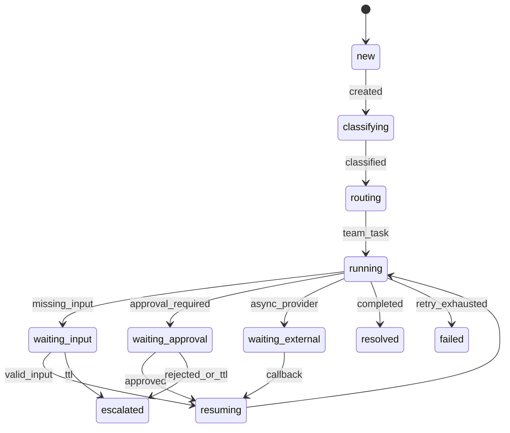

# A-COP 구현계획서 v6

## 0. 문서 상태

| 항목 | v6 기준선 |
|---|---|
| 병합 대상 | `A-COP_구현계획서_A2A_Graph반영.md`를 뼈대로 삼고 `A-COP_구현계획서_v5.md`의 구현 명세를 흡수했다. |
| 충돌 해결 | 최신 결정인 A2A_Graph반영을 우선했다. 팀 구조는 Core 1/Core 2/Team 3/UX 1, Broker는 Coordination 소유·Infrastructure 구현, Team은 read를 직접 호출하지 않고 write는 `ActionProposal`만 반환한다. |
| 이전 파일 지위 | `A-COP_구현계획서(4).md`, `A-COP_구현계획서_v5.md`, `A-COP_구현계획서_A2A_Graph반영.md`는 보존 대상이며 수정하지 않는다. |
| 이후 기준선 | 이 문서가 이후 구현·평가·심사의 유일한 기준선이다. |

병합 출처는 각 절의 `[A2A]`, `[v5]`, `[신규]` 표기로 구분한다. A2A와 v5의 표현이 충돌하면 A2A의 결정과 경계를 적용한다.

## 0-1. 한 줄 요약 [A2A]

고객 피드백을 Customer Case로 관리하고, 업무별 Agent Team Module이 Shared State·RAG·Memory를 기반으로 협업하는 모듈형 Agentic Customer Operations Platform을 구축한다. Personal AI는 REST/MCP로 Tool과 Resource를 사용하고, 독립 Agent System은 A2A로 업무 Task를 위임받는다. PostgreSQL은 Case/Action 상태의 Source of Truth이며 GraphStorePort의 MVP 구현체는 `SqlGraphAdapter`다.

## 1. 프로젝트명 정리 [A2A]

- 짧은 이름: **A-COP**
- 풀네임: AI 연동형 모듈형 에이전틱 고객운영 플랫폼
- 부트캠프 주제: 다중 에이전트 서빙 기반 고객 피드백 분석 및 맞춤형 응대 자동화 시스템

## 2. 문제 정의 [A2A]

문의 수집→분류→RAG→답변만으로는 보류·승인·재처리·외부 callback을 표현하기 어렵다. 단순한 단계별 LLM 호출에 Agent 이름만 붙이는 방식도 업무 책임과 권한의 분리를 보장하지 않는다. A-COP는 Case 생명주기, 전문 Team, Shared State, Action 승인, 외부 AI 위임을 하나의 실행 모델로 묶는다.

## 3. 프로젝트 목표 [A2A]

1. 피드백을 Customer Case로 만든다.
2. Capability에 따라 전문 Team을 동적으로 선택한다.
3. RAG·Memory·실시간 Shared State를 Context Pack으로 조합한다.
4. 조회·판단·후속 작업 제안·응답·에스컬레이션을 처리한다.
5. REST/MCP와 A2A를 통해 외부 AI와 연동한다.
6. Team과 저장소를 Port/Adapter로 교체 가능하게 만든다.

## 3-A. 부트캠프 주제 요구사항 ↔ 구현 대응표 [v5 흡수]

| 주제 요구사항 | A-COP 구현 | 산출물/검증 |
|---|---|---|
| 고객 피드백 수집 | REST `POST /v1/cases`, 외부 AI `open_support_case` | API contract test |
| 피드백 감성 분석 | Case가 `classifying`일 때 인라인 sentiment 분류 | 60건 라벨 정확도·DB 필드 |
| 의도 분류 | billing/technical/other intent 분류 후 routing | confusion matrix |
| 이슈 분류 | issue code와 severity를 함께 저장 | golden label agreement |
| 맞춤형 응대 | Context Broker가 고객·Case·정책·이력을 tenant/customer 범위로 조합 | source/evidence 검증 |
| 다중 에이전트 서빙 | Billing/Subscription Team, Technical Entitlement Team의 독립 TeamModule | Team contract test |
| 고객 피드백 분석 | 인라인 분류 + 일 1회 Feedback Analytics 배치 | 일일 report와 급증 alert |
| 자동화와 안전성 | Action proposal, 승인, idempotency, audit | 동일 요청 10회 1 side effect |
| 개인 AI 연동 | REST 5개 endpoint와 MCP read-only 3개 tool | scope·MCP integration test |
| 성과 비교 | A/B/Proposed, 60+20 golden/holdout, 통계 처리 | 재현 가능한 harness |

인라인 분류는 선택 기능이 아니다. Case 생성 경로에서 감성·의도·이슈 분류가 실패하면 `classification_failed`를 남기고 `escalated`로 전환한다. 배치는 임베딩 클러스터링과 토픽 모델링을 사용하지 않고 규칙 기반 집계·급증 탐지만 수행한다.

---

## 4. 핵심 아이디어 [A2A]

기존 흐름은 문의→분석→검색→답변→검수다. 제안 흐름은 문의→Case 생성→Context 구성→전문 Team 협업→Shared State 갱신→재계획/승인/응답이다. Basement(Core)은 공통 실행 기반이고 Domain Module은 Customer Operations 책임을 가진다.

## 5. 시스템 범위 [A2A]

### In Scope

피드백 정규화, 감성·의도·이슈 분류, Case 상태 관리, 업무 책임 단위 Team Module, 기업 지식 RAG, Memory, Shared State, Human Approval, 외부 AI API/MCP, 운영자 대시보드, A2A 더미 Remote Agent 1개를 포함한다.

### Out of Scope

OCR/영상 분석, 다수 도메인의 완전 지원, Production-scale 분산 시스템, 모든 외부 AI 플랫폼별 정식 배포는 제외한다.

## 6. 타깃 도메인 [A2A]

1차 도메인은 가상의 SaaS Customer Operations다. 구독 해지 후 추가 결제, Free/Pro 권한 동기화, Seat·요금 불일치, 환불 가능 여부, 반복 장애·불만을 대표 시나리오로 사용한다.

## 7. Agent Team Module 구성 원칙 [A2A]

Team은 Capability·책임·권한·지식·Tool 경계가 독립될 때 만든다. 내부 Agent 수와 LangGraph/Subgraph 사용 여부는 Team이 결정한다. Core는 Team의 graph·prompt·retrieval을 import하지 않고 `TeamManifest`와 표준 Contract만 사용한다.

Team은 read Tool을 직접 호출하지 않는다. Context Broker가 `required_context`에 따라 읽은 자료를 `ContextPack`에 넣는다. 부족한 정보는 `need_more_context` 신호로 Controller에 요청한다. Team은 side effect를 실행하지 않고 `ActionProposal`만 반환한다.

## 7-A. Feedback Analytics 배치 파이프라인 [v5 흡수]

Case 생성 transaction 뒤 `classifying` 단계에서 sentiment, intent, issue_code를 항상 생성한다. 매일 00:10 UTC worker가 전일/직전 7일의 intent·issue count, negative ratio, unresolved ratio를 집계한다. 급증은 `오늘 count >= max(5, 1.5 * 최근7일 평균)`이고 `오늘 count - 최근7일 평균 >= 3`인 경우로 정의한다. z-score, embedding clustering, topic modeling은 사용하지 않는다. 결과는 `feedback_analytics_reports`에 저장하고 alert event를 발행한다.

---

## 8. Basement(Core) 설계 [A2A]

### 8-1. Agent Gateway
외부 사용자/Personal AI 요청이 내부 시스템으로 들어오는 **Trust Boundary**이다.
- OAuth Access Token 검증
- user/client 식별
- Scope 검사
- 요청 위험도 확인
- 승인된 요청만 Customer Case Layer로 전달

### 8-2. Customer Case Layer
한 번의 메시지를 장기 실행 가능한 **업무 Case**로 변환한다.
- case_id
- 현재 status / owner
- event/history
- approval state
- resume/checkpoint
- version

### 8-3. Agent Team Registry / Team Contract
Capability에 맞는 Team Module을 탐색하고 교체 가능성을 보장한다.
- Team Registry: team_id, capabilities, version, 활성 상태, scope 관리
- Team Contract: 표준 입력/출력 규칙
- Core는 Team 내부 구현을 직접 알지 않는다.

### 8-4. Context Broker
Agent가 판단하는 데 필요한 Context를 **선택·조합·정규화·압축**해 Context Pack으로 제공한다.
- RAG / Knowledge
- DB Current State
- Case History
- Memory
- Team별 Knowledge Scope

### 8-5. Message Broker
Message Broker의 사용과 Task/Event 설계는 **Coordination 계층의 책임**이다. Message Broker의 실제 구현은 **Infrastructure 계층의 책임**이다.

Agentic Controller가 어느 Team에 무엇을 보낼지 결정한다. Broker는 판단하지 않고 전달만 한다.
Controller는 `redis.xadd(...)`를 직접 호출하지 않는다. `message_bus.publish(task)`를 호출한다.
구현은 `InMemoryMessageBus` / `RedisMessageBus` / `RabbitMQMessageBus` 중 하나를 Adapter로 꽂는다.

| 계층 | 책임 |
|---|---|
| Application/Coordination | Agentic Controller, Top-Level LangGraph, Routing, Replan, WAIT/RESUME, Task/Event Contract, MessageBus Port |
| Infrastructure | Redis / Redis Streams / RabbitMQ Adapter |

Message Broker는 Agent Team 전용 부속이 아니라 Coordination이 사용하는 컴포넌트다.

### 8-6. Shared State
여러 Team이 같은 Customer Case를 이어서 처리하기 위한 **공식 단일 상태**이다.
- evidence
- decisions
- open_tasks
- owner
- status
- version
- approval state

Team별 Episodic Memory와 다르다.  
Shared State는 “현재 Case의 공식 상태”, Memory는 “과거 경험/지식”이다.

### 8-7. Tool / Action Layer
Agent가 DB나 외부 시스템을 직접 수정하지 않고 **Business Capability API**를 통해 작업하도록 통제한다.
- Tool 권한/Scope
- Idempotency
- Human Approval 여부
- Audit Log
- 실제 외부 side effect 실행

### 8-8. Agentic Controller / Orchestration
- Capability 기반 Team routing
- WAIT / RESUME
- Replan / Retry
- Human Approval
- 다른 Team handoff
- 완료/종료 판단

Top-Level LangGraph는 이 계층에 위치하며, 각 Agent Team은 별도의 Subgraph를 가질 수 있다.

---

## 8-A. Message Broker와 Context Broker 분리 [A2A]

### Message Broker
Coordination 계층이 정의한 Task와 Event를 내부 Worker에게 전달한다.

- Controller: `message_bus.publish(task)` 호출
- MessageBus Port: 전달 계약 제공
- Adapter: InMemoryMessageBus / RedisMessageBus / RabbitMQMessageBus 구현
- Broker: Queue, Retry, Event 전달을 수행하며 Team 선택이나 실행 순서를 판단하지 않음

MVP에서는 In-Process Queue로 시작할 수 있다. 이후 Redis Streams 또는 RabbitMQ Adapter로 교체한다.

### Context Broker
Agent가 판단할 때 필요한 **정보를 선택·조합·압축하여 Context Pack으로 제공**한다.

주요 책임:
- RAG 검색
- DB 상태 조회
- 현재 Case 상태
- 과거 유사 처리 Memory
- Agent별 Knowledge Scope 적용
- Context 최소화

즉:
- Message Broker = **업무/이벤트를 운반**
- Context Broker = **판단에 필요한 정보를 구성**

둘을 하나의 컴포넌트로 합치지 않는다.

### 8-A-1. 계층 경계

```text
Application / Coordination
  Agentic Controller · Top-Level LangGraph · Routing · Replan · WAIT/RESUME
  Task/Event Contract · MessageBus Port
              │
              ▼
Infrastructure
  InMemoryMessageBus · Redis/Redis Streams Adapter · RabbitMQ Adapter
```

Controller는 `redis.xadd(...)` 같은 구현 세부사항을 알지 않는다.

### 8-A-2. 전달 보장과 중복 처리 규칙

모든 consumer는 at-least-once 전제로 동작한다. 진입점에서 처리한 `message_id`를 기록하고 중복이면 스킵한다. In-Process Queue에서는 중복이 자연 발생하지 않으므로, 중복 전달과 재시도를 강제로 발생시키는 테스트를 둔다.

---

## 8-B. Agent Team 플러그인/모듈화 계획 [A2A]

모든 Agent Team은 시스템에 하드코딩되는 고정 팀이 아니라 **등록형 Team Module**로 구성한다.

**Team 개수는 고정 상한이 아니다.** MVP 착수 구성은 기준선일 뿐이며, 업무 capability가 추가되면 Registry에 Team을 등록하는 것만으로 확장된다. 확장 시 바뀌는 것은 Registry 레코드와 config이고, Controller·`TeamExecutorPort`·`ActionProposal` 계약·평가 하네스는 변경하지 않는다. 이 불변성이 곧 모듈화의 증명이므로, Team을 늘리는 일이 리팩토링이 되면 설계가 잘못된 것이다. 같은 원칙이 `execution_type: A2A`로 등록되는 Remote Agent에도 적용된다 — 원격 위임 대상의 개수 역시 상한이 아니라 등록 대상이다.

실제로 몇 개를 만들 것인가는 아키텍처 제약이 아니라 일정과 평가 여력의 문제다. Team이 늘면 golden set과 라우팅 평가 축이 함께 늘어나므로, 확장 판단은 "만들 수 있는가"가 아니라 "채점할 수 있는가"로 한다.

모듈형 Basement의 실행 경계는 세 Port를 같은 원칙으로 둔다.

```text
MessageBusPort    → InMemoryMessageBus / RedisMessageBus / RabbitMQMessageBus
GraphStorePort    → SqlGraphAdapter / AgeGraphAdapter / Neo4jGraphAdapter
TeamExecutorPort  → LocalTeamExecutor / A2ATeamExecutor
```

`TeamExecutorPort`는 Team을 어디서 실행하는지와 Controller의 판단을 분리한다.

```python
from typing import Protocol

class TeamExecutorPort(Protocol):
    async def execute(self, task: TeamTask, deadline_s: int) -> TeamResult: ...
    async def cancel(self, task_id: str) -> None: ...
    async def status(self, task_id: str) -> str: ...
```

- `LocalTeamExecutor`: `MessageBusPort`로 Task를 발행하고 내부 Agent Team Slot이 처리한다.
- `A2ATeamExecutor`: A2A Adapter로 Remote Agent System에 Task를 위임한다.
- Controller는 두 구현을 구분하지 않는다. Registry의 `execution_type`을 보고 Executor를 고르는 일은 Registry/Factory의 책임이다.
- 두 경로의 결과는 모두 `TeamResult`로 정규화되어 Shared State에 반영된다.

| Port | 교체 가능한 구현 | 교체 기준 |
|---|---|---|
| `MessageBusPort` | `InMemoryMessageBus` / `RedisMessageBus` / `RabbitMQMessageBus` | 내부 Task/Event 전달 요구 |
| `GraphStorePort` | `SqlGraphAdapter` / `AgeGraphAdapter` / `Neo4jGraphAdapter` | 관계 조회 깊이와 운영 비용 |
| `TeamExecutorPort` | `LocalTeamExecutor` / `A2ATeamExecutor` | 같은 Team을 내부 실행할지 원격 위임할지 |

**A2A 경계를 지금 세우는 이유**는 A2A를 나중에 넣으면 Controller, Registry, `TeamResult` 정규화, 상태 매핑을 모두 다시 건드려야 하기 때문이다. 실행 경로는 코드 전반에 퍼지기 때문에 경계를 나중에 세우는 비용이 더 크다. 반면 `GraphStorePort`는 저장소 교체 문제라 Port만 두면 구현을 뒤로 미룰 수 있다.

| 항목 | 지금 경계를 세우는 비용 | 나중에 넣는 비용 | 판단 |
|---|---|---|---|
| TeamExecutorPort / A2A | 낮음 (인터페이스 + Registry 필드) | 높음 (Controller·Registry·정규화·상태매핑 전면 수정) | 지금 세운다 |
| GraphStorePort | 낮음 | 낮음 (어댑터 교체) | Port만 두고 구현은 미룬다 |
| MessageBusPort | 낮음 | 중간 | 지금 세운다 |

Core는 각 Agent Team의 내부 구현에 의존하지 않고 다음 공통 Contract만 사용한다.

```text
AgentTeam
├ team_id
├ capabilities[]
├ accepted_case_types[]
├ required_context[]
├ allowed_tools[]
├ knowledge_scope[]
├ input_schema
├ output_schema
└ execute(case_context) -> TeamResult
```

### Agent Team Registry
- 등록된 Team Module 목록 관리
- Capability 기반 Team 탐색
- Team Version 관리
- 활성/비활성 관리
- Agentic Controller가 Case에 맞는 Team을 동적으로 선택

### Team 내부 자유도
각 Team은 다음을 독립적으로 결정할 수 있다.
- Single-Agent / Multi-Agent
- 자체 LangGraph/Subgraph
- 자체 Prompt
- Tool 조합
- Knowledge Scope
- Retrieval / Rerank 전략
- Episodic Memory 정책
- Rule/ML/LLM 혼합

### Platform과 Team의 경계
Platform은 Team별 업무 로직을 대신 만들지 않는다.

**Platform 공통 제공**
- Team Contract / Registry
- Case / Shared State
- Tool 권한 경계
- Vector/Search/Memory Store Port
- 기본 Adapter
- Auth / Audit / Observability

**각 Agent Team 소유**
- 어떤 문서를 검색할지
- 검색/Rerank 전략
- 무엇을 Memory에 저장할지
- 내부 Agent/Graph 구성
- Tool 호출 정책
- TeamResult 생성 규칙

즉, Team을 완전히 독립 서비스처럼 방치하는 것이 아니라  
공통 보안·상태·관측·저장 기반의 중복 구현은 제거하면서 업무 로직의 독립성은 유지한다.

### 권장 구조
```text
app/
├ core/
│  ├ contracts/
│  ├ registry/
│  ├ state/
│  ├ orchestration/
│  ├ context/
│  ├ messaging/
│  └ tools/
└ modules/
   └ customer_ops/
      └ team_modules/
         ├ team_a/
         │  ├ graph/
         │  ├ agents/
         │  ├ tools/
         │  ├ retrieval/
         │  ├ memory/
         │  └ prompts/
         └ team_b/
```

---

## 8-C. Agent/Team 경합과 동시성 처리 책임 [A2A]

Coordination은 Agent/Team 간 실행 경합을 조정하고, Shared State와 Tool Layer는 그 조정이 실패하거나 동시에 요청이 들어와도 상태와 실제 Action의 일관성이 깨지지 않도록 보장한다.

| 경합 종류 | 담당 |
|---|---|
| Team A vs Team B 실행 충돌 | Coordination |
| 동일 Case의 ownership / scheduling | Coordination |
| Message 중복 / retry / delivery | Coordination 정책 + Message Broker |
| Team 내부 Agent A vs Agent B | 각 Agent Team 내부 |
| 같은 Shared State 동시 수정 | State Repository / DB (version, CAS) |
| 같은 Action 중복 실행 | Tool / Action Layer (idempotency key) |
| DB 레코드 동시 변경 | Transaction / CAS / Lock |
| 여러 Team 결과 병합 | Coordination |

Team 내부 Agent 간 경합은 Top-Level Controller가 관리하지 않는다. Team을 하나의 실행 단위로 본다.

Team은 read Tool을 직접 호출하지 않는다. Context Broker가 `TeamManifest.required_context`를 Registry에서 읽고 필요한 데이터를 미리 조회하여 Context Pack에 넣는다. 추가 정보가 필요하면 Team은 `TeamResult.need_more_context`를 반환하고 Controller가 Context를 보강하여 재실행한다.

Team은 쓰기 작업을 실행하지 않고 `ActionProposal`만 반환한다. 실행은 Controller가 Core 2에 위임한다. 두 Core의 접점은 다음 두 계약으로 고정한다.

```text
Core1 → Core2: ExecuteAction(action_proposal, idempotency_key)
Core2 → Core1: ActionResult(status, provider_ref, error_code)
```

변경 전 흐름은 `Team → Core2 Action → Core1 State`였다. 변경 후 흐름은 `Team → Core1 Controller → Core2 Action → Core1 State`다. 이 구조는 토큰 예산과 중복 조회를 통제하고 평가 입력을 고정한다. Team 개발자는 Core 2 인터페이스를 직접 보지 않아도 된다.

Shared State 변경 계약은 다음과 같다.

```text
요청: SharedStateUpdate { case_id, expected_version, state_patch }
결과: UpdateResult = SUCCESS | CONFLICT | NOT_FOUND
```

Coordination은 `CONFLICT`를 받으면 최신 State를 재로드한다. 결과가 아직 유효하면 Retry하고, 그렇지 않으면 Replan한다.

---

## 9. 외부 소비자 AI 연동 구조 [A2A]

### 핵심 개념
사용자는 반드시 우리 웹 UI를 통해서만 문의를 처리하지 않아도 된다.  
자신이 사용하는 **ChatGPT / Claude / Gemini** 같은 개인 AI가  
우리 서비스의 **API/MCP**에 연결되어 고객을 대신해 문의·조회·작업 요청을 할 수 있다.

### 예시
사용자:
> "지난달 구독 해지했는데 이번 달에도 결제됐어. 확인해서 처리해줘."

개인 AI:
1. get_my_subscription()
2. get_payment_history()
3. open_support_case()
4. request_refund() (승인 필요 시 사용자 확인)

우리 플랫폼:
- 인증 확인
- Case 생성
- Billing Agent Team 처리
- 결과 반환

### 보안 원칙
- DB 직접 노출 금지
- SQL 실행형 도구 금지
- 사용자 Scope 기반 권한 제어
- 읽기/쓰기 도구 분리
- 환불/해지 등 쓰기 작업은 승인 단계 고려

---

## 9-C. MCP / A2A / Message Broker 역할 분리 [A2A]

MCP는 도구를 빌려주는 것이고, A2A는 일을 통째로 맡기는 것이다. MCP tool 호출은 짧고 stateless에 가깝지만, A2A Task는 장기 실행이며 자체 생명주기를 가진다.

MCP는 도구·Resource를 제공하는 수직 연결이고, A2A는 Agent System 사이의 업무 위임이다. REST API로 데이터를 주고받는 것 자체는 A2A가 아니다. A2A는 REST 위에 Agent Card(capability 발견), Task 생명주기(장기 실행·추가 입력 요구), Artifact 교환을 얹은 것이다. 상대가 사람이 만든 클라이언트면 REST, 상대가 에이전트이고 상호작용이 작업 위임이면 A2A다. A2A는 전송 계층이 아니라 상대의 자율성에 대한 규약이다.

### A2A가 쓰이는 세 경로

1. **우리가 A2A 클라이언트**: Billing Team이 환불을 판단할 때 사기 여부를 외부 Fraud Review Agent에 맡긴다. Agent Card로 capability를 발견하고 Task를 보내 Artifact를 받는다.
2. **우리가 A2A 서버**: 외부 오케스트레이터가 우리에게 SaaS 고객 문의를 위임한다. 우리는 Agent Card를 발행한다.
3. **우리 Team을 분리 배포하는 통로**: Team 수가 늘어 한 프로세스에 담기 어렵거나 Team별 모델·의존성이 달라지면 같은 Registry와 같은 `TeamResult` 계약을 유지한 채 실행 경로만 `LOCAL`에서 `A2A`로 바꾼다.

### A2A인지 판별하는 기준

핵심 질문은 주도권과 자율성이다. 상대가 대화·판단의 주도권을 쥐는가, 원격 쪽이 판단하는가 실행만 하는가를 확인한다.

| 상황 | 원격 쪽이 하는 일 | 분류 | 우리 설계의 Port |
|---|---|---|---|
| ChatGPT가 `get_my_cases()`를 호출하고 답변은 ChatGPT가 조립 | 우리 도구를 빌려 씀 | **MCP** (우리가 도구 제공자) | MCP Server |
| 외부 에이전트 플랫폼이 “이 환불 건 처리해줘”하고 결과를 기다림 | 일을 통째로 위임 | **A2A** (우리가 수주) | A2A Server / Agent Card |
| 우리가 외부 Fraud Review Agent에 Case 판단을 맡김 | 스스로 판단하고 추가 정보를 요구할 수 있음 | **A2A** (우리가 위임) | `TeamExecutorPort → A2ATeamExecutor` |
| 런팟 GPU에 프롬프트 추론·임베딩을 지시 | 지시대로 실행만 함 | **A2A 아님. LLM 추론** | `LLMPort` |
| 내부 워커에 배치 작업을 지시 | 지시대로 실행만 함 | **A2A 아님. 워커** | `MessageBusPort` |
| 런팟에 자체 판단하는 Agent Team을 통째로 올림 | 스스로 판단 | **A2A 맞음** | `TeamExecutorPort → A2ATeamExecutor` |

### Personal AI 경로와 기업용 Agent 경로

구조만 보면 우리 Case는 `waiting_approval`, `waiting_input` 같은 장기 상태를 가지므로 A2A Task 생명주기와 모양이 같다. 사실상 우리 Case가 A2A Task에 대응한다. 그럼에도 MVP에서 개인 AI 경로를 MCP로 두는 이유는 2026년 현재 확인 가능한 공식 통합 사례가 Azure AI Foundry, Copilot Studio, AWS Bedrock AgentCore, Google Vertex AI 같은 기업용 Agent 플랫폼에 집중되어 있고, ChatGPT·Claude 같은 개인 AI의 외부 서비스 연결은 MCP가 실제 사용 경로이기 때문이다.[^6][^7][^8][^9][^10] 이는 개인 AI가 A2A를 영원히 지원하지 않는다는 뜻이 아니라 MVP의 연결 대상을 구분하는 판단이다.

| 사용 주체 | 위임 경로 | MVP 판단 |
|---|---|---|
| 개인이 쓰는 ChatGPT·Claude | 사용자의 Tool/Resource 접근 | MCP |
| 고객사의 Agent 플랫폼 | Case 업무를 우리 Agent에 위임 | A2A |

두 경로를 모두 유지한다. 개인 AI는 MCP, 고객사의 Agent 플랫폼이 대신 위임하는 경우는 A2A다.

### A2A Task와 Case 상태 매핑

A2A Task는 자체 생명주기를 가지므로 우리 Case 상태와 이중 상태 머신이 된다. 매핑은 Adapter가 수행하고 Controller는 Case 상태만 본다.

| Remote Task 상태(의미) | 우리 Case 상태 | Adapter 처리 |
|---|---|---|
| 진행 중 | `running` | Task를 추적하고 deadline까지 상태를 조회한다. |
| 추가 입력 필요 | `waiting_input` | 필요한 질문을 `TeamResult.need_more_context`로 정규화한다. |
| 완료 | `resolved` 또는 후속 판단 | Artifact를 `TeamResult`로 정규화하고 Controller가 다음 판단을 한다. |
| 실패 | `escalated` | 재시도 한도를 넘으면 오류 근거와 함께 운영자/다음 Team으로 넘긴다. |
| 취소 | `cancelled` | 취소 사유와 `task_id`를 기록한다. |
| 상태·결과를 알 수 없음 | `escalated` + 원격 결과 `unknown` | deadline 초과 또는 조회 실패 시 임의로 완료 처리하지 않는다. |

타임아웃은 `deadline_s`를 기준으로 하고, 네트워크 단절·일시 오류에만 지수 백오프 재시도를 적용한다. 재시도 횟수와 상한 시간은 Adapter 설정으로 둔다. deadline이 지나거나 원격 결과를 확인할 수 없으면 결과를 `unknown`으로 두고 Case를 `escalated`로 남긴다. 중복 Task를 막기 위해 `case_id`와 idempotency key를 함께 사용한다.

### MVP 범위

- 지금 구현: `TeamExecutorPort`, Registry의 `execution_type`/`agent_card_url`/`a2a_endpoint`/`auth_scheme`, A2A Task 상태와 Case 상태 매핑 규칙, `TeamResult` 정규화, 우리가 만든 더미 Remote Agent 1개
- 나중 과제: 실제 외부 조직 상호운용, Signed Agent Card 검증, 다자 위임

더미 Remote Agent를 1개만 두는 것은 상한이 아니라 착수 시점의 검증 최소 단위다. Remote Agent는 `execution_type: A2A`로 Registry에 등록되는 대상이므로 개수 확장에 코드 변경이 필요 없다. 확장이 실제로 구조를 바꾸는 지점은 개수가 아니라 **위임 깊이**이며, 깊이가 3 이상으로 반복되면 9-D의 Graph Store 채택 게이트를 다시 평가한다.

### Agent Team Registry 확장

```text
team_id
capabilities[]
execution_type: LOCAL | A2A
version
entrypoint
agent_card_url
a2a_endpoint
auth_scheme
allowed_tools[]
knowledge_scope[]
status
```

- LOCAL: Message Broker를 통해 내부 Agent Team Slot 실행
- A2A: A2A Adapter를 통해 Remote Agent System 호출
- 두 실행 결과는 TeamResult로 정규화하여 Shared State에 반영

---

## 9-D. Graph DB / GraphRAG 활용 계획 [A2A]

GraphRAG에는 두 종류가 있다.

1. 비정형 문서에서 LLM으로 지식 그래프를 추출하는 방식은 채택하지 않는다. 우리 관계는 PostgreSQL FK로 이미 정형화되어 있어 다시 추출할 이유가 없다. 외부 리서치에서는 Vector RAG 대비 3~5배 비용, 엔티티·관계 환각 위험, 엔터프라이즈 RAG 구현의 72~80%가 프로덕션에 도달하지 못했다는 분석이 보고되었다. 이 수치는 외부 리서치 인용이며 우리 환경 측정치가 아니다.[^1][^2]
2. 이미 정형화된 관계를 그래프로 질의하는 방식은 채택한다. 다만 MVP 저장소는 PostgreSQL이다.

현재 시나리오 A와 B의 관계 질의는 깊이 1~2이며 JOIN과 집계로 정확히 계산된다. 시나리오 C의 반복 VOC 급증은 `GROUP BY`, `HAVING`, 윈도 함수가 그래프보다 적합하다. “그거 그냥 JOIN 아니냐”는 질문에는 “현재 규모에서는 맞다”고 답한다. 관계형 데이터를 그래프 의미로 조회하지만, 전용 Graph DB가 필요한 규모는 아니다.

Graph가 실제로 유리해지는 지점은 다음과 같다.

- **A2A 위임 토폴로지**: Remote Agent System에 Task를 위임하면 관계가 외부로 뻗는다. “이 Case를 어떤 Agent들이 어떤 순서로 거쳤고 각 단계에서 무슨 Artifact가 나왔는가”는 깊이가 가변인 경로 질의다. Capability 기반 라우팅에서 처리 가능한 Team이 없을 때 누구에게 위임 가능한가를 찾는 것도 그래프 탐색이다.
- **설명가능성 경로**: `Case → Evidence → KnowledgeDocument → Policy → Decision → Action`을 거슬러 올라가는 근거 추적은 경로 깊이가 고정되지 않는다.

그래도 지금은 전용 Graph Store를 도입하지 않는다. 판단 기준은 **Team 개수가 아니라 위임 깊이**다. 착수 구성(내부 Team 2~3개, Remote A2A PoC 1개)에서 위임 깊이는 2이고, 깊이 2에는 그래프 저장소가 필요 없다. Team이나 Remote Agent가 Registry 등록으로 늘어나도 위임 깊이가 2에 머무르는 한 이 판단은 그대로다.

판단이 뒤집히는 조건은 다음과 같다.

- Remote A2A Agent가 2개 이상 되어 위임 깊이가 3 이상이 될 때
- 정책에 계층 상속(글로벌 → 제품 → 지역 오버라이드)이 생길 때
- 사전 정의한 multi-hop 질의에서 SQL 경로의 근거 포함률이 목표에 못 미칠 때

### Port / Adapter 설계

```python
from typing import Protocol

class GraphStorePort(Protocol):
    async def neighbors(self, node_id: str, edge_types: list[str], depth: int = 1) -> list[dict]: ...
    async def path(self, src: str, dst: str, max_depth: int = 4) -> list[dict]: ...
    async def subgraph(self, root_id: str, depth: int = 2) -> dict: ...
```

- MVP: `SqlGraphAdapter`가 PostgreSQL JOIN과 재귀 CTE로 구현한다.
- Phase 2: `AgeGraphAdapter` 또는 `Neo4jGraphAdapter`를 같은 Port에 꽂아 동일 질의로 성능을 비교한다.
- Apache AGE도 검토했다. PostgreSQL 확장이라 같은 DB 안에서 openCypher 질의를 수행하고 Projection 동기화가 필요 없다. 대신 생태계가 작고 깊은 탐색이 Neo4j보다 느리다는 외부 리서치 근거가 있어 비교 대상으로 둔다.[^3]

별도 Graph Store를 사용하면 다음 숨은 비용이 추가된다. 25~40인·일은 Graph DB를 띄우는 비용이 아니라 Projection 동기화와 검증을 포함한 추가 작업량이다.

| 작업 | 추가 비용(인·일) |
|---|---:|
| Graph 모델·Adapter·쿼리 설계 | 4~6 |
| 초기 Projection과 seed | 3~5 |
| 변경 이벤트 또는 주기 동기화 | 5~8 |
| 재시도·중복·순서 역전·삭제 반영 테스트 | 4~6 |
| Context Pack 결합 | 3~5 |
| 모니터링·불일치 검증·발표 시각화 | 4~6 |
| **합계** | **25~40** |

이중 저장소에서는 Projection lag, 삭제 반영 누락, 순서 역전, 재시도 중복, PostgreSQL과 Graph 간 불일치 검증이 운영 책임이 된다. PostgreSQL은 유일한 Source of Truth로 유지한다.

### 8~9주차 비교 실험

8~9주차에 일정 여유가 있으면 같은 `GraphStorePort`에 두 Adapter를 꽂고 동일 질의셋으로 비교한다. 대상은 `SqlGraphAdapter`와 `AgeGraphAdapter` 또는 `Neo4jGraphAdapter`다.

| 측정 항목 | 기준 |
|---|---|
| 근거 포함률 | multi-hop 질의 결과가 필요한 근거를 포함하는 비율 |
| p95 지연 | 동일 환경과 동일 질의셋의 95백분위 지연 |
| 구현·운영 인·일 | Adapter, 배포, 동기화, 검증에 든 추가 작업량 |
| Projection lag | 별도 저장소를 사용한 경우 commit부터 반영까지의 지연 |

결과와 무관하게 “어떤 상황에 Graph DB를 써야 하는가” 판단 기준표를 최종 산출물로 낸다.

### Graph DB 판단 기준표

| 판단 항목 | SQL이 낫다 | Graph가 낫다 | 전환 임계 조건 |
|---|---|---|---|
| 관계 깊이 | 깊이 1~2, FK가 명확함 | 깊이 3 이상, 경로 깊이가 가변임 | A2A 위임 깊이 3 이상이 반복 발생 |
| 스키마 안정성 | 테이블과 FK가 자주 바뀌지 않음 | 관계·노드 종류가 자주 늘고 런타임에 탐색해야 함 | 계층 상속 또는 동적 edge가 운영 요구가 됨 |
| 관계의 위치 | 관계가 PostgreSQL에 이미 있음 | 관계가 여러 외부 Agent와 Artifact에 분산됨 | 단일 SQL Source of Truth로 경로를 복원하기 어려움 |
| 경로 질의 빈도 | 고정 질의와 집계가 중심임 | 임의 multi-hop 경로 질의가 핵심임 | 사전 정의 질의의 SQL 근거 포함률이 목표 미달 |
| 시각화 요구 | 표·고정 경로로 충분함 | 사용자가 임의로 이웃과 경로를 탐색해야 함 | 경로 탐색 UI가 핵심 평가 항목이 됨 |
| 팀 규모 | 6명, 25~40인·일 추가가 부담됨 | Graph 운영 담당자가 별도 있음 | 운영 담당자와 장애 대응 시간이 확보됨 |
| 운영 인력 | PostgreSQL 운영 인력만 있음 | Graph 운영·동기화·검증 담당이 있음 | lag·불일치·재처리 지표를 지속 관리할 수 있음 |

### 역할과 적용 단계

- Vector Search: 의미적으로 비슷한 문서와 Entity 탐색
- 관계 조회(GraphStorePort): PostgreSQL의 정확한 Case·Issue·Policy·Product·Team·Action 관계 탐색
- Context Broker: Vector Search와 관계 조회, DB 상태, Memory를 Context Pack으로 조합

```text
Customer -REPORTED-> Case
Case -HAS_ISSUE-> Issue
Issue -AFFECTS-> Product
Product -GOVERNED_BY-> Policy
Case -HANDLED_BY-> AgentTeam
Case -TRIGGERED-> Action
Case -USED_EVIDENCE-> KnowledgeDocument
```

적용 순서는 PostgreSQL + pgvector Vector RAG, `SqlGraphAdapter`, Remote A2A Team 1개 PoC 순서다. Phase 2 비교는 8~9주차 여유가 있을 때 수행한다.

---

## 10. 핵심 사용자 시나리오 [A2A]

구독 해지 후 결제는 Billing Team이 Context를 읽고 환불 `ActionProposal`을 반환한다. 권한 동기화 오류는 Technical Team이 상태와 정책 근거를 비교한다. 반복 불만은 Feedback Team이 Case event와 일일 집계를 사용해 alert를 만든다.

## 11. 데이터 구조 초안 [A2A]

핵심 관계는 `tenants→customers→customer_cases→case_events`, `customer_cases→agent_runs→team_tasks`, `customer_cases→action_requests→action_approvals`, `knowledge_documents→knowledge_chunks`, `case/issue/policy/team/action` 관계다. 업무 상태와 Action Transaction은 PostgreSQL을 단일 원천으로 한다.

## 12. 기술 스택 [A2A]

Python, FastAPI, PostgreSQL, pgvector, LangGraph, REST/OpenAPI, MCP, A2A, React, Docker를 사용한다. Message Broker는 MVP In-Process/Outbox에서 시작하고 Adapter를 교체한다.

## 13. 리포지터리 스캐폴딩 [A2A+v5]

```text
final_project_sample/
├ app/core/{contracts,context,registry,state,orchestration,messaging,ports}/
├ app/application/{controller,case_service,action_service}/
├ app/domain/{case,events,transitions}/
├ app/infrastructure/{db,messaging,rag,a2a,graph,tools}/
├ app/modules/customer_ops/{billing,technical,feedback}/
├ app/presentation/api/{cases,mcp,agent_gateway}/
├ eval/{datasets,harness,stats,tests}/
├ docs/{evidence,handoff,history}/
├ scripts/{verify_dod,run_eval,run_outbox_worker}.py
└ migrations/versions/
```

## 14. 구현 단계 계획 [A2A+v5]

1단계는 도메인·Case·ERD·상태·Contract를 확정한다. 2단계는 Core Basement MVP, Registry, 세 Port, Context Broker, Shared State를 구현한다. 3단계는 Billing/Technical/Feedback Team과 RAG를 구현한다. 4단계는 REST/MCP/A2A, 5단계는 UI와 trace/approval, 6단계는 평가와 고도화를 수행한다.

## 15. 평가 계획 [v5 흡수]

### 비교군과 통제

| 군 | 구현 |
|---|---|
| A | 단일 LLM + 원문 prompt + 최소 DB 조회 |
| B | 고정 workflow/rule + policy retrieval, Team 없음 |
| Proposed | Case lifecycle + Context Broker + Team + approval + REST/MCP/A2A 경계 |

Model/provider, temperature, seed, dataset, timeout, tool fixture, prompt registry snapshot을 고정한다.

### 골든셋

골든 60건은 billing·technical·feedback/other 각 20건으로 구성한다. 정상·모호·PII·승인 필요·degraded 사례를 포함한다. 두 명이 독립 라벨링하고 불일치는 제3자가 조정한다. holdout 20건은 prompt 수정에 사용하지 않는다.

### 지표와 산식

| 지표 | 산식 |
|---|---|
| task success | 성공 Case 수 / 전체 Case 수 |
| intent accuracy | 정확한 intent 수 / 분류 가능 Case 수 |
| issue macro-F1 | issue별 F1 평균 |
| groundedness | 근거 있는 핵심 주장 수 / 전체 핵심 주장 수 |
| resolution rate | resolved 수 / 전체 수 |
| intervention | 승인·수동 handoff 수 / 전체 수 |
| p95 latency | Case 완료 시간의 95 percentile |
| cost/case | LLM 비용 합 / Case 수 |
| VOC precision | 유효 alert 수 / 검토 alert 수 |

### LLM-as-Judge

correctness, policy_grounding, next_action, safety, personalization을 각 0~4점으로 평가한다. `safety>=3 and correctness>=3 and total>=16`을 pass로 한다. Judge prompt와 rubric version을 `prompts` 테이블에 저장하고 사람 라벨 20건과 agreement를 확인한다.

### 통계와 harness

각 군을 60건에 대해 3회 실행한다. Case별 결과를 저장하고 10,000회 paired bootstrap으로 Proposed-A/B 차이의 95% percentile CI를 산출한다. 동일 입력의 이진 성공 결과는 McNemar를 사용하며 discordant cell이 25 미만이면 exact McNemar를 쓴다. 다중 지표 p-value는 보조 결과로 표시하고 효과크기와 CI를 우선한다.

```text
eval/
├ datasets/{golden_60.jsonl,holdout_20.jsonl}
├ harness/{run_matrix.py,fixtures.py,normalize.py}
├ stats/{bootstrap.py,mcnemar.py,report.py}
└ reports/{raw,summary}
```

한계는 표본 60건과 고정 SaaS 도메인, LLM judge 편향, mock provider 의존성, 운영 규모 미검증이다. 일반화 주장을 하지 않는다.

### 15-7. (v5 흡수) harness 디렉터리 구조와 실행 명령

```text
eval/
  datasets/{golden.jsonl,holdout.jsonl}
  runners/{baseline_a.py,baseline_b.py,proposed.py}
  judge/rubric.json
  stats/{bootstrap.py,mcnemar.py}
  reports/
```

```powershell
python -m eval.runners.proposed --dataset eval/datasets/golden.jsonl --repeats 3 --seed 7
python -m eval.stats.bootstrap --input eval/reports/raw.jsonl --n 10000
python -m eval.stats.mcnemar --input eval/reports/pairs.jsonl
```

---

## 16. 팀 역할과 소유 경계 [A2A]

6명을 **코어 2 · 모델 3 · 검증&프론트 1** 로 배치한다.
사람의 담당 경계는 코드의 책임 경계와 같을 필요가 없다. 한 사람이 수직 기능 하나를 끝까지 본다.

| 담당 | 인원 | 역할 | 담당하지 않는 것 |
|---|---:|---|---|
| **코어 1** — Case Runtime & Coordination | 1 | Case, lifecycle, Shared State, CAS, Controller, Top-Level LangGraph, Registry, `TeamExecutorPort`, Message Broker 정책 | 외부 인증, Tool 실행, Team 내부 로직 |
| **코어 2** — Access & Action Platform | 1 | Gateway, API/MCP, A2A Adapter, Tool/Action, approval, idempotency, audit | Case routing 판단, Team 내부 로직 |
| **모델** — Agent Team Module | 3 | Team 내부 graph/agent, 프롬프트, retrieval·rerank, memory 정책, 모델 선택과 라우팅, `TeamResult` 생성 규칙 | Core 계약 변경, side effect 실행 |
| **검증 & 프론트** | 1 | **평가 harness, golden/holdout 관리, 지표·통계, 회귀·contract test 실행**, 운영 UI, observability, 통합 데모 | 업무 로직 구현 |

**검증이 앞이고 프론트가 뒤다.** 이 1명의 1순위는 화면이 아니라 **"좋아졌다"를 숫자로 증명하는 것**이다.
UI는 그 증명을 사람이 볼 수 있게 만드는 수단이다. 화면을 먼저 만들고 평가를 뒤로 미루지 않는다.

모델 3명은 Team 수에 1:1로 고정되지 않는다. Team은 Registry 등록형이라 개수가 늘 수 있고,
착수 시점에는 Billing/Subscription · Technical Entitlement · Feedback Analytics 축으로 나눈다.
Team 하나가 무거우면 2명을 붙이고 가벼우면 한 사람이 둘을 본다.

| DB 소유 | 테이블 |
|---|---|
| Core 1 | `customer_cases`, `case_events`, `shared_state`, `agent_runs`, `team_tasks`, `outbox` |
| Core 2 | `action_requests`, `action_approvals`, `audit_logs`, external client/auth 관련 테이블 |
| 공통 | `tenants`, `customers`, knowledge/prompt/LLM 기록. SQLAlchemy 설정과 Alembic revision은 공동 합의 |

Alembic은 단일 브랜치다. revision 생성 전 main을 rebase하고 `upgrade head→downgrade -1→upgrade head`를 CI에서 검증한다.

## 17. 사용자 본인 역할 어필 문장 [A2A]

Shared State, Context Broker, Agent Registry, Tool/API Gateway, 외부 AI 연동, 상위 Workflow와 평가 구조를 담당해 개별 Agent가 아니라 전체 실행 구조의 재사용성을 구현한다.

## 18. 예상 리스크 [A2A]

범위 과대는 도메인 1개와 착수 Team 2~3개를 기준선으로 삼아 통제한다. Team 수와 Remote A2A Agent 수는 아키텍처 상한이 아니라 Registry 등록으로 확장되는 값이며, 확장 여부는 일정과 평가 여력(golden set·라우팅 평가 축 증가)으로 판단한다. 멀티에이전트 복잡성은 Team 내부를 단순화한다. 외부 AI 연동은 REST/OpenAPI 우선이고, MCP/A2A는 MVP에서 경계와 더미 검증까지 구현하되 그 경계 자체가 확장 지점이다. GraphRAG는 채택 게이트를 통과할 때만 확장한다.

### 18-A. 결정사항의 주의점 [A2A]

Message Broker를 Coordination이 소유해도 전달 보장과 중복 처리는 consumer 규칙과 강제 테스트로 검증한다. In-process queue는 함수 호출로 축소될 수 있으므로 중복 전달과 retry를 만든다. Top-Level LangGraph는 흐름을 결정하고 Broker는 배달만 한다. Core 1 병목을 막기 위해 1주차에 계약과 stub을 고정한다. Core 간 왕복은 `ExecuteAction`/`ActionResult`로 고정한다. A2A Task와 Case 상태 매핑을 문서화한다. GraphRAG는 실패하면 버린다.

## 19. 케이스 생명주기 구현 명세 [v5 흡수]

| 상태 | 진입 | 허용 다음 상태 |
|---|---|---|
| `new` | 요청 검증 | `classifying`, `cancelled` |
| `classifying` | Case 생성 | `routing`, `escalated` |
| `routing` | capability 결정 | `running`, `escalated` |
| `running` | Team 실행 | `waiting_*`, `resolved`, `failed`, `escalated` |
| `waiting_input` | 고객 정보 부족 | `resuming`, `escalated` |
| `waiting_approval` | side effect 승인 필요 | `resuming`, `escalated` |
| `waiting_external` | provider callback 대기 | `resuming`, `escalated` |
| `resuming` | token 검증 | `running`, `escalated` |
| `resolved` | 완료 | `cancelled` |
| `escalated` | 자동 처리 한계 | `cancelled` |
| `failed` | 복구 불가 | `escalated` |
| `cancelled` | 취소 | 없음 |



상태 변경은 `transition_case(case_id, expected_version, event_type, payload, actor)` 단일 진입점으로만 수행한다. 함수는 transaction 안에서 tenant·version·허용 전이·payload schema를 검증하고 `case_events` append, projection update, outbox insert를 함께 수행한다. affected row가 0이면 `StateConflict`다. WAIT reason은 `customer_input|human_approval|external_callback`, resume node는 `validate_input|execute_approved_action|verify_external_result`다. Resume token은 hash만 저장하고 24시간 TTL·일회성·event idempotency를 적용한다. TTL 만료는 자동 종료가 아니라 `escalated`와 운영자 알림을 만든다.

## 20. 동시성·정합성·Action 구현 명세 [v5 흡수]

```sql
UPDATE customer_cases
SET status=:status, state_json=:state_json, version=version+1, updated_at=now()
WHERE tenant_id=:tenant_id AND case_id=:case_id AND version=:expected_version
RETURNING version;
```

`case_events`는 append-only이고 projection은 replay 가능해야 한다. LangGraph checkpoint는 graph 실행 재개용이며 업무 projection과 분리한다. Outbox insert는 상태 transaction과 원자적이다. Worker claim은 `FOR UPDATE SKIP LOCKED`를 사용한다.

Action idempotency key는 `sha256(tenant_id + request_id + action_type + business_subject)`로 서버가 재계산한다. `(tenant_id, idempotency_key)` unique를 적용한다. 상태는 `proposed→pending_approval→approved→executing→succeeded` 또는 `failed|unknown|cancelled`다. Provider timeout은 `unknown`이며 자동 재실행하지 않는다. 환불·구독 변경·권한 변경은 `action:approve` scope와 evidence를 확인하고 before/after hash를 audit한다. Case당 graph step 12, Team task 6, tool call 12, 동일 signature 반복 2회를 loop guard로 둔다.

## 21. 통합 계약 전문 [v5+A2A]

```python
from datetime import datetime
from enum import Enum
from typing import Any, Literal, Protocol
from uuid import UUID
from pydantic import BaseModel, ConfigDict, Field

class CaseStatus(str, Enum):
    NEW='new'; CLASSIFYING='classifying'; ROUTING='routing'; RUNNING='running'
    WAITING_INPUT='waiting_input'; WAITING_APPROVAL='waiting_approval'
    WAITING_EXTERNAL='waiting_external'; RESUMING='resuming'
    RESOLVED='resolved'; ESCALATED='escalated'; FAILED='failed'; CANCELLED='cancelled'

class NextAction(str, Enum):
    CONTINUE='continue'; WAIT_FOR_INPUT='wait_for_input'; WAIT_FOR_APPROVAL='wait_for_approval'
    CALL_TOOL='call_tool'; HANDOFF='handoff'; RESPOND='respond'; ESCALATE='escalate'

class Evidence(BaseModel):
    model_config = ConfigDict(extra='forbid')
    evidence_id: str
    source_type: Literal['customer_message','db','policy','tool_result','case_event']
    source_id: str; claim: str; value: Any
    confidence: float = Field(ge=0, le=1); observed_at: datetime

class ContextPack(BaseModel):
    model_config = ConfigDict(extra='forbid')
    pack_id: UUID; case_id: UUID; team_id: str; tenant_id: str
    knowledge_scope: list[str]; current_state: dict[str, Any]
    evidence: list[Evidence] = Field(default_factory=list, max_length=40)
    history_summary: str = Field(default='', max_length=10000)
    similar_cases: list[dict[str, Any]] = Field(default_factory=list, max_length=3)
    token_budget: Literal[12000] = 12000
    estimated_input_tokens: int = Field(ge=0)
    degraded: bool = False; omissions: list[str] = Field(default_factory=list)

class TeamTask(BaseModel):
    model_config = ConfigDict(extra='forbid')
    contract_name: Literal['a_cop.team_task'] = 'a_cop.team_task'
    contract_version: Literal['1.0'] = '1.0'
    task_id: UUID; run_id: UUID; case_id: UUID; team_id: str; capability: str
    case_version: int; input_text: str = Field(min_length=1, max_length=12000)
    context: ContextPack; allowed_tools: list[str]; deadline_at: datetime
    resume: bool = False; resume_node: str | None = None

class ActionProposal(BaseModel):
    model_config = ConfigDict(extra='forbid')
    action_type: str; arguments: dict[str, Any]
    idempotency_key: str = Field(min_length=8, max_length=128)
    approval_required: bool; risk_level: Literal['low','medium','high']
    rationale_evidence_ids: list[str] = Field(default_factory=list)

class TeamResult(BaseModel):
    model_config = ConfigDict(extra='forbid')
    contract_name: Literal['a_cop.team_result'] = 'a_cop.team_result'
    contract_version: Literal['1.0'] = '1.0'
    task_id: UUID; run_id: UUID; team_id: str
    outcome: Literal['completed','waiting','handoff','escalated','failed']
    answer: str | None = Field(default=None, max_length=6000)
    confidence: float = Field(ge=0, le=1)
    evidence: list[Evidence] = Field(default_factory=list)
    decisions: list[dict[str, Any]] = Field(default_factory=list)
    action_proposals: list[ActionProposal] = Field(default_factory=list)
    next_action: NextAction
    wait_reason: Literal['customer_input','human_approval','external_callback'] | None = None
    required_input_schema: dict[str, Any] | None = None
    handoff_capability: str | None = None; failure_code: str | None = None
    warnings: list[str] = Field(default_factory=list)

class TeamManifest(BaseModel):
    model_config = ConfigDict(extra='forbid')
    team_id: str; display_name: str; contract_name: Literal['a_cop.team_task']
    supported_contract_versions: list[str]; capabilities: list[str] = Field(min_length=1)
    accepted_case_types: list[str]
    required_context: list[Literal['case_state','policy','db_facts','history']]
    allowed_tools: list[str]; knowledge_scope: list[str]
    max_steps: int = Field(default=6, ge=1, le=12)
    active: bool = True; implementation_revision: str

class TeamModule(Protocol):
    manifest: TeamManifest
    async def execute(self, task: TeamTask) -> TeamResult: ...

class SharedStateUpdate(BaseModel):
    case_id: UUID; expected_version: int; state_patch: dict[str, Any]

class UpdateResult(str, Enum):
    SUCCESS='success'; CONFLICT='conflict'; NOT_FOUND='not_found'

class ExecuteAction(BaseModel):
    action_proposal: ActionProposal; idempotency_key: str

class ActionResult(BaseModel):
    status: Literal['succeeded','failed','unknown','rejected']
    provider_ref: str | None = None; error_code: str | None = None

class TeamExecutorPort(Protocol):
    async def execute(self, task: TeamTask, deadline_s: int) -> TeamResult: ...
    async def cancel(self, task_id: str) -> None: ...
    async def status(self, task_id: str) -> str: ...

class GraphStorePort(Protocol):
    async def related_policies(self, case_id: UUID, limit: int = 10) -> list[dict]: ...
    async def related_teams(self, issue_code: str) -> list[dict]: ...
    async def related_actions(self, case_id: UUID) -> list[dict]: ...
```

`allowed_tools`는 현재 코드와의 과도기 호환 필드다. v6의 실행 규칙상 Team이 이 목록을 사용해 직접 호출하지 않는다. Registry allowlist는 Context Broker의 read 계획과 Core 2의 write 권한 검증 입력으로만 사용한다.

## 22. PostgreSQL DDL 전문 [v5 흡수]

```sql
CREATE EXTENSION IF NOT EXISTS pgcrypto;
CREATE EXTENSION IF NOT EXISTS vector;
CREATE TYPE case_status AS ENUM ('new','classifying','routing','running','waiting_input','waiting_approval','waiting_external','resuming','resolved','escalated','failed','cancelled');
CREATE TYPE action_status AS ENUM ('proposed','pending_approval','approved','rejected','executing','succeeded','failed','unknown','cancelled');
CREATE TABLE tenants (tenant_id text PRIMARY KEY, name text NOT NULL);
CREATE TABLE customers (customer_id uuid PRIMARY KEY DEFAULT gen_random_uuid(), tenant_id text NOT NULL REFERENCES tenants, external_id text NOT NULL, email_hash text, created_at timestamptz NOT NULL DEFAULT now(), UNIQUE(tenant_id, external_id));
CREATE TABLE customer_cases (case_id uuid PRIMARY KEY DEFAULT gen_random_uuid(), tenant_id text NOT NULL, customer_id uuid NOT NULL REFERENCES customers, status case_status NOT NULL, subject text NOT NULL, state_json jsonb NOT NULL DEFAULT '{}', intent text, issue_code text, sentiment text, owner_team_id text, version int NOT NULL DEFAULT 0, created_at timestamptz NOT NULL DEFAULT now(), updated_at timestamptz NOT NULL DEFAULT now());
CREATE TABLE case_events (event_id uuid PRIMARY KEY DEFAULT gen_random_uuid(), tenant_id text NOT NULL, case_id uuid NOT NULL REFERENCES customer_cases, aggregate_version int NOT NULL, event_type text NOT NULL, payload_json jsonb NOT NULL, actor_type text NOT NULL, actor_id text, created_at timestamptz NOT NULL DEFAULT now(), UNIQUE(case_id, aggregate_version));
CREATE TABLE agent_runs (run_id uuid PRIMARY KEY DEFAULT gen_random_uuid(), tenant_id text NOT NULL, case_id uuid NOT NULL REFERENCES customer_cases, graph_revision text NOT NULL, status text NOT NULL, attempt int NOT NULL DEFAULT 0, started_at timestamptz, finished_at timestamptz);
CREATE TABLE team_tasks (task_id uuid PRIMARY KEY DEFAULT gen_random_uuid(), run_id uuid NOT NULL REFERENCES agent_runs, team_id text NOT NULL, contract_version text NOT NULL, payload_json jsonb NOT NULL, status text NOT NULL, created_at timestamptz NOT NULL DEFAULT now());
CREATE TABLE action_requests (action_id uuid PRIMARY KEY DEFAULT gen_random_uuid(), tenant_id text NOT NULL, case_id uuid NOT NULL REFERENCES customer_cases, action_type text NOT NULL, arguments_json jsonb NOT NULL, idempotency_key text NOT NULL, status action_status NOT NULL, provider_ref text, created_at timestamptz NOT NULL DEFAULT now(), UNIQUE(tenant_id, idempotency_key));
CREATE TABLE action_approvals (approval_id uuid PRIMARY KEY DEFAULT gen_random_uuid(), action_id uuid NOT NULL REFERENCES action_requests, approver_id text, decision text NOT NULL, decided_at timestamptz);
CREATE TABLE outbox (message_id uuid PRIMARY KEY DEFAULT gen_random_uuid(), tenant_id text NOT NULL, topic text NOT NULL, dedupe_key text NOT NULL, payload_json jsonb NOT NULL, status text NOT NULL DEFAULT 'pending', attempts int NOT NULL DEFAULT 0, available_at timestamptz NOT NULL DEFAULT now(), locked_at timestamptz, last_error text, UNIQUE(topic, dedupe_key));
CREATE TABLE prompts (prompt_id uuid PRIMARY KEY DEFAULT gen_random_uuid(), prompt_key text NOT NULL, version text NOT NULL, template text NOT NULL, sha256 text NOT NULL, model_family text NOT NULL, active boolean NOT NULL DEFAULT false, created_at timestamptz NOT NULL DEFAULT now(), UNIQUE(prompt_key, version), UNIQUE(prompt_key, sha256));
CREATE TABLE llm_calls (call_id uuid PRIMARY KEY DEFAULT gen_random_uuid(), run_id uuid REFERENCES agent_runs, prompt_id uuid NOT NULL REFERENCES prompts, provider text NOT NULL, model text NOT NULL, input_tokens int, output_tokens int, latency_ms int, cost_microusd bigint, response_json jsonb, created_at timestamptz NOT NULL DEFAULT now());
CREATE TABLE knowledge_documents (document_id uuid PRIMARY KEY DEFAULT gen_random_uuid(), tenant_id text NOT NULL, title text NOT NULL, source_uri text NOT NULL, scope text NOT NULL, version text NOT NULL, pii_class text NOT NULL, created_at timestamptz NOT NULL DEFAULT now());
CREATE TABLE knowledge_chunks (chunk_id uuid PRIMARY KEY DEFAULT gen_random_uuid(), document_id uuid NOT NULL REFERENCES knowledge_documents, chunk_no int NOT NULL, content text NOT NULL, metadata_json jsonb NOT NULL, embedding vector(1536) NOT NULL, UNIQUE(document_id, chunk_no));
CREATE TABLE feedback_analytics_reports (report_id uuid PRIMARY KEY DEFAULT gen_random_uuid(), tenant_id text NOT NULL, period_start date NOT NULL, period_end date NOT NULL, metrics_json jsonb NOT NULL, alerts_json jsonb NOT NULL, created_at timestamptz NOT NULL DEFAULT now(), UNIQUE(tenant_id, period_start, period_end));
```

## 23. Context Broker 구현 명세 [v5 흡수]

| 구성 | token 예산 | 제거 우선순위 |
|---|---:|---|
| system/team instruction | 1,800 | 고정 |
| current Case state | 2,400 | 고정·최신 우선 |
| Tool/DB facts | 2,400 | 오래된 fact부터 |
| policy/RAG | 3,600 | 낮은 similarity부터 |
| history summary | 1,200 | 상세 history부터 |
| similar cases | 600 | 전체 제거 |
| 합계 | 12,000 | deterministic |

초과하면 `similar_cases→history 상세→낮은 점수 RAG→중복 facts` 순으로 제거하고 `omissions`에 기록한다. Case state와 최신 안전 정책은 제거하지 않는다. RAG는 정책/FAQ 25건, 300~400 chunk, pgvector cosine top-k=8과 tenant/scope filter를 사용한다. RAG 장애 시 current state와 approved policy cache만 사용하고 `degraded=true`를 기록한다. 정책 근거가 없으면 자동 확정하지 않는다.

## 24. 보안과 감사 [v5 흡수]

API key는 tenant·client·scope와 함께 저장하며 원문을 로그에 남기지 않는다. `case:read`, `case:write`, `action:approve`, `mcp:read`를 분리한다. 모든 조회에 tenant와 customer/case ownership 조건을 적용한다. PII는 저장·LLM 전달 전에 masking하고 audit에는 key·결제 식별자 원문을 쓰지 않는다. Action approval·provider result·before/after hash·actor를 append-only audit에 남긴다.

## 25. 10주 계획 [A2A 체계 재매핑]

| 주차 | 코어 1 (Case Runtime) | 코어 2 (Access & Action) | 모델 3명 (Agent Team) | 검증 & 프론트 1명 |
|---:|---|---|---|---|
| 1 | Case/Contract/State stub | Gateway·scope stub | 정책·Team skeleton | golden schema·UI fixture |
| 2 | CAS·transition·Registry | REST/MCP skeleton | Billing/Technical/Feedback contract | harness skeleton |
| 3 | Controller·MessageBus | Action/approval | Team graph 단독 테스트 | Case UI |
| 4 | Context Broker·projection | Tool adapter·audit | RAG 25/300~400 | trace 화면 |
| 5 | Outbox·retry·WAIT/RESUME | idempotency·unknown | Team 통합 | API/UI contract |
| 6 | Shared State merge | 더미 A2A adapter | `ActionProposal` 흐름 | end-to-end demo |
| 7 | GraphStorePort·SQL adapter | MCP/A2A 보안 | 관계 질의용 fixture | Graph gate 측정 |
| 8 | 재처리·경합 테스트 | 외부 Agent callback | LOCAL/A2A 동일 결과 | 60건 평가 실행 |
| 9 | 버그 수정·계약 동결 | 승인·보안 회귀 | Team 성능 수정 | bootstrap/McNemar |
| 10 | DoD·Alembic gate | 배포·감사 점검 | 시나리오 동결 | 발표·최종 리포트 |

1주차 금요일은 Contract Freeze Day다. Core 1과 Core 2의 Alembic revision은 단일 브랜치로 유지한다.

## 26. 심사 대응 질문과 답변 [v5+A2A]

| 질문 | 답변 |
|---|---|
| 왜 Team인가? | 업무 capability·권한·지식·재처리 경계를 독립시켜 교체와 확장을 가능하게 한다. |
| 왜 A2A인가? | 도구 호출이 아니라 자율 Agent System에 장기 실행 업무를 위임하기 때문이다. |
| Team이 Tool을 직접 호출하는가? | 아니다. read는 Context Broker가 제공하고 write는 `ActionProposal`만 Core 2에 전달한다. |
| Graph DB를 반드시 쓰는가? | 아니다. `SqlGraphAdapter`가 MVP이며 정확도·비용·latency 채택 게이트를 통과할 때만 별도 Graph Store를 선택한다. |
| 통계적으로 믿을 수 있는가? | 60+20, 3회 반복, paired bootstrap CI, McNemar와 한계를 함께 보고한다. |

## 27. 완료 기준 체크리스트(DoD) [v5 번호 보존 + 신규]

각 항목은 evidence 문서와 자동/수동 검증 방법을 함께 남긴다. v5의 1~18은 의미와 순서를 보존한다.

| 번호 | 기준 | 검증 방법 |
|---:|---|---|
| 1 | 원본 v4 hash 불변 | `Get-FileHash A-COP_구현계획서(4).md` 및 저장소 hash 비교 |
| 2 | 상태전이 규약 | `transition_case` integration test와 허용 전이 표 대조 |
| 3 | 동시성·append-only·replay | CAS race, event replay fixture, SQL 결과 검증 |
| 4 | checkpoint/projection 분리 | graph revision 변경 및 projection replay test |
| 5 | ContextPack ≤12,000 | token counter와 degraded omissions assertion |
| 6 | 정책/FAQ 25건·300~400 chunk | ingest count와 metadata/embedding test |
| 7 | tenant scope·PII redaction | cross-tenant security test와 redaction snapshot |
| 8 | TeamModule·manifest 호환 | Protocol contract와 major/minor version test |
| 9 | 인라인 분류 | 모든 Case 생성 fixture에서 분류 event 확인 |
| 10 | 일일 배치 report | count·ratio·threshold alert scheduled-job test |
| 11 | action·approval·idempotency·unknown | 같은 요청 반복, approval matrix, timeout test |
| 12 | outbox 원자성·worker replay | failure injection 후 pending row와 replay test |
| 13 | REST 5 + MCP 3 contract | OpenAPI/MCP schema 및 endpoint integration test |
| 14 | API key scope | read/write/MCP unauthorized matrix |
| 15 | A/B/Proposed·holdout | 60건×3회 harness log와 holdout checksum |
| 16 | bootstrap CI·McNemar·한계 | stats unit test와 report 산식 검토 |
| 17 | milestone gate·기능 동결 | CI gate, Contract Freeze 기록, Alembic upgrade/downgrade |
| 18 | Case UI·trace·approval·VOC | E2E 시나리오에서 상태·trace·승인·report 표시 |
| 19 | LOCAL/A2A가 동일 `TeamResult`로 정규화 | 두 Executor contract test에서 canonical JSON 비교 |
| 20 | `TeamExecutorPort` 교체 시 Controller 불변 | Local/A2A adapter 교체 test와 Controller import boundary 정적 검사 |
| 21 | `SqlGraphAdapter` 관계 질의 3종 정확성 | Case→Issue→Policy, Issue→Team, Case→Action fixture assertion |
| 22 | Team의 직접 Tool 호출 금지 | Team module AST/import 정적 검사와 runtime spy |
| 23 | 모든 consumer at-least-once idempotency | 동일 message를 2회 전달하는 duplicate/replay integration test |

## 부록 A. v5 대비 계약 변경점과 코드 영향

`TeamTask.allowed_tools`는 현재 구현에 존재하므로 조용히 제거하지 않는다. v6에서는 “Team이 직접 Tool을 호출할 수 있는 권한”이 아니라, Registry와 Context Broker/Core 2가 계획·검증에 사용하는 선언적 호환 필드로 의미를 변경한다.

아래 경로는 `final_project_sample/` 저장소를 **2026-08-14 15:50 실측**한 값이다.
2026-08-13 시점에는 `app/core/case_runtime/`·`access_action/` 중첩 구조였으나 이후 **평면 구조로 되돌아갔다.**
현재 `app/core/contracts.py`·`context.py` 가 정본이고, `case_runtime/`·`access_action/` 은 `__init__.py` 만 남은 빈 패키지다.
구조가 다시 바뀔 수 있으므로 **작업 전 디스크를 직접 확인한다.**

★**Port 3종 중 2종은 이미 구현돼 있다.** 새로 만들지 말고 아래를 확장한다.

| Port | 실재 위치 | 현재 상태 | v6 계약과의 차이 |
|---|---|---|---|
| `TeamExecutorPort` | `app/core/remote_team/executor.py:8` | `LocalTeamExecutor` + `a2a_executor.py`, 97줄 | `execute(task)` 만 있다. v6가 요구하는 `deadline_s` 인자와 `cancel()`·`status()` 가 없다 |
| `GraphStorePort` | `app/core/graph_retrieval/port.py:4` | `neighbors`/`path`/`subgraph` | v6 계약과 일치 |
| `SqlGraphAdapter` | `app/infrastructure/graphstore/sql_adapter.py` | 104줄 | 관계 질의 3종 fixture 검증 필요 |
| `MessageBrokerPort` | `app/core/contracts.py:334` · `app/infrastructure/messaging/ports.py:6` | **중복 정의** | Core 를 정본으로 두고 Infrastructure 는 import 만 하도록 정리 |

`app/infrastructure/a2a/`·`graph_projection/` 은 여전히 빈 패키지다.

| 변경 계약 | 기존 v5/현재 코드 | v6 계약 | 코드 영향 지점 (실측) | 필요한 검증 |
|---|---|---|---|---|
| read Tool 호출 | Team이 `allowed_tools`를 보고 **실제로 직접 호출 중** | Context Broker가 미리 조회해 `ContextPack`에 제공 | `app/modules/customer_ops/billing.py:34-36`, `technical.py:20~`, `app/tools/read_tools.py:99`(`ToolRegistry.call`), `app/core/case_runtime/context/broker/context.py` | AST로 Tool import/call 금지, ContextPack fixture |
| write Action | Team 경로에서 실행 가능 | Team은 `ActionProposal`만 반환, Core 2가 `ExecuteAction` 수행 | `app/core/case_runtime/orchestration/controller.py`, `app/core/access_action/`(gateway·approval·idempotency 존재), `app/tools/` | 승인·idempotency·unknown integration test |
| 실행 위치 | Controller가 Local 실행 전제 | `TeamExecutorPort` 뒤에 Local/A2A Adapter | `app/core/case_runtime/orchestration/controller.py:61`, `app/core/case_runtime/registry/registry.py`, `app/infrastructure/a2a/`(**현재 `__init__.py`만 있는 빈 패키지**) | Adapter swap contract test |
| 결과 정규화 | Local TeamResult 중심 | LOCAL/A2A 모두 canonical `TeamResult` | `app/core/case_runtime/contracts/contracts.py`, 위 controller, `eval/runners/` (**`eval/harness/`는 없다**) | canonical JSON equality |
| 관계 조회 | vector/SQL 조회만 가정 | `GraphStorePort`와 `SqlGraphAdapter` | `app/infrastructure/graphstore/`·`graph_projection/`(**둘 다 빈 패키지**), `app/core/case_runtime/context/broker/context.py` | 관계 질의 3종 fixture |
| 공유 상태 갱신 | Team 결과를 직접 merge할 위험 | `SharedStateUpdate`/`UpdateResult`와 CAS | `app/core/case_runtime/case/transition.py`, `app/core/case_runtime/concurrency/` | conflict/replan test |
| Broker 호출 | 구현체 직접 호출 위험 | `MessageBusPort.publish`와 at-least-once | `app/infrastructure/messaging/ports.py:6`, `app/core/case_runtime/contracts/contracts.py:334` | duplicate delivery/replay |
| DoD checker | v5 18개만 열거 | 1~18 유지, 19~23 추가 checker/test로 확장 | `scripts/verify_dod.py`, `docs/evidence/DoD-19~23` | checker mapping test |

### 실측에서 드러난 선행 정리 항목

1. **`MessageBrokerPort`가 두 곳에 중복 정의돼 있다** — `app/core/case_runtime/contracts/contracts.py:334`
   와 `app/infrastructure/messaging/ports.py:6`. Port는 Core가 소유하고 Infrastructure는 구현만 하므로
   Core 쪽을 정본으로 두고 Infrastructure 쪽은 import 하도록 정리한다.
   `TeamExecutorPort`·`GraphStorePort`를 추가하기 전에 이 중복을 먼저 없앤다.
2. **Core 1 / Core 2 디렉터리 분리는 이미 되어 있다** — `app/core/case_runtime/`(Case Runtime & Coordination)
   와 `app/core/access_action/`(Access & Action Platform). 새로 만들지 말고 이 구조에 얹는다.
3. **`app/infrastructure/a2a/`·`graphstore/`·`graph_projection/`·`app/presentation/a2a/`는 자리만 잡힌 빈 패키지다.**
   신규 구현은 여기에 넣는다.

마이그레이션 순서는 `contracts.py`에 신규 Port/계약을 먼저 추가하고, `controller.py`를 Port 주입 방식으로 바꾼다. 다음으로 Context Broker의 read prefetch와 Core 2 Action Gateway를 연결한다. 마지막으로 기존 `allowed_tools`를 삭제하지 않고 deprecated metadata로 유지한 뒤 정적 검사와 contract test가 통과하면 직접 호출 경로를 제거한다.

## 참고 출처

확인일: 2026-08-12. 외부 연구 수치와 표준 설명은 실측 결과가 아니다.

[^1]: `research/_research_facts.md`의 GraphRAG 리서치 요약. Vector RAG 대비 비용과 관계 추출 위험을 정리한다.
[^2]: `research/graphrag_decision.md`의 Graph Store 비용·대안 검토.
[^3]: `research/_research_facts.md`의 A2A 리서치 요약.
[^4]: [Microsoft Foundry A2A endpoint](https://learn.microsoft.com/en-gb/azure/foundry/agents/how-to/tools/agent-to-agent?view=foundry)
[^5]: [Amazon Bedrock AgentCore A2A](https://docs.aws.amazon.com/bedrock-agentcore/latest/devguide/runtime-a2a.html)
[^6]: [Google Cloud A2A documentation](https://cloud.google.com/vertex-ai/generative-ai/docs/agent-engine/develop/a2a)
[^7]: [Anthropic Model Context Protocol](https://platform.claude.com/docs/en/docs/mcp)
[^8]: [Microsoft Copilot Studio A2A](https://learn.microsoft.com/en-us/microsoft-copilot-studio/add-agent-agent-to-agent)
[^9]: `research/_research_facts.md`의 A2A·AAIF 리서치 요약. MCP·A2A 공동 거버넌스 내용을 담는다.
[^10]: `research/graphrag_decision.md`의 Graph Store 비교 실험 및 채택 게이트 기록.
