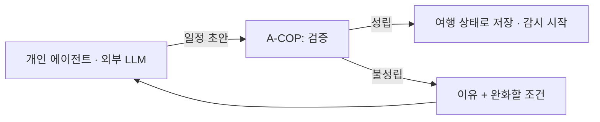

# A-COP 구현계획서 v10 — 여행 지속관리 CS 플랫폼

## 0. 문서 상태

| 항목 | 값 |
|---|---|
| 판 | **v10** (2026-09-08 판올림). v9 이하는 보존본 |
| 무엇이 바뀌었나 | **도메인이 커머스 CS → 여행 CS 로 교체됐다.** 코어 계약·생명주기·동시성·감사·평가 도구는 승계하고, Team 모듈과 도메인 데이터는 전량 신규다 |
| 왜 바뀌었나 | 팀이 최종 주제로 후보 E(여행 전체를 관리하는 AI API 서비스)를 결정했다 (2026-09-08) |
| 근거 문서 | `team_branch/me/여행/_최종주제_후보비교_v4_2026-09-08.md` (팀 결정·MVP 범위)<br>`team_branch/me/travel-agent-business-review_v3.md` (사업성·원가·경쟁·인프라 근거) |
| 이 문서의 역할 | **범위·결정·일정.** 세부 설계와 운영 사실은 `wiki/` 가 정본이다 |
| 남은 기간 | 2026-09-08 기준 최종발표(10-26)까지 **7주** |

### 0-1. 한 줄 정의

> **가고 싶은 곳과 예약을 주면 전체 여행이 성립하는지 검증하고, 여행이 끝날 때까지 상황 변화를 먼저 감지해 남은 일정을 조정하는 여행 CS 플랫폼.**

계획을 *만드는* 것은 우리 일이 아니다. 고객의 개인 에이전트(OpenClaw·Hermes 등)나 외부 LLM 이 만든 일정을 받아, **그 계획이 현실에서 성립하는지 검증하고 여행 종료까지 지켜본다.**

### 0-2. v9 에서 무엇을 가져오고 무엇을 버리나

★**이 표가 이 판올림의 실체다.** "여행으로 바꿨다"만 적으면 무엇을 다시 만들어야 하는지 알 수 없다.

| v9 자산 | v10 처리 | 근거 |
|---|---|---|
| Case 생명주기 12 상태 (§19) | **승계 + 확장** — 시스템 발기(發起) Case 를 위해 `trigger_source` 추가 | 아래 §4-B |
| 통합 계약 (`CaseStatus`·`NextAction`·`Evidence`·`ActionProposal`·`TeamResult`) | **승계. 필드 변경 없음** | 계약을 바꾸면 코어를 다시 검증해야 한다 |
| Controller · TeamExecutorPort · Registry | **승계** | Team 만 갈아 끼우는 구조가 이 판올림의 전제다 |
| 동시성·정합성 (낙관적 잠금·idempotency·outbox) | **승계** | §6 |
| 근거 대조 · 승인 게이트 (D-005) | **승계하되 적용 범위를 나눈다** | ★§4-C — 여행 Pre-CS 와 충돌한다 |
| 감사 기록 · tenant 격리 · RLS | **승계** | |
| 평가 하네스 (A/B/Proposed·judge·방어 지표) | **승계. 정답 시나리오만 교체** | §8 |
| Composer (응답 문구 소재) | **승계. 소재를 영어 통지 문구로 교체** | |
| 커머스 Team 4종 (Procurement+Order&Payment, Fulfillment&Logistics, Return&Refund, Catalog&Verification) | **MVP 경로에서 제외.** 등록은 남겨도 되나 호출되지 않는다 | v4 §3-7 |
| VOC & Store Manager Team | **제외** | 도메인이 사라졌다 |
| Response Generation & Review Team | **원칙만 승계** — 생성과 검수를 다른 주체가 한다 | §5 각 Team 내부 규칙으로 흡수 |
| 커머스 도메인 데이터 (주문·배송·반품) | **제외** | |
| 인라인 분류 라벨 어휘 | **교체** — §5-A |

### 0-3. 아직 정하지 않은 것

`[미확보]` 로 표시한다. 모르는 것을 정한 것처럼 적지 않는다.

| 항목 | 누가 정하나 | 언제까지 |
|---|---|---|
| MVP 대상 도시 (서울 권장) | 팀 | 1주차 |
| 지원 언어 범위 — 영어 1개로 시작하나 방한 상위 국가는 중국·일본·대만이다 | 팀 | 1주차 |
| 액티비티 운영 변경 정보를 어디서 받나 (공지 수집 vs 업체 연결) | 도시 선정 후 표본 조사 | 2주차 |
| 인바운드 전제의 손익 재계산 (해외 카드 수수료·환율·영어 채널 획득비) | 결제 수단 결정 뒤 | MVP 이후 |
| 59,000원 수용 여부 | 유료 파일럿 20~30팀 | MVP 이후 |

---

## 1. 프로젝트명과 대상

| 항목 | 값 |
|---|---|
| 프로젝트명 | **A-COP** (AI Customer Operations Platform) — 이름은 유지한다. 코어가 그대로이기 때문이다 |
| 제품 정의 | 여행 지속관리 CS 플랫폼 |
| **1순위 고객** | **처음 한국에 자유여행을 오는 외국인 개인·친구 그룹 (인바운드)** |
| 2순위 | 가족·소그룹 |
| 판매 형태 | 팀당 여행 이용권. 기준 상품 7일·4인·2도시 **59,000원**(VAT 포함) |
| 접점 | 고객의 개인 에이전트. 우리는 **API 로만** 만난다. 자체 앱·음성(STT/TTS)은 만들지 않는다 |

**왜 인바운드인가.** 2025년 방한 외래객이 1~11월 누적 1,741만 명으로 2019년 수준을 회복했고 개별여행 비중이 82.9%다 `[외부]`. 인바운드 대상이면 국내 공공 데이터(TourAPI)가 곧 대상 데이터라 데이터 접근이 다른 여행 시장보다 쉽다.

★**사업 검토서(v2/v3)의 고객 근거는 한국인 해외여행 고객의 것이다.** 인바운드에는 유추 근거로만 쓴다. 인바운드 대상 유료 설계·관리 상품 사례는 `[미확보]` 다.

---

## 2. 문제 정의

가고 싶은 곳과 예약은 있지만 이동·식사·동행 조건까지 맞춰 전체 여행을 짜기 어렵다. **그리고 여행이 시작된 뒤가 더 어렵다** — 휴무·지연·기상 변화가 생기면 남은 예약과 동선을 고객이 다시 계산해야 한다.

인바운드 고객은 여기에 두 가지가 더 얹힌다. 한국어 중심 플랫폼에서 정보를 얻기 어렵고, 예약 변경이 생기면 현지 연락처로 혼자 풀어야 한다.

---

## 3. 프로젝트 목표

| # | 목표 | 검증 방법 |
|---|---|---|
| 1 | 외부가 만든 일정을 받아 **성립 여부를 코드로 판정**한다 | 필수 조건 위반 0건, 불가능한 일정 탐지율 |
| 2 | 판정 결과에 **근거와 확인 시각**을 붙인다. 모르면 '미확인'으로 돌려준다 | 확인 시각 표시율 100% |
| 3 | 여행 종료까지 **변화를 먼저 감지**해 조정하고 통지한다 | 감지→통지 시간, 통지 전 재검증 통과율 100% |
| 4 | 고객이 거부하면 **되돌린다** | 거부→되돌림 성공률 |
| 5 | 자동 처리 한계를 만나면 **사람에게 넘긴다** | 인계 건의 근거 첨부율 |
| 6 | **업체 건은 승인 없이 실행하지 않고 변경 링크로 넘긴다** | 링크 생성률, 링크에 담긴 대안·차액 |
| 7 | **협약사 자동 실행은 시뮬레이션으로 보여준다** | Mock 공급자 한정 동작, 실제 공급자 자동 실행 0건 |

★**3·6 은 실제 동작, 7 은 시연이다.** 감지해서 우리 일정을 고쳐도(3) 업체 예약은 승인이 필요하므로 링크로 넘긴다(6). 협약이 되면 그 구간이 사라지는데(7), 그건 Mock 공급자에서만 보여준다. 지금 규칙과 미래상을 섞어 말하지 않는다.

★**목표 3이 이 제품의 정체성이다.** 일반적인 CS 는 고객이 문제를 알린 뒤 고쳐 준다. 우리는 반대다 — 우리가 먼저 알아채고 조정한 뒤 통지하고, 고객은 마음에 들지 않을 때만 말한다.

---

## 4. 핵심 설계 결정

### 4-A. 계획 생성은 우리 일이 아니다



계획 생성기를 만들면 트리플·Mindtrip·범용 에이전트와 정면으로 겹친다. 우리 가치는 **계획이 현실에서 성립하는지 확인하는 데** 있다.

### 4-B. Case 는 사람이 아니라 시스템도 발기(發起)한다

v9 의 Case 는 전부 고객 요청에서 시작한다. 여행에서는 **감시가 Case 를 만든다.**

```python
class TriggerSource(str, Enum):
    CUSTOMER = 'customer'      # 고객·에이전트 요청 (v9 와 같음)
    SCHEDULE = 'schedule'      # 다음 확인 시점 도래
    SUPPLIER = 'supplier'      # 업체 이벤트 (MVP 에서는 Mock)
```

`Case` 에 `trigger_source` 와 `trip_id` 를 더한다. **상태 12종은 그대로 쓴다** — 시스템이 만든 Case 도 classifying → routing → running 을 똑같이 지난다.

★새로 필요한 집합체는 **Trip** 하나다. Case 는 여행 중 여러 번 생기고 끝나지만, Trip 은 여행 시작부터 종료까지 산다.

### 4-C. ★실행 경계

**기본 규칙: 업체 예약은 승인 없이 실행하지 않는다.** v9 §9-E·D-005 그대로다.
Pre-CS(먼저 조정하고 통지)는 **우리 DB 안의 일정 버전에만** 적용한다.

업체가 걸리면 두 경우뿐이다.

| # | 경우 | 처리 | 지금 상태 |
|---|---|---|---|
| **1** | **협약사** 예약 변경·취소 | 위임 범위 안이면 사람을 멈추지 않고 실행하고 통지 | **시뮬레이션 범위** — Mock 공급자에서만 동작한다 |
| **2** | **비협약사** 또는 위임 범위 밖 | 실행하지 않고 **변경 링크**(바꿀 항목·대안·차액)로 넘긴다 | **실제 동작** |

★**1번은 "협약이 되면 이렇게 된다"를 보여주는 것이지 지금의 운영 규칙이 아니다.**
실제 공급자에는 승인 필수 규칙이 그대로 적용된다.

**안전장치.** 자동 실행 분기는 `supplier.tier == 'simulated'` 일 때만 열린다.
실제 공급자가 등록되면 그 건은 승인 경로로 간다. 아키텍처 테스트로 막는다(DoD-14·15).

#### 위임 범위 (1번에서 쓴다)

| 항목 | 예 |
|---|---|
| 금액 상한 | 여행 전체 N원, 건당 M원 |
| 대상 종류 | 액티비티·식사는 위임, 항공·숙박은 제외 |
| 되돌림 조건 | 무료 취소 구간 안에서만 |
| 횟수 | 같은 항목 재변경 K회까지 |

하나라도 벗어나면 2번으로 내려간다. 위임은 언제든 좁히거나 철회할 수 있다.
자동 실행은 무엇을·왜·얼마에·되돌림 기한까지 기록한다.

#### 2번은 빈손으로 넘기지 않는다

> "10/03 인천→후쿠오카 편이 결항됐습니다. 같은 날 15:20 편이 있고 차액은 +42,000원입니다.
> 그날 15시 액티비티는 17시로 옮겨 두었습니다. 항공권 변경은 아래 링크에서 진행해 주세요."

우리 일정 버전은 이미 고쳐 두고 업체 건만 링크로 넘긴다.

#### 되돌림

일정 버전은 **불변(append-only)** 이다. 되돌리기는 이전 버전을 복사해 새 버전을 만드는 것이지
버전을 지우는 것이 아니다.

★업체 예약의 되돌림은 다르다. 우리 DB 는 되돌리면 끝이지만 업체 예약은 **보상 거래**가 필요하고
실패할 수 있다. 시뮬레이션에서도 되돌림 시도를 상태로 남기고, 실패하면 사람에게 넘긴다.

### 4-D. 사실과 생성을 분리한다

| 종류 | 처리 |
|---|---|
| 계산으로 판정 가능 | 예약 시간 충돌·이동 여유·예산 합계·필수 조건 누락 → **코드가 판정한다. LLM 을 부르지 않는다** |
| 확인 수준을 높일 수 있음 | 오늘 영업·운행 여부 → **출처와 확인 시각을 같이 저장한다** |
| 모름 | 현재 대기·실제 혼잡 → **'미확인'으로 표시한다. 모델이 채워 넣지 못하게 한다** |

`currentOpeningHours` 는 오늘부터 7일의 제공자 데이터이지 조회 순간의 개점 확인이 아니다. **재조회 시각을 현장 관찰 시각처럼 표시하지 않는다.**

---

## 5. Team 모듈 구성

Team 은 지역 상품이 아니라 **여행을 구성하는 객체 종류별**로 나눈다. 도시를 늘리는 것은 데이터 추가이고, Team 을 늘리는 것은 객체 종류 추가다.

각 Team 은 셋을 갖는다 — ① 검증 규칙 ② 감시 소스 ③ 재계획 후보 생성. **전체 일정 정합성(시간 충돌·예산·이동 여유)은 Team 이 아니라 코어 검증 층이 본다.**

| 순서 | Team | 검증 규칙 | 감시 소스 | 재계획 |
|---|---|---|---|---|
| **1 · MVP 필수** | **Activity** | 예약 시간·운영일·인원·날씨 조건·취소/환급 규정 | 운영 공지, 기상청 초단기예보, 예약 확인 | 같은 시간대 대체, 날짜 이동, 환급 안내 |
| 2 | **Dining** | 영업시간·휴무·예약 여부·동행 조건(아이·할랄·채식) | 영업 공지, Places 영업시간 | 인접 대안, 식사 시간 이동 |
| 3 | **Mobility** | 구간 이동 시간·환승·막차·여유 | 운행 정보, Routes | 경로·순서 재배열 |
| **1 과 함께 · MVP 필수** | **Booking Handoff** | 승인이 필요한 건을 특정하고 대안·차액을 정리한다. **시연 모드에서는** 위임 범위 대조·위약금 계산도 한다 | 예약 확인, Mock 공급자 | 변경 링크 생성. **시연 모드 한정**으로 Mock 예약 변경 |
| 등록만 | Lodging / Flight | 잠긴 예약으로만 취급한다 | — | — |

★**Booking Handoff 가 등록만에서 MVP 필수로 올라왔다**(팀 결정 2026-09-08). 감지해서 우리 일정을 고쳐도 업체 예약을 못 바꾸면 고객이 결국 직접 처리하므로, **무엇을 어떻게 바꿔야 하는지 정리해 넘기는 것**까지가 제품이다.

★**이 Team 은 판정만 하고 실행은 코어 Action 층이 한다.** Team 이 side effect 를 직접 실행하지 않는다는 규칙(§6)은 그대로다.

★**시연 모드는 이 Team 안에 갇힌다.** Mock 공급자일 때만 위임 범위를 대조해 자동 실행 제안을 만들고, 실제 공급자면 그 분기에 들어가지 않는다. 이름을 Execution 이 아니라 **Handoff** 로 둔 것도 기본 동작이 인계이기 때문이다.

**왜 Activity 가 첫째인가.** 취소·변경 규정이 문서로 존재해 판정 규칙을 바로 쓸 수 있고(후보 B 조사의 우천 취소 규정 틀을 그대로 쓴다), 예약금이 걸려 실패 비용이 크다.

인바운드 액티비티 예시: 템플스테이, 한강 수상 액티비티, 공연·뮤지컬, 테마파크, 겨울 스키·눈썰매, 쿠킹 클래스.

★**각 Team 안에서 판정(코드)과 대안 생성(LLM)을 분리한다.** 생성한 대안은 판정을 **다시 통과해야** 통지된다. v9 의 Response Generation & Review 원칙을 Team 내부 규칙으로 흡수한 것이다.

### 5-A. 코어에서 바뀌는 것

| 부품 | v9 | v10 |
|---|---|---|
| 코어 1 분류 라벨 | 주문·배송·반품·교환·기타 | **일정 제출 / 사건 신고 / 확인 요청 / 조정 거부 / 그 외** |
| Context Broker | 주문·배송 정보를 싣는다 | **여행 상태**(최신 일정·잠긴 예약·필수 조건·다음 확인 시점)를 싣는다 |
| 코어 2 Action | 주문 조회·배송 조회·환불 실행 등 | **장소·운영 조회 / 이동 시간 조회 / 기상 조회** 세 개 (Mock 허용) |
| Composer 소재 | 한국어 CS 문구 | **영어 통지 문구** + 운영자용 한국어 |

---

## 6. 승계하는 코어 규칙

바꾸지 않는다. 바꾸면 코어를 다시 검증해야 한다.

| 규칙 | 내용 |
|---|---|
| 낙관적 동시성 | `UPDATE ... WHERE version = %(expected_version)s`. 파이썬 선검사와 SQL 조건을 **둘 다** 유지한다 |
| Idempotency | `action_requests UNIQUE(tenant_id, idempotency_key)` |
| 이벤트 순서 | `case_events UNIQUE(case_id, aggregate_version)` |
| 발행 중복 방지 | `outbox UNIQUE(tenant_id, topic, dedupe_key)` — `tenant_id` 를 뺀 옛 제약을 쓰지 않는다 |
| Team 은 side effect 를 실행하지 않는다 | `ActionProposal` 로 코어에 돌려준다 |
| Core 계층은 도메인 어휘를 모른다 | 아키텍처 가드가 막는다. 여행 어휘도 `app/modules/` 안에 둔다 |
| 근거 없는 문장을 답변에 넣지 않는다 | 모든 핵심 주장에 `Evidence` 를 붙인다 |

---

## 7. 데이터

| 구분 | 확보 난이도 | 출처 | MVP 처리 |
|---|---|---|---|
| 국내 관광지·행사·숙박 기본 정보 | 쉬움 | TourAPI (공공데이터포털, 무료) | **직접 사용** |
| 액티비티 운영·취소·환급 규정 | 공개 | 액티비티 약관, 소비자분쟁해결기준 | **판정 규칙으로 코드화** |
| 기상 | 공개 | 기상청 초단기예보·관측 | **직접 사용** |
| 장소 영업시간·리뷰 | 유료·조건부 | Google Places (오늘 포함 7일, 리뷰 관련성 순 최대 5개, 캐싱·표시 조건 있음) | **소량 호출 또는 Mock** |
| 이동 시간 | 유료 | Routes API (출발×도착 **요소** 단위 과금) | **소량 호출 또는 Mock** |
| 임시 휴무·현재 대기·실제 동선 성과 | 어려움 | 현장 제보·업체 확인 | **합성 시나리오로 대체** |
| 항공·숙박 예약 실데이터 | 제한 | Amadeus Self-Service 포털 2026-07-17 폐쇄, Skyscanner 는 승인 파트너 전용, Duffel 은 종량제 | **잠긴 예약으로만 취급** |
| 여행 예약·일정 | 없음 | — | **합성 20~30건 + 사건 시나리오 10개** |

★**팀 보유 자산 중 쓰이는 것:** 번역 성능 비교 자료(`datasets/mt/*`)가 인바운드 영어 응대 검토에 바로 쓰인다. 커머스 주문 기록(`datasets/commerce/*`)은 이 도메인에서 쓰지 않는다.

★**데이터 사용 권한을 비용 절감의 근거로 쓰지 않는다.** Places 리뷰 원문을 장기 저장해 자체 데이터셋으로 만드는 권한은 자동으로 생기지 않는다. 표시 조건은 개인 에이전트 화면에서도 충족해야 한다.

---

## 8. 평가 계획

v9 의 평가 하네스를 그대로 쓰고 **정답 시나리오만 교체**한다.

| 지표 | 무엇을 재나 | MVP 목표 |
|---|---|---|
| 필수 조건 위반률 | 잠긴 예약·동행 조건을 깨뜨렸나 | **0건** |
| 통지 전 재검증 통과율 | 우리가 만든 대안이 판정을 다시 통과했나 | **100%** |
| 확인 시각 표시율 | 근거에 확인 시각이 붙었나 | **100%** |
| 감지→통지 시간 | 변화를 알아채고 알리기까지 | 측정 |
| 거부→되돌림 성공률 | 고객이 거부했을 때 이전 버전으로 돌아갔나 | 측정 |
| 적절한 기권율 / 과잉 기권율 | 모를 때 모른다고 하나 / 알 수 있는데 넘기나 | **둘 다 본다** |

★**기권 두 지표는 반드시 같이 본다.** 하나만 보면 "전부 사람에게 넘김"이 만점이 되거나 "전부 자동 처리"가 만점이 된다.

★**judge 를 그대로 믿지 않는다.** 커머스 도메인에서 judge v3 의 `policy_grounding` 이 독립 읽기 둘과 3점 넘게 어긋났고, `answer` 가 `null` 인 건에 `correctness` 만점을 주는 것이 확인됐다. **여행 시나리오로 교체할 때 루브릭의 "답이 없을 때" 규칙을 먼저 채운다.**

---

## 9. 구현 단계

| 단계 | 범위 | 이 프로젝트에서 |
|---|---|---|
| **1. 계획과 검증** | 일정 수신·저장, 예약·이동·예산 검사, 출처·확인 시각 표시, 에이전트 API | **MVP — 여기까지 한다** |
| 2. 현장 유료 검증 | 한 도시 20~30팀 파일럿 | 이후 |
| 3. 데이터·지역 확장 | 수행 결과 누적, 커버리지 확대 | 이후 |
| 4. 거래 실행 | 계약된 업체부터 결제·변경·취소 | 이후 |

### 9-A. MVP 범위 (7주)

| 항목 | 최소 범위 | 이번엔 뺀다 |
|---|---|---|
| 고객·지역 | 인바운드 외국인 개인·친구 그룹, 국내 1도시 | 다도시, 가족, 한국인 해외여행 |
| 언어 | **영어 1개** + 운영자용 한국어 | 중국어·일본어 |
| 계획 생성 | **만들지 않는다** | 자체 추천·생성기 |
| 검증 API | 엔드포인트 하나 — 코드 검증 / 확인 수준·시각 / 불가능 사유·완화 조건. 결과는 `ActionProposal` | OR-Tools 최적화, 보행·피로 모델 |
| 상태 저장 | Trip 1건 = 최신 일정 버전 + 잠긴 예약 + 필수 조건 + 다음 확인 시점 + 통지·거부 이력 | 동시 수정 충돌 처리, 백업·복구 |
| 지속 관리 루프 | 로컬 주기 작업. 최소 주기 = 출발 전날 / 매일 아침 / 각 예약 2시간 전 | 업체 웹훅, 클라우드 스케줄러 |
| 선제 조정 | 변화 감지 → 재계획 → 재검증 → 통지 → 거부 시 되돌림 | 대안 동시 제시 |
| **업체 건 인계** | **바꿔야 할 것·대안·차액을 정리한 변경 링크 생성.** 우리 일정은 먼저 고쳐 두고 업체 건만 넘긴다 | 링크 클릭 이후 추적, 예약 완료 자동 확인 |
| **협약사 자동 실행 (시연)** | **Mock 공급자 한정.** 위임 범위 저장·대조, 범위 안이면 승인 대기 없이 Mock 예약 변경 후 통지. `tier=='simulated'` 게이트 | 실제 업체 계약·연동, 실결제 |
| 사람 인계 | 검증 실패·근거 충돌·거부 후 대안 없음 → 사람 검토 상태 | 상담 상품 |
| 외부 연결 | 텍스트 API + 여행별 토큰. 개인 에이전트 1종 연결 시연 | 다중 에이전트, 음성 |
| 인프라 | **로컬 실행 + 외부 LLM API** | Cloud Run·Supabase 배포 |

### 9-B. 7주 배분 `[추정]`

| 주 | 무엇 |
|---|---|
| 1 | 도시·언어 결정, 코어 라벨 교체, Trip 상태 저장, Action 3종(Mock) |
| 2~3 | **Activity Team** — 판정 규칙, 감시 소스, 재계획 후보 |
| 4 | Dining Team |
| 5 | Mobility Team + **선제 조정 루프**(감지→재검증→통지→되돌림) |
| 6~7 | 평가 시나리오 교체·측정, 발표 준비 |

★근거 없는 배분이다. 1주차가 끝나면 실측으로 다시 잡는다.

---

## 10. 리스크

| 리스크 | 왜 생기나 | 대응 |
|---|---|---|
| **감시 소스가 없다** | 액티비티 운영 변경을 어디서 받는지 아직 모른다 `[미확보]` | 1~2주차에 도시 표본 조사. 없으면 **Mock 이벤트로 루프를 증명**하고 그 사실을 명시 |
| **시연 경로가 실제 공급자에 닿음** | 자동 실행 분기가 Mock 밖으로 새면 **고객 돈이 나간다** | `tier == 'simulated'` 게이트를 아키텍처 테스트로 강제(DoD-14·15) |
| **시뮬레이터를 실적으로 오해** | Mock 으로 잘 도는 것을 "예약 자동화 완성"으로 읽을 수 있다 | 산출물마다 시연임을 표시. 기본 규칙은 승인 필수라고 함께 적는다 |
| **되돌림 실패** | 업체 예약은 보상 거래가 필요하고 실패할 수 있다 | 되돌림 시도를 상태로 남기고 실패하면 사람에게 넘긴다(DoD-21) |
| 언어 범위 | 영어만 지원하면 방한 상위 국가(중국·일본·대만) 고객이 빠진다 | **시연 범위를 좁히는 선택이며 시장 판단이 아니다**라고 문서에 명시 |
| 도메인 교체로 평가 자산 무효화 | 커머스 골든셋이 못 쓰인다 | 하네스는 승계, 시나리오만 교체. judge 루브릭 구멍 먼저 수리 |
| 7주 안에 Team 3개 | 배분이 추정이다 | Activity 하나만으로도 루프가 성립하도록 설계. Dining·Mobility 는 절삭 가능 |

---

## 11. 심사 대응

| 질문 | 답 |
|---|---|
| "일정 생성 앱과 뭐가 다른가" | 생성을 하지 않는다. **성립 검증과 종료까지의 지속 관리**가 제품이다 |
| "그건 트리플·Mindtrip 도 하지 않나" | 일정 생성·수정·여행 중 추천은 한다. 우리가 겨냥하는 공백은 **외부 개인 에이전트의 맥락을 받아 여행 종료까지 선제 관리 루프를 운영하는 것**이다. 사용자 직접 관찰에서 Mindtrip 의 자동 추적·외부 에이전트 연동은 확인되지 않았다 — 다만 **기능 부재가 입증된 것은 아니다** |
| "왜 승인 없이 일정을 바꾸나" | 우리 DB 의 일정 버전은 되돌릴 수 있다. **업체 예약과 결제는 승인 없이 건드리지 않는다**(§4-C) |
| "데이터는 있나" | 국내 기본 정보와 액티비티 규정·기상은 공개다. 예약·현장 데이터는 **합성**이며 그렇게 표시한다 |
| "성능이 더 낫다는 근거는" | **아직 없다.** 비교 시험은 수행하지 않았다. MVP 통과 기준은 §8 이다 |

---

## 12. 완료 기준 (DoD)

| # | 항목 | 판정 |
|---|---|---|
| 1 | 외부 일정을 받아 저장하고 최신 버전을 반환한다 | 자동 |
| 2 | 예약 시간 충돌·이동 여유·예산·동행 조건을 코드로 판정한다 | 자동 |
| 3 | 불가능한 일정을 이유와 완화 조건을 붙여 거절한다 | 자동 |
| 4 | 모든 판정 근거에 출처와 확인 시각이 붙는다 | 자동 |
| 5 | 확인할 수 없는 것을 '미확인'으로 반환한다 | 자동 |
| 6 | 다음 확인 시점이 도래하면 시스템이 Case 를 만든다 | 자동 |
| 7 | 변화를 감지해 재계획하고 **재검증을 통과한 뒤에만** 통지한다 | 자동 |
| 8 | 고객이 거부하면 이전 일정 버전으로 되돌린다 | 자동 |
| 9 | 되돌림 후에도 이력이 남는다 (append-only) | 자동 |
| 10 | 자동 처리 한계에서 근거를 붙여 사람에게 넘긴다 | 자동 |
| 11 | 다른 여행의 상태에 접근할 수 없다 | 자동 |
| 12 | 같은 변경을 두 번 받아도 일정이 두 번 바뀌지 않는다 | 자동 |
| 13 | Team 이 side effect 를 직접 실행하지 않는다 | 아키텍처 테스트 |
| 14 | **실제 공급자에는 자동 실행이 걸리지 않는다.** 승인 경로로 간다 | 아키텍처 테스트 |
| 15 | **자동 실행 분기는 `tier == 'simulated'` 에서만 열린다** | 아키텍처 테스트 |
| 16 | 업체 건은 실행하지 않고 변경 링크를 만든다 | 자동 |
| 17 | 변경 링크에 바뀔 항목·대안·차액이 들어 있다 | 자동 |
| 18 | (시연) 위임 범위를 벗어난 자동 실행이 0건이다 | 측정 |
| 19 | (시연) 위임을 철회하면 진행 중인 자동 실행이 멈춘다 | 자동 |
| 20 | (시연) 자동 실행에 무엇을·왜·얼마에·되돌림 기한이 기록된다 | 자동 |
| 21 | (시연) 되돌림이 실패하면 사람에게 넘어간다 | 자동 |
| 22 | 평가 시나리오에서 필수 조건 위반 0건 | 측정 |

★**14·15 번이 §4-C 를 지키는 장치다.** 기본 규칙은 승인 필수이고, 자동 실행은
Mock 공급자에만 열린다. 문서로만 두면 지켜지지 않는다.

★**18~21 은 "(시연)" 을 붙여 둔다.** 시연 경로의 판정이므로 실제 운영 성능으로 읽히면 안 된다.

---

## 13. 참고

- 팀 결정과 MVP 범위: `team_branch/me/여행/_최종주제_후보비교_v4_2026-09-08.md`
- 사업성·원가·경쟁·인프라 근거: `team_branch/me/travel-agent-business-review_v3.md`
- 주제 후보 전체 목록: `team_branch/me/여행/_주제아이디어_목록_20260908.md`
- 승계하는 코어 설계: `program/plan/A-COP_구현계획서_v9.md` §8·§19·§20·§21
- 세부 설계·운영 사실: `wiki/`
