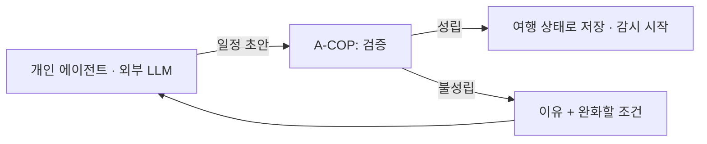

# A-COP 구현계획서 v11 — 여행 지속관리 CS 플랫폼

## 0. 문서 상태

| 항목 | 값 |
|---|---|
| 판 | **v11** (2026-09-10 판올림). **v10 은 보존본으로 `program/plan/` 에 그대로 둔다** — 인용한 문서가 여럿이다. v9 이하도 보존본 |
| 무엇이 바뀌었나 | **도메인은 그대로 여행 CS 다.** 09-08 이후 정한 여행 전환 결정을 기준선에 올렸다 — 라우팅 축 · 분류 어휘 값 · 실행 대상 식별 · 조건 보존 · 지속 관리 루프 · 알림 채널 · 데이터 구분 · DB 도메인 표 · 대표 시나리오 · 화면. 목록은 §0-2A |
| 왜 바뀌었나 | **v10 §5-A 가 정한 분류 라벨로는 Case 가 Team 에 도달하지 못한다**(2026-09-09 실행으로 확인). 기준선 자체의 오류이므로 개정 없이는 뒤따르는 설계 문서들이 기준선과 다른 말을 하게 된다 |
| 근거 문서 | `team_branch/me/여행/_최종주제_후보비교_v4_2026-09-08.md` (팀 결정·MVP 범위)<br>`team_branch/me/travel-agent-business-review_v3.md` (사업성·원가·경쟁·인프라 근거)<br>여행 전환 설계 문서 다섯 — §13 |
| 이 문서의 역할 | **범위·결정·일정.** 세부 설계와 운영 사실은 `wiki/` 가 정본이다 |
| 남은 기간 | 2026-09-10 기준 최종발표(10-26)까지 **6주 4일** |
| **판올림 뒤 갱신** | `[2026-09-10 오후]` **팀장이 §0-3 의 아홉 중 여덟을 정했다.** 같은 날이라 판을 올리지 않고 §0-4 에 적고 본문에 반영했다. **절 번호는 하나도 안 바꿨다** — 인용하는 문서가 있다 |

### 0-1. 한 줄 정의

> **가고 싶은 곳과 예약을 주면 전체 여행이 성립하는지 검증하고, 여행이 끝날 때까지 상황 변화를 먼저 감지해 남은 일정을 조정하는 여행 CS 플랫폼.**

계획을 *만드는* 것은 우리 일이 아니다. 고객의 개인 에이전트(OpenClaw·Hermes 등)나 외부 LLM 이 만든 일정을 받아, **그 계획이 현실에서 성립하는지 검증하고 여행 종료까지 지켜본다.**

### 0-2. v9 에서 무엇을 가져오고 무엇을 버리나

★**이 표는 v10 판올림(커머스 → 여행)의 실체다.** "여행으로 바꿨다"만 적으면 무엇을 다시 만들어야 하는지 알 수 없다. **v11 은 이 표를 하나도 바꾸지 않았다** — 무엇을 승계하고 버리는지는 그대로다. v11 이 바꾼 것은 아래 §0-2A 다.

| v9 자산 | v10·v11 처리 | 근거 |
|---|---|---|
| Case 생명주기 12 상태 (§19) | **승계 + 확장** — 시스템 발기(發起) Case 를 위해 `trigger_source` 추가 | 아래 §4-B |
| 통합 계약 (`CaseStatus`·`NextAction`·`Evidence`·`ActionProposal`·`TeamResult`) | **승계. 필드 변경 없음** | 계약을 바꾸면 코어를 다시 검증해야 한다 |
| Controller · TeamExecutorPort · Registry | **승계** | Team 만 갈아 끼우는 구조가 이 판올림의 전제다 |
| 동시성·정합성 (낙관적 잠금·idempotency·outbox) | **승계** | §6 |
| 근거 대조 · 승인 게이트 (D-005) | **승계하되 적용 범위를 나눈다** | ★§4-C — 여행 Pre-CS 와 충돌한다 |
| 감사 기록 · tenant 격리 · RLS | **승계** | |
| 평가 하네스 (A/B/Proposed·judge·방어 지표) | **승계. 정답 시나리오만 교체** | §8 |
| Composer (응답 문구 소재) | **승계. 소재를 한국어 통지 문구로 교체** `[2026-09-10 정정]` v10·v11 초판은 「영어」였다 — 언어 결정(§0-4)으로 바뀌었다 | §1 |
| 커머스 Team 4종 (Procurement+Order&Payment, Fulfillment&Logistics, Return&Refund, Catalog&Verification) | **MVP 경로에서 제외.** 등록은 남겨도 되나 호출되지 않는다 | v4 §3-7 |
| VOC & Store Manager Team | **제외** | 도메인이 사라졌다 |
| Response Generation & Review Team | **원칙만 승계** — 생성과 검수를 다른 주체가 한다 | §5 각 Team 내부 규칙으로 흡수 |
| 커머스 도메인 데이터 (주문·배송·반품) | **제외** | |
| 인라인 분류 라벨 어휘 | **교체** — §5-A | 값은 §5-B (v11 에서 확정) |

### 0-2A. v10 에서 무엇이 바뀌었나

★**v10 을 지우지 않는다.** 그 판을 인용하는 문서가 여럿이고, **무엇이 달라졌는지는
이 표가 말한다.** 두 판을 나란히 두면 "어느 쪽이 맞나" 를 사람이 매번 판정하게 된다.

| 항목 | v10 | v11 | 왜 바꿨나 |
|---|---|---|---|
| 코어 1 분류 라벨 | 한국어 다섯만 적었다 | **ASCII 슬러그 다섯** — `itinerary_submit` · `incident_report` · `confirm_request` · `adjust_reject` · `other` | 값이 프롬프트·DB·평가셋을 오간다. 한국어를 넣으면 인코딩이 붙는다 |
| 라우팅 축 | 적혀 있지 않았다 | **두 축을 다 쓴다** — `case_type` 은 객체 종류, `intent` 는 요청 종류 | v10 의 다섯은 객체 종류가 아니라서 **여섯 팀 중 어느 곳에도 안 갔다** |
| `case_type` 을 어디서 얻나 | 없었다 | **`issue_code` 의 접두에서 뽑는다** | 계약에 칸을 새로 만들면 Registry·A2A·평가 하네스가 다 걸린다 |
| `issue_code` 어휘 | 적혀 있지 않았다 | **여행 17개**(§5-B). 접두는 객체 종류 | 코드에 커머스 값이 그대로 남아 있었다 |
| 분류 어휘의 자리 | 코드 상수 | **`config/` 선언 하나에서 셋이 나온다** — 프롬프트 · 출력 검증 · 라우팅 | 프롬프트에 커머스 어휘가 **따로** 박혀 있었다. 상수만 바꾸면 프롬프트는 계속 커머스를 말한다 |
| capability 선택 | 적혀 있지 않았다 | **팀이 `select_capability` 로 고른다.** 필요한 팀 넷 중 하나만 있다 | 축을 바꾸면 **있는 훅이 조용히 멈춘다** — 실패해도 `None` 이라 아무도 모른다 |
| 멱등 키의 `business_subject` | 적혀 있지 않았다 | **서버가 확인한 대상 객체 id** (§4-E) | `case_id` 고정이라 한 Case 의 둘째 제안이 **소리 없이 사라진다** |
| 일정 항목의 조건 | 적혀 있지 않았다 | **`scope` 칸 하나로 Trip 조건과 항목 조건을 같이 보존한다** (§7-B) | 조건을 잃으면 **필수 조건을 위반한 일정을 정상으로 판정한다** |
| 지속 관리 루프 | "로컬 주기 작업" 한 줄 | **루프 둘 — 감시와 배달** (§6-A) | 하나로 합치면 감시가 막힐 때 배달도 멈춘다 |
| 알림 채널 | 적혀 있지 않았다 | **무료 채널 하나(디스코드 웹훅)로 고객에게 직접 통지** `[2026-09-10 오후 정정]` 이 표의 초판은 「시연 출력」이라고 적었다 | 7주에 세 채널을 만들 이유가 없다. 오류·재시도·중복은 채널마다 공짜가 아니다 |
| 데이터 구분 | 출처별 표 하나 | **API · RAG · 합성 셋으로 가른다** (§7-A) | 안 가르면 규정을 API 로 조회하려 들고 영업시간을 RAG 에 넣는다 |
| DB 도메인 표 | 적혀 있지 않았다 | **19표 중 5표만 갈아낀다** (§7-B) | 코어 14표를 건드리면 "코어 승계" 라는 전제가 무너진다 |
| 대표 시나리오 | 적혀 있지 않았다 | **「비 와서 액티비티가 깨진다」** 8단계 (§8-A) | MVP 필수 Team 둘을 한 번에 보여주고 승인 경계가 자연스럽게 나온다 |
| 화면 | 적혀 있지 않았다 | **넷** — 일정 · 사건 · 승인 · 추적 (§9-C) | 넷 중 둘이 이미 있다. 새로 만들 것은 「일정」 하나다 |
| DoD | 22항목 | **24항목** — 라우팅 도달성과 제안 분리를 더했다 | 이번 판에서 **실제로 뚫려 있던 두 자리**다 |

★**이 표의 오른쪽 칸이 v11 의 실체다.** "여행 결정을 반영했다" 만 적으면 무엇을
다시 읽어야 하는지 알 수 없다. v10 §0-2 가 같은 이유로 만든 표다.

### 0-3. 아직 정하지 않은 것

`[미확보]` 로 표시한다. 모르는 것을 정한 것처럼 적지 않는다.

★`[2026-09-10 오후]` **아홉이 다 닫혔다** → §0-4. 그 과정에서 **새로 드러난 둘**이 남는다.

| 항목 | 누가 정하나 | 언제까지 |
|---|---|---|
| **기준 상품은 2도시(§1)인데 MVP 범위는 1도시(§9-A)다** — 파는 것과 만드는 것이 다르다. 상품 정의를 고칠지, MVP 를 그대로 두고 "시연 범위"라고 적을지 | 팀 | 가격을 밖에 말하기 전 |
| **가격이 수용되나** — 파일럿 없이는 못 답한다. 비용과 손익분기는 §11-A 가 답한다 | 유료 파일럿 20~30팀 | MVP 이후 |

★**첫 줄은 Codex 검토가 찾았다.** §1 은 기준 상품을 7일·4인·**2도시** 59,000원으로
적었고 §9-A 의 MVP 는 국내 **1도시**다. **파일럿에서 파는 상품과 만드는 범위가 다르면
가격 검증이 무엇을 검증한 것인지 말할 수 없다.**

★**아홉이 각각 무엇을 놓고 갈렸는지**는 [`A-COP_정할것_9건_설명.md`](A-COP_정할것_9건_설명.md)
에 남아 있다. 여덟은 §0-4 로 닫혔지만 **무엇을 놓고 갈렸는지는 그 문서가 갖고 있다** —
결정을 되짚을 때 읽는다.

★`[참고]` **닫은 수와 남은 수를 합한 분모가 문서마다 다르게 세어져 있다** —
같은 작업을 두고 「24 → 9」로 적은 곳과 「24 → 7」로 적은 곳이 있다. **분모가
확정되지 않았으므로 비율을 만들지 않는다.**

### 0-4. `[2026-09-10 오후]` 팀장 결정 여덟

★**아홉 중 여덟이 닫혔다.** 각 결정이 본문 어디를 바꿨는지 같이 적는다.

| # | 결정 | 본문 어디 |
|---|---|---|
| 1 | **대상 도시는 서울** | §9-A · §8-A |
| 2 | **우리가 내는 언어는 한국어 하나.** 고객 언어로의 번역은 **접속한 개인 에이전트가 한다** | §1 · §5-A · §9-A |
| 3 | **강사가 말한 「에이전트」는 더 확인하지 않는다** — 핵심 개념이 반영되고 기능이 정상 동작하면 된다 | 아래 ★ |
| 4 | **알림은 무료 채널 중 구현이 가장 간단한 것 하나부터.** 그 채널로 **고객에게 계획 변경을 통지한다** | §6-A |
| 5 | **지원한다고 넣은 장소는 전부 되게 한다** — 쇼핑 제외 목록을 좁힌다 | §5 |
| 6 | **무료·무예약 활동도 Activity 가 처리한다.** 새 업무 규칙을 만들지 않는다 | §5-D (신설) · §4-E |
| 7 | **감시 소스는 범용 API·사이트부터 시작해 업체로 넓힌다** | §7-C (신설) |
| 8 | **손익은 「지금 얼마 들고 얼마 받으면 남나」까지만.** 그다음은 **수익 구조 설계**가 더 중요하다 | §11-A (신설) |
| 9 | **통지가 닿았는지는 사양에 넣지 않는다.** 최고 안 하나로 일정을 고치고 알림을 보낸다. **상태의 정본은 여행계획서 링크**이고, 고객은 알림을 못 봤어도 링크로 들어오면 고쳐진 계획서를 본다 | §1 · §6-A · §9-C |

★**3번을 닫은 근거는 「확인했다」가 아니라 「기준을 바꿨다」다.** 강사 요구사항의
해석을 물어 맞추는 대신, **우리가 정한 핵심 개념이 반영되고 기능이 실제로 도는 것**을
기준으로 삼는다. 그래서 이 항목은 확인 대기가 아니라 **판정 기준 변경으로 닫혔다.**
`[미확보]` 는 그대로다 — v11 이 `MCP`·`Docker`·`AWS` 를 말하지 않는 것은 여전히
빠진 것인지 뺀 것인지 정해지지 않았다. **그건 기능이 도는 것과 별개다.**

★**2번이 범위를 줄인다.** 다국어를 우리가 지지 않으므로 통지 문구·평가 자료가
**한국어 한 벌**이면 된다. 대신 **번역 품질은 우리가 보증하지 못한다** — 고객이 받는
문장은 상대 에이전트가 옮긴 것이다. 발표에서 "다국어 지원"이라고 말하면 안 된다.

★**6번은 지시가 맞는데 코드가 아직 못 한다.** 아래 §5-D 에 실측을 적었다.

★★**9번이 통지 설계를 바꾼다.** 앞 판은 「보냈다」와 「알았다」의 간극을 계약으로
메우려 했는데, **그 간극을 설계로 없앤다.**

```
알림   변화가 있었다는 신호            못 봐도 상태는 이미 고쳐져 있다
링크   ★상태의 정본. 언제 들어와도 최신 계획서를 본다
재요청 알림을 보고 마음에 안 들면 API 나 웹으로 다시 요청한다
```

★**그래서 수신 확인이 제품 조건이 아니다.** 알림이 유실돼도 **고객이 잘못된 일정을
들고 다니게 되지 않는다** — 링크가 항상 맞는 것을 보여주기 때문이다. 알림을
승인 요청으로 쓰면 그때는 도달이 조건이 되지만, **우리는 먼저 고치고 알린다**(§3 목표 3).

---

## 1. 프로젝트명과 대상

| 항목 | 값 |
|---|---|
| 프로젝트명 | **A-COP** (AI Customer Operations Platform) — 이름은 유지한다. 코어가 그대로이기 때문이다 |
| 제품 정의 | 여행 지속관리 CS 플랫폼 |
| **1순위 고객** | **처음 한국에 자유여행을 오는 외국인 개인·친구 그룹 (인바운드)** |
| 2순위 | 가족·소그룹 |
| 판매 형태 | 팀당 여행 이용권. 기준 상품 7일·4인·2도시 **59,000원**(VAT 포함) |
| 접점 | **둘이다** `[결정 2026-09-10 오후]` — ① **고객의 개인 에이전트**와 API 로 만난다 ② **여행계획서 링크**로 고객이 직접 들어와 본다. 자체 앱·음성(STT/TTS)은 만들지 않는다 |
| **여행계획서 링크** | **상태의 정본.** 여행별 토큰이 붙은 주소 하나. 언제 들어와도 **최신 일정 버전**을 본다. 고쳐 달라는 요청도 여기서 받는다 — 같은 요청을 API 로도 받는다(§9-C) |
| **우리가 내는 언어** | `[결정 2026-09-10]` **한국어 하나.** 고객 언어로 옮기는 것은 **접속한 개인 에이전트가 한다** — 우리는 다국어를 지지 않는다. ★그래서 **번역 품질을 우리가 보증하지 못한다.** "다국어 지원"이라고 말하지 않는다 |

**왜 인바운드인가.** 2025년 방한 외래객이 1~11월 누적 1,741만 명으로 2019년 수준을 회복했고 개별여행 비중이 82.9%다 `[외부]`. 인바운드 대상이면 국내 공공 데이터(TourAPI)가 곧 대상 데이터라 데이터 접근이 다른 여행 시장보다 쉽다.

★**사업 검토서(v2/v3)의 고객 근거는 한국인 해외여행 고객의 것이다.** 인바운드에는 유추 근거로만 쓴다. 인바운드 대상 유료 설계·관리 상품 사례는 `[미확보]` 다.

---

## 2. 문제 정의

가고 싶은 곳과 예약은 있지만 이동·식사·동행 조건까지 맞춰 전체 여행을 짜기 어렵다. **그리고 여행이 시작된 뒤가 더 어렵다** — 휴무·지연·기상 변화가 생기면 남은 예약과 동선을 고객이 다시 계산해야 한다.

인바운드 고객은 여기에 두 가지가 더 얹힌다. 한국어 중심 플랫폼에서 정보를 얻기 어렵고, 예약 변경이 생기면 현지 연락처로 혼자 풀어야 한다.

---

## 3. 프로젝트 목표

| # | 목표 | 검증 방법 |
|---|---|---|
| 1 | 외부가 만든 일정을 받아 **성립 여부를 코드로 판정**한다 | 필수 조건 위반 0건, 불가능한 일정 탐지율 |
| 2 | 판정 결과에 **근거와 확인 시각**을 붙인다. 모르면 '미확인'으로 돌려준다 | 확인 시각 표시율 100% |
| 3 | 여행 종료까지 **변화를 먼저 감지**해 조정하고 통지한다 | 감지→통지 시간, 통지 전 재검증 통과율 100% |
| 4 | 고객이 **다시 요청하면** 되돌리거나 다른 안으로 바꾼다 | 재요청→되돌림·교체 성공률 |
| 5 | 자동 처리 한계를 만나면 **사람에게 넘긴다** | 인계 건의 근거 첨부율 |
| 6 | **업체 건은 승인 없이 실행하지 않고 변경 링크로 넘긴다** | 링크 생성률, 링크에 담긴 대안·차액 |
| 7 | **협약사 자동 실행은 시뮬레이션으로 보여준다** | Mock 공급자 한정 동작, 실제 공급자 자동 실행 0건 |

★**3·6 은 실제 동작, 7 은 시연이다.** 감지해서 우리 일정을 고쳐도(3) 업체 예약은 승인이 필요하므로 링크로 넘긴다(6). 협약이 되면 그 구간이 사라지는데(7), 그건 Mock 공급자에서만 보여준다. 지금 규칙과 미래상을 섞어 말하지 않는다.

★**목표 3이 이 제품의 정체성이다.** 일반적인 CS 는 고객이 문제를 알린 뒤 고쳐 준다. 우리는 반대다 — 우리가 먼저 알아채고 조정한 뒤 통지하고, 고객은 마음에 들지 않을 때만 말한다.

---

## 4. 핵심 설계 결정

### 4-A. 계획 생성은 우리 일이 아니다



계획 생성기를 만들면 트리플·Mindtrip·범용 에이전트와 정면으로 겹친다. 우리 가치는 **계획이 현실에서 성립하는지 확인하는 데** 있다.

### 4-B. Case 는 사람이 아니라 시스템도 발기(發起)한다

v9 의 Case 는 전부 고객 요청에서 시작한다. 여행에서는 **감시가 Case 를 만든다.**

```python
class TriggerSource(str, Enum):
    CUSTOMER = 'customer'      # 고객·에이전트 요청 (v9 와 같음)
    SCHEDULE = 'schedule'      # 다음 확인 시점 도래
    SUPPLIER = 'supplier'      # 업체 이벤트 (MVP 에서는 Mock)
```

`Case` 에 `trigger_source` 와 `trip_id` 를 더한다. **상태 12종은 그대로 쓴다** — 시스템이 만든 Case 도 classifying → routing → running 을 똑같이 지난다.

★새로 필요한 집합체는 **Trip** 하나다. Case 는 여행 중 여러 번 생기고 끝나지만, Trip 은 여행 시작부터 종료까지 산다.

### 4-C. ★실행 경계

**기본 규칙: 업체 예약은 승인 없이 실행하지 않는다.** v9 §9-E·D-005 그대로다.
Pre-CS(먼저 조정하고 통지)는 **우리 DB 안의 일정 버전에만** 적용한다.

업체가 걸리면 두 경우뿐이다.

| # | 경우 | 처리 | 지금 상태 |
|---|---|---|---|
| **1** | **협약사** 예약 변경·취소 | 위임 범위 안이면 사람을 멈추지 않고 실행하고 통지 | **시뮬레이션 범위** — Mock 공급자에서만 동작한다 |
| **2** | **비협약사** 또는 위임 범위 밖 | 실행하지 않고 **변경 링크**(바꿀 항목·대안·차액)로 넘긴다 | **실제 동작** |

★**1번은 "협약이 되면 이렇게 된다"를 보여주는 것이지 지금의 운영 규칙이 아니다.**
실제 공급자에는 승인 필수 규칙이 그대로 적용된다.

**안전장치.** 자동 실행 분기는 `supplier.tier == 'simulated'` 일 때만 열린다.
실제 공급자가 등록되면 그 건은 승인 경로로 간다. 아키텍처 테스트로 막는다(DoD-14·15).

#### 위임 범위 (1번에서 쓴다)

| 항목 | 예 |
|---|---|
| 금액 상한 | 여행 전체 N원, 건당 M원 |
| 대상 종류 | 액티비티·식사는 위임, 항공·숙박은 제외 |
| 되돌림 조건 | 무료 취소 구간 안에서만 |
| 횟수 | 같은 항목 재변경 K회까지 |

하나라도 벗어나면 2번으로 내려간다. 위임은 언제든 좁히거나 철회할 수 있다.
자동 실행은 무엇을·왜·얼마에·되돌림 기한까지 기록한다.

#### 2번은 빈손으로 넘기지 않는다

> "10/03 인천→후쿠오카 편이 결항됐습니다. 같은 날 15:20 편이 있고 차액은 +42,000원입니다.
> 그날 15시 액티비티는 17시로 옮겨 두었습니다. 항공권 변경은 아래 링크에서 진행해 주세요."

우리 일정 버전은 이미 고쳐 두고 업체 건만 링크로 넘긴다.

#### 되돌림

일정 버전은 **불변(append-only)** 이다. 되돌리기는 이전 버전을 복사해 새 버전을 만드는 것이지
버전을 지우는 것이 아니다.

★업체 예약의 되돌림은 다르다. 우리 DB 는 되돌리면 끝이지만 업체 예약은 **보상 거래**가 필요하고
실패할 수 있다. 시뮬레이션에서도 되돌림 시도를 상태로 남기고, 실패하면 사람에게 넘긴다.

### 4-D. 사실과 생성을 분리한다

| 종류 | 처리 |
|---|---|
| 계산으로 판정 가능 | 예약 시간 충돌·이동 여유·예산 합계·필수 조건 누락 → **코드가 판정한다. LLM 을 부르지 않는다** |
| 확인 수준을 높일 수 있음 | 오늘 영업·운행 여부 → **출처와 확인 시각을 같이 저장한다** |
| 모름 | 현재 대기·실제 혼잡 → **'미확인'으로 표시한다. 모델이 채워 넣지 못하게 한다** |

`currentOpeningHours` 는 오늘부터 7일의 제공자 데이터이지 조회 순간의 개점 확인이 아니다. **재조회 시각을 현장 관찰 시각처럼 표시하지 않는다.**

### 4-E. 무엇을 바꾸는 작업인지 서버가 특정한다

`[결정 2026-09-10]` **실행 요청의 멱등 키에 들어가는 「대상」은 서버가 정한다.**
멱등 키(같은 요청을 두 번 받아도 한 번만 실행되게 하는 열쇠)는 넷으로 만든다 —
tenant · 요청 id · 작업 종류 · **대상**. 이 마지막 칸을 v11 에서 정한다.

| | |
|---|---|
| v9·v10 | 대상 = **Case id 고정**. 한 Case 에 같은 종류 작업은 하나라는 전제 |
| **v11** | 대상 = **서버가 인자에서 꺼내 실재·소유를 확인한 대상 객체 id** |

★**왜 바꾸나.** `[실측 2026-09-10]` 살아 있는 DB 에서 재현했다(트랜잭션 롤백).
한 Case·같은 작업 종류·예약만 다른 제안 둘을 넣으면 **한 행**이 되고 두 번째
제안의 인자가 저장되지 않는다. 오류도 경고도 없다.

★**여행이 옛 전제를 깬다.** 커머스에서 Case id 를 고른 데는 근거가 있었다 —
환불은 Case 당 하나였고 결제 식별자를 담을 계약 필드가 없었다
(`wiki/records/reports/2026-08-14_S-IDEMKEY_리포트.md`). **여행은 둘 다 깬다** —
Trip 하나에 예약이 여럿이고, 예약 id 가 있다.

★`[검토 2026-09-10]` **지금은 잠재 결함이다.** 여행 Team 은 전부 제안을 하나씩만
돌려주므로 정상 경로가 아직 거기 닿지 않는다. 다만 `TeamResult` 계약이 여럿을
허용하고, **승인 화면도 실행 직전 재검증도 「저장된 행」을 읽으므로 사라진 것을
되살리지 못한다.** 사양을 먼저 정해 둔다.

#### 대상 id 를 어디서 꺼내나

| 작업 종류 접두 | 꺼낼 인자 | 무엇인가 |
|---|---|---|
| `activity.*` · `dining.*` | **예약이 있으면 `booking_id`, 없으면 `item_id`** | 예약 한 건 또는 일정 항목 하나 |
| `booking.*` | `booking_id` | 예약 한 건 |
| `mobility.*` | `item_id` | 일정 항목 한 구간 |
| `trip.*` | `trip_id` | 여행 전체 |

★`[정정 2026-09-10 오후]` **첫 줄이 처음에는 `booking_id` 하나였다.** 그러면
**무예약 활동의 변경 제안이 대상 없음으로 거부된다** — 경복궁 휴관을 알아채고도
일정을 못 고친다. §5-D 가 그 경위를 적었다. **일정 항목에는 언제나 id 가 있으므로
「대상을 특정 못 하면 거부한다」는 원칙은 그대로 지켜진다.**

★**없으면 폴백하지 않고 거부한다.** 대상을 특정하지 못한 채 실행하면 무엇을
바꾸는지 모르는 작업이 된다. 커머스의 `fulfillment_logistics` 가 이미 그렇게 한다
(대상 불명이면 사람에게 넘긴다).

★**Team 이 준 값을 그대로 쓰지 않는다.** 서버가 인자에서 꺼내 **실재하는지·이
여행의 것인지 확인한 뒤** 키에 넣는다. 지금 코드 주석이 경계한 자리가 그것이다 —
*"The Team value is advisory."*

★**「한 사건 = 한 Case」를 지키기 위한 결정이다.** 다른 안은 "한 Case 에 같은 종류
작업은 하나" 를 사양으로 못박는 것인데, **비가 오면 액티비티·식당·이동이 한꺼번에
흔들린다.** Case 를 쪼개면 한 사건을 여러 Case 로 나눠 놓고 고객에게 따로 통지하게
되고, DoD-8(재요청하면 되돌린다)에서 **어디까지 되돌릴지**가 애매해진다.

`[미확보]` 위 규칙표를 코드에 둘지 `config/` 에 둘지는 안 정했다. **어휘는 설정으로
빼기로 했지만(§5-B) 이건 계약에 더 가깝다.**

---

## 5. Team 모듈 구성

Team 은 지역 상품이 아니라 **여행을 구성하는 객체 종류별**로 나눈다. 도시를 늘리는 것은 데이터 추가이고, Team 을 늘리는 것은 객체 종류 추가다.

각 Team 은 셋을 갖는다 — ① 검증 규칙 ② 감시 소스 ③ 재계획 후보 생성. **전체 일정 정합성(시간 충돌·예산·이동 여유)은 Team 이 아니라 코어 검증 층이 본다.**

| 순서 | Team | 검증 규칙 | 감시 소스 | 재계획 |
|---|---|---|---|---|
| **1 · MVP 필수** | **Activity** — **활동 그 자체**(자연·인문·레포츠·쇼핑). 예약 없는 항목도 다룬다 | 예약 시간·운영일·인원·날씨 조건·취소/환급 규정 | 운영 공지, 기상청 초단기예보, 예약 확인 | 같은 시간대 대체, 날짜 이동, 환급 안내 |
| 2 | **Dining** | 영업시간·휴무·예약 여부·동행 조건(아이·할랄·채식) | 영업 공지, Places 영업시간 | 인접 대안, 식사 시간 이동 |
| 3 | **Mobility** | 구간 이동 시간·환승·막차·여유 | 운행 정보, Routes | 경로·순서 재배열 |
| **1 과 함께 · MVP 필수** | **Booking Handoff** | 승인이 필요한 건을 특정하고 대안·차액을 정리한다. **시연 모드에서는** 위임 범위 대조·위약금 계산도 한다 | 예약 확인, Mock 공급자 | 변경 링크 생성. **시연 모드 한정**으로 Mock 예약 변경 |
| 등록만 | Lodging / Flight | 잠긴 예약으로만 취급한다 | — | — |

★**Booking Handoff 가 등록만에서 MVP 필수로 올라왔다**(팀 결정 2026-09-08). 감지해서 우리 일정을 고쳐도 업체 예약을 못 바꾸면 고객이 결국 직접 처리하므로, **무엇을 어떻게 바꿔야 하는지 정리해 넘기는 것**까지가 제품이다.

★**이 Team 은 판정만 하고 실행은 코어 Action 층이 한다.** Team 이 side effect 를 직접 실행하지 않는다는 규칙(§6)은 그대로다.

★**시연 모드는 이 Team 안에 갇힌다.** Mock 공급자일 때만 위임 범위를 대조해 자동 실행 제안을 만들고, 실제 공급자면 그 분기에 들어가지 않는다. 이름을 Execution 이 아니라 **Handoff** 로 둔 것도 기본 동작이 인계이기 때문이다.

**왜 Activity 가 첫째인가.** 취소·변경 규정이 문서로 존재해 판정 규칙을 바로 쓸 수 있고(후보 B 조사의 우천 취소 규정 틀을 그대로 쓴다), 예약금이 걸려 실패 비용이 크다.

### ★ Activity 는 「여행지에서 하는 활동」 그 자체다 — 확정

`[사용자 확정 2026-09-09 · 팀원 분류체계 2026-09-10]`

**일정의 「무엇을 한다」 칸 전부**를 맡는다. 예약 유무·실내 여부·레저 여부로 **좁히지 않는다.**

| 기준 | 범위 |
|---|---|
| **한국관광공사 관광정보 API** | **A01 자연 · A02 인문(문화/예술/역사) · A03 레포츠 · A04 쇼핑** |
| **Google Places API** | 자연 `beach`·`island`·`lake`·`mountain_peak`·`nature_preserve`·`river`·`scenic_spot`·`woods` · 인문 `historical_place`·`historical_landmark`·`castle`·`monument`·`cultural_landmark`·`tourist_attraction`·`museum`·`art_museum`·`history_museum`·`art_gallery` · 쇼핑 `shopping_mall`·`department_store`·`market`·`flea_market`·`farmers_market`·`gift_shop`·`clothing_store`·`womens_clothing_store`·`jewelry_store`·`shoe_store`·`cosmetics_store`·`toy_store`·`tea_store`·`book_store`·`electronics_store`·`sporting_goods_store`·`sportswear_store`·`liquor_store` |

★`[결정 2026-09-10]` **지원한다고 넣은 장소는 전부 되게 한다.** 쇼핑에서 제외했던
**생활밀착형·저관광연관 21종** 중 **시나리오·데이터에 들어간 것은 제외 목록에서 뺀다** —
시나리오에 넣은 **대형마트**가 그 예다.

★**「넣었는데 분류가 뺀다」가 이 결정이 없애려는 상태다.** 지원 목록과 분류 목록이
어긋나면 그 장소는 화면에는 있고 판정에는 없다. **둘을 같은 표에서 만든다.**

`[미확보]` 21종의 나머지를 하나씩 어떻게 할지는 안 정했다. **기준은 정해졌다** —
넣은 것은 되게 한다. 목록 정본은 `final_project_cs/wiki/teams/activity.md` 다.

★**예약은 조건이 아니다.** 경복궁은 예약 없이 가지만 **휴관일·운영시간·날씨**가
걸리므로 판정 대상이다. **날씨가 안 걸리는 항목도 이 Team 이 맡는다** — 감시 소스는
항목마다 다르고, **어디에 걸리는지를 판정하는 것**이 이 Team 의 일이다.

★★**두 번 다시 이렇게 부르지 않는다.** 실제로 두 번 잘못 불렸다.

| 잘못 부른 것 | 왜 그렇게 됐나 | 맞는 것 |
|---|---|---|
| **결제·환불 팀** | 뼈대를 `return_refund`·`procurement_order_payment` 에서 베껴서 도해에 그렇게 그렸다(2026-09-09) | **뼈대 출처는 판정 구조를 어디서 베꼈나일 뿐 팀의 정체가 아니다** |
| **레저 전용 팀** | 판정 규칙에 「날씨 조건」이 있으니 날씨 걸리는 것만 넣자고 **정의를 규칙에서 거꾸로 유도했다** | **규칙은 팀이 무엇을 보는지이지 팀이 무엇인지가 아니다.** 좁히면 경복궁·박물관·쇼핑이 갈 곳이 없어 일정의 큰 칸이 통째로 빈다 |

정본은 `final_project_cs/wiki/teams/activity.md`.

★**각 Team 안에서 판정(코드)과 대안 생성(LLM)을 분리한다.** 생성한 대안은 판정을 **다시 통과해야** 통지된다. v9 의 Response Generation & Review 원칙을 Team 내부 규칙으로 흡수한 것이다.

### 5-A. 코어에서 바뀌는 것

| 부품 | v9 | v10·v11 |
|---|---|---|
| 코어 1 분류 라벨 | 주문·배송·반품·교환·기타 | **일정 제출 `itinerary_submit` / 사건 신고 `incident_report` / 확인 요청 `confirm_request` / 조정 거부 `adjust_reject` / 그 외 `other`** |
| 라우팅 축 | `intent` 하나로 Team 을 골랐다 | **`case_type`(객체 종류) + `intent`(요청 종류) 두 축** — §5-B |
| 분류 어휘의 자리 | 코드 상수 | **`config/` 선언 하나.** 프롬프트·출력 검증·라우팅이 같은 데서 나온다 |
| capability 선택 | 기본값으로 갔다 | **팀이 `select_capability` 로 고른다** — §5-C |
| Context Broker | 주문·배송 정보를 싣는다 | **여행 상태**(최신 일정·잠긴 예약·필수 조건·다음 확인 시점)를 싣는다 |
| 코어 2 Action | 주문 조회·배송 조회·환불 실행 등 | **장소·운영 조회 / 이동 시간 조회 / 기상 조회** 세 개 (Mock 허용) |
| Composer 소재 | 한국어 CS 문구 | **한국어 통지 문구** — 여행 어휘로 교체한다. `[결정 2026-09-10]` 고객 언어 번역은 개인 에이전트 몫이다(§1) |

### 5-B. ★라우팅은 두 축이다

`[결정 2026-09-10]` **위 다섯(요청 종류)만으로는 Case 가 Team 에 도달하지 못한다.**
`[실측 2026-09-09]` 등록된 여섯 팀에 그 라벨을 넣어 봤고 **전부 라우팅 실패**했다.
같은 자리에 `activity`·`booking`·`dining` 을 넣으면 라우팅된다.

**원인은 축이 둘인데 하나로 뭉개져 있는 것이다.**

```
case_type   객체 종류   activity · booking · mobility · dining · lodging · flight
intent      요청 종류   itinerary_submit · incident_report · confirm_request
                       · adjust_reject · other            ← §5-A 의 다섯
```

레지스트리는 처음부터 **두 축**을 받게 만들어져 있다 — `case_type` 으로 Team 을
고르고 `intent` 로 capability 를 좁힌다. **설계는 이미 두 축이고, 부르는 쪽이 한
축만 쓰고 있었다.**

★**계약에 칸을 새로 만들지 않는다.** 분류 결과는 지금 넷이다(감정·요청 종류·문제
코드·심각도). **문제 코드가 이미 객체 접두를 달고 있으므로**(커머스에서
`order_payment_failed` 처럼) 거기서 객체 종류를 뽑는다.

```
issue_code = "activity_weather_risk"
                ↑ case_type        ↑ 무엇이 문제인가
```

#### 정한 값

```python
INTENTS = frozenset({
    "itinerary_submit",   # 일정 제출
    "incident_report",    # 사건 신고
    "confirm_request",    # 확인 요청
    "adjust_reject",      # 조정 거부
    "other",              # 그 외
})

ISSUE_CODES = frozenset({
    "activity_weather_risk", "activity_cancel_or_change", "activity_other",
    "booking_change_needed", "booking_cancel_needed",
    "booking_status_unknown", "booking_other",
    "mobility_delay", "mobility_route_broken", "mobility_other",
    "dining_closed", "dining_conditions_unmet", "dining_other",
    "lodging_status", "lodging_other",
    "flight_status", "flight_other",
    "other",
})
```

★**슬러그를 쓴다.** v10 §5-A 는 한국어만 적었는데, 이 값은 프롬프트·DB·평가
데이터셋을 오간다. 커머스 어휘도 ASCII 였다. 한국어 뜻과 일대일로 붙는다.

| 팀 | 받는 `case_type` | 대응하는 `issue_code` | capability |
|---|---|---|---|
| `activity` | `activity` | `activity_*` 3개 | `check_cancelable` · `check_feasible` · `propose_change` |
| `booking_handoff` | `booking` | `booking_*` 4개 | `verify` · `prepare_change` · `prepare_cancel` |
| `mobility` | `mobility` | `mobility_*` 3개 | `check_route` · `status` · `exception` |
| `dining` | `dining` | `dining_*` 3개 | `check_open` · `check_conditions` |
| `lodging` | `lodging` | `lodging_*` 2개 | `status` |
| `flight` | `flight` | `flight_*` 2개 | `status` |

`[실측 2026-09-09]` 이 값으로 시뮬레이션했다 — **`issue_code` 17개 전부 라우팅
성공, 팀 여섯 전부 도달.** 접두가 팀 목록을 벗어나는 것도, 접두가 없는 팀도 없다.

★**`"other"` 만 접두가 없고, 그 하나는 어느 팀에도 안 간다.** 어느 객체 얘긴지
모르는 Case 를 아무 팀에나 보내면 안 된다. **사람에게 넘긴다** —
`[실측 2026-09-10]` 그 경로는 이미 있다(`ROUTING_FAILED` → `escalated`).

#### 어휘를 `config/` 에 둔다

★**상수만 바꾸면 부족하다.** `[실측 2026-09-10]` 프롬프트에 커머스 어휘가 **따로**
박혀 있다 — 문제 코드는 상수에서 만드는데 **요청 종류만 문자열 리터럴**이다.

> **선언 하나에서 셋이 나온다 — 프롬프트 · 출력 검증 · 라우팅.**

★**같은 검사를 CI 와 기동 때 둘 다 돌린다.** 설정으로 빼는 대가가 "런타임 실패" 가
되면 안 된다. 검사 내용은 **선언한 `issue_code` 접두가 등록된 Team 을 가리키나** 다.
`config/project.yaml` 을 읽는 자리가 이미 Team 구현체를 import 해 확인하므로 같은
자리에 붙는다.

#### 끝났는지 어떻게 아나

★**"통과하는지" 로 확인하면 안 된다.** `[실측 2026-09-09]` 이걸 막으라고 만든 가드
테스트가 **등록조차 안 된 팀 하나만 보느라** 여행 Case 전부가 라우팅 불가인 상태를
통과시켰다. **일부러 깨뜨려 빨간 것을 본 뒤에** 고쳐야 가드인지 안다(DoD-23).

★검사 방향도 바꾼다. 전에는 "Team 이 받는 것을 분류기가 만들 수 있나" 였고,
이제는 **"Team 이 받는 것마다 그리로 가는 `issue_code` 가 있나"** 다. 접두가 없으면
그 팀은 영원히 안 불린다.

### 5-C. capability 는 팀이 고른다

`[실측 2026-09-09]` 레지스트리는 문자열로 추측하지 않고 **팀에게 먼저 묻는다**
(`select_capability`). 돌려준 값이 선언한 capability 인지도 검사한다. 이유가 코드
주석에 있다 — *"팀이 자기 capability 의 의미를 안다."*

★**축을 바꾸면 이 훅이 조용히 멈춘다.** 지금 하나 있는 구현이 `intent` 를 객체
종류로 가정한다. §5-B 를 적용하면 그 가드가 안 맞아 **`None` 을 돌려주고 기본
capability 로 떨어진다 — 예외가 안 난다.** 지연·결항이 와도 경로 조회가 불린다.

`[실측 2026-09-10]` capability 가 **둘 이상인 팀만** 이 훅이 필요하다.

| 팀 | capability | 훅 | 판정 |
|---|---:|---|---|
| `activity` | 3 | 없음 | **필요** — 시연이 대안 제시로 가야 하는데 기본은 성립 검사다 |
| `booking_handoff` | 3 | 없음 | **필요** — 확인 / 변경 준비 / 취소 준비가 갈린다 |
| `dining` | 2 | 없음 | **필요** — 영업 확인 / 조건 확인 |
| `mobility` | 3 | **있음** | 있다. 다만 **가드를 요청 종류로 바꿔야 한다** |
| `lodging` · `flight` | 1 | 없음 | **필요 없다** — 고를 것이 없다 |

**넷에 필요하고 그중 하나만 있다.**

★**요청 종류가 생기면 이 훅이 더 정확해진다.** 지금은 본문 낱말만 보는데
(`"끊겼"`·`"놓쳤"`), 「사건 신고」라는 신호가 같이 오면 **본문이 애매해도 사건임을
안다.** 커머스에서 이 훅이 넓어 단순 문의를 사건으로 잘못 잡은 적이 있다고 그 파일
주석이 적어 뒀다.

★**확인 방법도 "안 깨지는지" 가 아니다.** 이 훅은 실패할 때 `None` 을 돌려주므로
**깨져도 조용하다.** 「막차가 끊겼습니다」 + 사건 신고 → **예외 처리 capability** 가
나오는지를 봐야 한다. 경로 조회가 나오면 훅이 죽은 것이다.

### 5-D. 무료·무예약 활동도 Activity 가 판정한다

`[결정 2026-09-10]` **새 업무 규칙을 만들지 않는다.** 경복궁처럼 취소 기한·위약금이
없는 활동은 **이미 §5 가 Activity 범위에 넣었다** — "예약은 조건이 아니다."
**취소 규정 칸이 비는 것이지 규칙이 없는 것이 아니다.** 그런 항목에는 실제로 걸리는
것으로 판정한다 — **휴관일 · 운영시간 · 날씨 · 이동 여유.**

★★**그런데 지금 코드는 그렇게 못 한다.** `[실측 2026-09-10]`
`app/modules/travel_ops/activity.py` 를 열어 확인했다.

| 줄 | 지금 무슨 일이 일어나나 |
|---|---|
| `:66` | 판정 입력을 **`read.booking`(예약)** 으로 읽는다 |
| `:76` | **예약이 없으면 아무것도 판정하지 않고 「모름」으로 돌려준다** |
| `:78` | **취소·환급 규정이 없어도 「모름」** — 무료 활동은 규정 자체가 없다 |
| `:81` | 시작 시각을 **예약에서** 읽는다 |
| `:138` · `:152` | 장소 id 와 기상 조회 시각도 **예약에서** |
| `:237` | 변경 제안의 대상이 **`booking_id`** 다 |

★**그래서 경복궁을 넣으면 두 번 막힌다** — 예약이 없어서 한 번(`:76`), 규정이
없어서 또 한 번(`:78`). **판정이 틀리는 게 아니라 아예 안 나온다.**

#### 그래서 정하는 것은 규칙이 아니라 **판정 입력의 층**이다

> **Activity 의 판정 입력은 「예약」이 아니라 「일정 항목」이다.
> 예약은 항목에 붙는 선택 정보다.**

| | |
|---|---|
| 항목에서 오는 것 | 시작·끝 시각 · 장소 · 비용 · 잠김 여부 (§7-B `itinerary_items`) |
| 예약이 있을 때만 오는 것 | 취소 기한 · 위약금 · 인원 대 정원 · 예약 id |
| 예약이 없으면 | **그 칸을 「없음」으로 두고 나머지로 판정한다.** 「모름」이 아니다 |

★**「없음」과 「모름」을 구분해야 한다.** §4-D 가 정한 것이 이것이다 — 무료 활동에
취소 규정이 **없는 것**은 사실이고, 규정을 **조회 못 한 것**은 미확인이다. 지금 코드는
둘을 똑같이 「모름」으로 돌려준다.

★**이건 코드 세션 몫이다.** 이 계획서는 **무엇이 입력이어야 하는지**까지만 정한다.

---

## 6. 승계하는 코어 규칙

바꾸지 않는다. 바꾸면 코어를 다시 검증해야 한다.

| 규칙 | 내용 |
|---|---|
| 낙관적 동시성 | `UPDATE ... WHERE version = %(expected_version)s`. 파이썬 선검사와 SQL 조건을 **둘 다** 유지한다 |
| Idempotency | `action_requests UNIQUE(tenant_id, idempotency_key)`. ★**키를 만드는 재료 중 「대상」이 바뀌었다** — §4-E. 제약 자체는 그대로다 |
| 이벤트 순서 | `case_events UNIQUE(case_id, aggregate_version)` |
| 발행 중복 방지 | `outbox UNIQUE(tenant_id, topic, dedupe_key)` — `tenant_id` 를 뺀 옛 제약을 쓰지 않는다 |
| Team 은 side effect 를 실행하지 않는다 | `ActionProposal` 로 코어에 돌려준다 |
| Core 계층은 도메인 어휘를 모른다 | 아키텍처 가드가 막는다. 여행 어휘도 `app/modules/` 안에 둔다 |
| 근거 없는 문장을 답변에 넣지 않는다 | 모든 핵심 주장에 `Evidence` 를 붙인다 |

### 6-A. 지속 관리 루프는 둘이다

`[결정 2026-09-10]` v10 §9-A 가 "로컬 주기 작업" 한 줄로 두었던 것을 갈라 적는다.
**둘을 하나로 합치면 안 된다** — 감시가 막히면 배달도 멈추고, 배달이 실패하면 감시가
다시 안 돈다. **지금 코드가 이미 나눠 놨다.**

```
① 감시 루프    trip_watch_sweeper    변화가 있나 본다      ← 새로 만든다
② 배달 루프    바깥함 일꾼            알림을 실제로 보낸다   ← 이미 있다
```

#### ① 감시 루프 — 되잡기 작업(sweeper) 넷째

**되잡기 작업**은 놓친 일을 나중에 다시 집어 처리하는 주기 실행이다.
`[실측 2026-09-09]` 이미 셋 있고 **전부 Team 이 아니라 코어 층**에 있다(분류
되잡기 · 라우팅 되잡기 · 피드백 작업). 실행기도 있다 — 한 번 돌기(cron 용)와
상주하기를 고를 수 있고, 실패가 있으면 종료 코드로 알린다.

```
trip_watch_sweeper
  1  다음 확인 시점이 지난 Trip 을 집는다        watch_schedule 에서 읽는다
  2  감시 소스를 조회한다                       기상 · 운영 공지 · 운행 정보
  3  변화 없으면 → 다음 확인 시점만 갱신하고 끝
  4  변화 있으면 → Case 를 만든다               ← 여기서부터 기존 경로 그대로
```

★**4번이 핵심이다. 되잡기 작업은 Case 를 만들기만 한다.** 판정도 재계획도 하지
않는다 — 그건 기존 경로(분류 → Team → 재검증)가 이미 하는 일이다. **여기서 판정까지
하면 Team 을 두 벌 만들게 된다.**

★**그래서 §5 의 「감시 소스」는 Team 의 능력이 아니다.** **되잡기 작업이 무엇을
볼지의 목록**으로 읽는다. Team 은 여전히 불려서 돈다.

★**주기는 코드가 정하지 않는다.** 기존 되잡기 작업이 그렇게 돼 있고 이유가 주석에
있다 — *"상주 루프를 기본으로 두면 언제 도는지가 코드에 숨는다."* 임계값은 설정
파일에, 부르는 주기는 운영이 정한다. 최소 주기는 §9-A 가 이미 적었다 —
**출발 전날 / 매일 아침 / 각 예약 2시간 전.**

★`[결정 2026-09-10]` **감시 소스 선언은 `config/` 에 두되 검사를 붙인다.** Team 의
계약(manifest)에 칸을 더하면 Registry·A2A·평가 하네스가 다 걸린다. 대신
**"선언한 감시 소스가 등록된 Team·capability 를 가리키나"** 를 기동 때 확인한다.
안 붙이면 오타 하나가 **조용히 감시 안 됨**으로 끝난다.

#### ② 배달 루프 — **바깥함**(outbox)은 이미 있다

**바깥함**은 보낼 것을 DB 에 먼저 적어 두고 별도 일꾼이 꺼내 보내는 방식이다.

```
재계획 · 재검증 통과
   ↓  바깥함에 적는다     topic="trip.notice"
바깥함 행 (보내기 전)
   ↓  일꾼이 한 번 돈다
보내는 함수(publisher)  →  디스코드 / 텔레그램 / 이메일
   ↓  성공하면 「보냄」 으로 표시
```

★**보내는 함수가 그냥 콜러블 하나다.** 어댑터 자리가 이미 열려 있다.
이미 들어 있는 것 — 재시도 3회 · 죽은 일꾼의 잠금 회수 · tenant 별 분리 실행 ·
**`UNIQUE(tenant_id, topic, dedupe_key)` 로 중복 발행을 DB 가 막는다**(§6).

★**행을 지우지 않는다.** 무엇을 언제 보냈는지가 남는다 — 알림은 "보냈다" 를
증명해야 하는 일이다.

★**「재검증」 을 빼면 안 된다.** §5 가 못박았다 — 생성한 대안은 판정을 **다시
통과해야** 통지된다. 안 그러면 "고쳤다" 고 알리고 그 고친 것이 또 깨진다.

#### 알림 채널 — 디스코드 하나만 만든다

`[외부]` 아래는 각 서비스 공개 문서에서 아는 것이고 **이 프로젝트에서 붙여 확인한
것이 아니다.** 붙일 때 확인해야 한다.

| | 붙이는 비용 | 받는 사람이 할 일 | 시연에 좋은가 |
|---|---|---|---|
| **디스코드 웹훅** | 가장 싸다 — 주소 하나에 POST | 없음 (채널만 있으면 된다) | **가장 좋다** |
| 텔레그램 봇 | 봇 토큰 + 대화 id | **먼저 봇에게 말을 걸어야** 대화 id 가 생긴다 | 보통 |
| 이메일(SMTP) | 계정 + 앱 비밀번호 | 없음 | 스팸함 위험 |

★`[결정 2026-09-10 오후]` **무료 채널 중 구현이 가장 간단한 것 하나를 먼저 만들고,
그 채널로 고객에게 계획 변경을 통지한다.** 위 표 기준으로 **디스코드 웹훅**이 가장
간단하다 — 주소 하나에 POST 이고 **받는 사람 쪽 준비가 없다.**

★**세 채널을 다 만들지 않는다.** 보내는 함수를 갈아 끼우면 된다고 해도 **오류·재시도·
중복 처리까지 공짜는 아니다.** 7주에 세 개를 만들 이유가 없다. 나머지 둘은 **같은
자리에 함수 하나를 더 얹는 일**로 남는다.

★**이 채널은 시연 출력이 아니라 고객 통지 경로다.** `[2026-09-10 정정]` 이 절의
초판은 "제품 경로는 에이전트 API, 디스코드는 시연 출력"이라고 갈라 적었는데,
**팀 결정은 무료 채널로 고객에게 직접 통지하는 것**이다. 에이전트 API 는 **일정을
받고 돌려주는 경로**로 남고, **변화가 생겼을 때 미는 것은 이 채널**이다.

★★`[결정 2026-09-10 오후]` **「닿았나」는 사양에 넣지 않는다.** 웹훅이 200 을
돌려주는 것과 여행자가 본 것은 다르고 디스코드는 읽음을 알려주지 않는데, **그 간극이
문제가 되지 않게 설계한다.**

| | 무엇인가 | 못 닿으면 |
|---|---|---|
| **알림** | 변화가 있었다는 **신호** | **상태는 이미 고쳐져 있다.** 고객이 틀린 일정을 들고 다니지 않는다 |
| **여행계획서 링크** | ★**상태의 정본.** 언제 들어와도 최신 버전 | 링크는 늘 같은 자리에 있다 |
| **재요청** | 알림을 보고 마음에 안 들면 **API 나 웹으로 다시 요청** | 나중에 들어와서 요청해도 된다 |

★**이게 성립하는 이유는 우리가 먼저 고치기 때문이다**(§3 목표 3). 알림을 **승인
요청**으로 쓰면 그때는 도달이 조건이 된다 — 답이 안 오면 아무것도 못 하니까.
**우리는 통지로 쓴다.** 그래서 전달 기한·수신 확인·실패 시 처리가 **제품 조건에서
빠진다.**

★**대신 알림에는 무엇이 바뀌었는지와 다른 안이 들어간다.** 링크만 던지면 고객이
열어 보기 전까지 아무것도 모른다 — 알림 자체로 판단이 되어야 재요청이 일어난다.

★**업체 예약은 여전히 승인이 필요하다**(§4-C). 우리 DB 의 일정 버전을 먼저 고치는
것과 업체 예약을 건드리는 것은 다르다. **먼저 고치는 것은 앞의 것뿐이다.**

★`[결정 2026-09-10]` **비밀은 `.env`, 나머지는 `config/`.** 이 저장소에 관례가 이미
있다. 웹훅 주소·토큰은 비밀이고, 어느 채널을 쓸지·재시도 횟수는 설정이다.

★**보내는 함수가 하나라는 성질은 그대로 쓴다.** 채널을 바꾸거나 늘릴 때 루프를
건드리지 않는다 — 그게 §6 의 Ports 성질이다.

---

## 7. 데이터

| 구분 | 확보 난이도 | 출처 | MVP 처리 |
|---|---|---|---|
| 국내 관광지·행사·숙박 기본 정보 | 쉬움 | TourAPI (공공데이터포털, 무료) | **직접 사용** |
| 액티비티 운영·취소·환급 규정 | 공개 | 액티비티 약관, 소비자분쟁해결기준 | **판정 규칙으로 코드화** |
| 기상 | 공개 | 기상청 초단기예보·관측 | **직접 사용** |
| 장소 영업시간·리뷰 | 유료·조건부 | Google Places (오늘 포함 7일, 리뷰 관련성 순 최대 5개, 캐싱·표시 조건 있음) | **소량 호출 또는 Mock** |
| 이동 시간 | 유료 | Routes API (출발×도착 **요소** 단위 과금) | **소량 호출 또는 Mock** |
| 임시 휴무·현재 대기·실제 동선 성과 | 어려움 | 현장 제보·업체 확인 | **합성 시나리오로 대체** |
| 항공·숙박 예약 실데이터 | 제한 | Amadeus Self-Service 포털 2026-07-17 폐쇄, Skyscanner 는 승인 파트너 전용, Duffel 은 종량제 | **잠긴 예약으로만 취급** |
| 여행 예약·일정 | 없음 | — | **합성 20~30건 + 사건 시나리오 10개** |

★**팀 보유 자산 중 쓰이는 것:** 번역 성능 비교 자료(`datasets/mt/*`)가 인바운드 영어 응대 검토에 바로 쓰인다. 커머스 주문 기록(`datasets/commerce/*`)은 이 도메인에서 쓰지 않는다.

★**데이터 사용 권한을 비용 절감의 근거로 쓰지 않는다.** Places 리뷰 원문을 장기 저장해 자체 데이터셋으로 만드는 권한은 자동으로 생기지 않는다. 표시 조건은 개인 에이전트 화면에서도 충족해야 한다.

### 7-A. 데이터는 셋으로 가른다

`[결정 2026-09-10]` 위 표는 **출처**별이다. 만들 때는 **어떻게 쓰이나**로 한 번 더
가른다.

| 구분 | 무엇 | 어디에 둔다 | 여행에서 |
|---|---|---|---|
| **API** | 실시간 조회 — 장소·운영시간·이동시간·기상 | 외부 호출 (Mock 허용) | **신규** |
| **RAG** | 잘 안 변하는 규정 — 취소·환급 규정, 위약금율, 동행 조건 | 지식 문서 표 | **전량 교체** |
| **합성** | 시험용 — 일정·예약·고객 | 시드 스크립트 | **신규** |

★**가르는 기준은 「얼마나 자주 바뀌나」다.** 운영시간은 오늘 바뀔 수 있으니 API,
우천 취소 규정은 계약서에 적힌 것이라 RAG. **이 기준을 안 정하면 규정을 API 로
조회하려 들거나 운영시간을 RAG 에 넣게 된다.**

`[실측 2026-09-09]` 지금 있는 것 — 지식 코퍼스 **25문서 / 306청크가 전부 쇼핑몰**,
`datasets/` 에 여행 없음.

### 7-B. DB 는 19표 중 5표만 갈아낀다

`[실측 2026-09-09]` 지금 19표를 성격으로 가르면 이렇다.

| | 표 | 여행에서 |
|---|---|---|
| **코어 — 그대로** | `customer_cases` · `case_events` · `agent_runs` · `team_tasks` · `action_requests` · `action_approvals` · `outbox` · `llm_calls` · `prompts` · `customers` · `tenants` · `knowledge_documents` · `knowledge_chunks` · `feedback_analytics_reports` | **14표 손 안 댐** |
| **도메인 — 갈아낌** | `orders` · `order_items` · `products` · `returns` · `shipments` | **5표 교체** |

여행 쪽 후보:

```
trips                여행 하나. Case 여럿을 가로지른다
itinerary_versions   일정 버전 (append-only). 되돌림이 여기서 나온다
itinerary_items      항목 {시작, 끝, 장소, 비용, 잠김여부}
bookings             예약. 잠긴 것과 안 잠긴 것
watch_schedule       다음 확인 시점 — 감시 루프가 읽는다
```

★**`trips` 가 `customer_cases` 와 다른 이유**는 §4-B 가 적었다 — Case 는 여러 번
생기고 끝나지만 **Trip 은 여행 끝까지 산다.**

★**`itinerary_versions` 를 append-only 로 두면** 되돌림·이벤트 순서·감사 추적을
새로 안 만들어도 된다. `case_events` 가 이미 그 모양이다.

#### ★조건을 버리지 않는다 — `scope` 칸 하나로

`[결정 2026-09-10]` **일정을 다섯 칸으로 정규화하면서 조건을 잃으면 안 된다.**
`[실측 2026-09-10]` 조건이 두 수준에 다 있다.

| 조건 | 어디서 읽나 | 수준 |
|---|---|---|
| 식단(할랄·채식) | Case 상태 | **Trip** |
| 인원 대 정원 | 예약 | **항목** |

```
trip_constraints (가칭)
    scope     trip | item        ← 무엇에 붙는가
    ref_id    trip_id 또는 item_id
    kind      dietary · party_size · age_limit …
    value
```

★**표를 둘로 나누지 않는다.** 나누면 같은 종류의 조건을 두 곳에서 찾게 되고,
조건이 하나 늘 때마다 어느 표인지 먼저 정해야 한다.

★**Trip 조건이 항목 조건을 덮지 않는다.** 둘 다 만족해야 통과다 — 여행 전체가
채식이어도 이 액티비티가 인원 초과면 여전히 불가다.

★**이건 검증 신뢰성 그 자체다.** 조건을 못 본 채 "성립한다" 고 판정하면 **필수
조건을 위반한 일정을 정상으로 통과시킨다.** 그게 이 제품이 파는 것의 반대이고,
§8 의 첫 지표(필수 조건 위반률 0건)가 그것을 잰다.

`[미확보]` 표 이름과 칸 이름은 DB 설계에서 확정한다. **한 표로 간다는 것이 결정이다.**

### 7-C. 감시 소스는 넓은 것부터 좁은 것으로 넓혀 간다

`[결정 2026-09-10]` **업체를 먼저 뚫지 않는다.** 어느 장소에나 통하는 공개 소스에서
시작해 **덮이는 범위를 넓혀 가며** 업체별 정보로 내려간다.

| 단계 | 무엇을 본다 | 덮는 범위 | 상태 |
|---|---|---|---|
| **1** | **공개 API** — 기상, 관광정보(운영시간·휴무), 장소, 이동 | 서울의 거의 모든 항목 | §7 이 이미 쓴다 |
| **2** | **공개 사이트·공지** — 개별 시설의 휴관·운영 변경 공지 | 표본을 뽑아 늘린다 | 도시가 정해졌으므로 **시작할 수 있다** |
| **3** | **업체 정보** — 액티비티 공급자가 주는 변경 | 협약한 곳만 | MVP 밖 (§9-A) |

★**1단계만으로도 루프가 증명된다.** §8-A 의 대표 시연이 기상 하나로 돈다. **2단계가
없다고 시연이 막히지 않는다** — 다만 "실제 운영 변경을 잡는다"는 주장은 2단계까지
가야 선다.

★**커버리지를 세어서 말한다.** "공지를 수집한다"가 아니라 **서울 표본 N곳 중 몇 곳이
어느 단계로 덮이나**를 적는다. 분모를 안 밝히면 커버리지가 아니다.

★**못 덮는 것은 Mock 으로 증명하고 그렇게 표시한다** — §10 이 정한 대로다.
Mock 이벤트로 돈 루프를 "실제 운영 변경을 감지했다"로 말하지 않는다.

`[미확보]` 2단계의 대상 목록과 수집 방식은 표본 조사 결과로 정한다.

---

## 8. 평가 계획

v9 의 평가 하네스를 그대로 쓰고 **정답 시나리오만 교체**한다.

| 지표 | 무엇을 재나 | MVP 목표 |
|---|---|---|
| 필수 조건 위반률 | 잠긴 예약·동행 조건을 깨뜨렸나 | **0건** |
| 통지 전 재검증 통과율 | 우리가 만든 대안이 판정을 다시 통과했나 | **100%** |
| 확인 시각 표시율 | 근거에 확인 시각이 붙었나 | **100%** |
| 감지→통지 시간 | 변화를 알아채고 알리기까지 | 측정 |
| 재요청→되돌림·교체 성공률 | 고객이 다시 요청했을 때 이전 버전으로 돌아갔거나 다른 안으로 바뀌었나 | 측정 |
| 적절한 기권율 / 과잉 기권율 | 모를 때 모른다고 하나 / 알 수 있는데 넘기나 | **둘 다 본다** |

★**기권 두 지표는 반드시 같이 본다.** 하나만 보면 "전부 사람에게 넘김"이 만점이 되거나 "전부 자동 처리"가 만점이 된다.

★**judge 를 그대로 믿지 않는다.** 커머스 도메인에서 judge v3 의 `policy_grounding` 이 독립 읽기 둘과 3점 넘게 어긋났고, `answer` 가 `null` 인 건에 `correctness` 만점을 주는 것이 확인됐다. **여행 시나리오로 교체할 때 루브릭의 "답이 없을 때" 규칙을 먼저 채운다.**

### 8-A. 대표 시나리오 하나 — 「비 와서 액티비티가 깨진다」

`[결정 2026-09-10]` 시연과 평가가 같은 이야기를 쓴다. **고른 이유 셋** — MVP 필수
Team 둘을 한 번에 보여주고(Activity · Booking Handoff), 감시 소스가 기상이라
**변화를 만들어 내기 쉽고**, 승인 경계가 자연스럽게 등장한다.

```
1  일정 등록      서울 · 한강 수상 액티비티 14:00 · 근처 식당 17:00 · 이동 30분
2  검증 통과      시간 충돌 없음 · 이동 여유 있음 → Trip 저장, 감시 시작
3  변화 감지      감시 루프가 기상 조회 → 14:00 강수확률 80%
4  Case 생성      「사건 신고」로 분류 (§5-A · §5-B)
5  Team 판정      Activity — 우천 취소 규정 적용, 대체 후보 생성
6  재검증         대체안이 시간·예산·이동을 다시 통과해야 통지된다
7  적용·인계      ★최고 안 하나를 우리 일정에 적용. 업체 건은 Booking Handoff 가
                  변경 링크 + 차액으로 넘긴다 (§4-C — 업체 예약은 승인이 필요하다)
8  통지           알림 = 무엇이 왜 바뀌었나 + 적용 안 한 다른 안 + 계획서 링크
9  재요청         마음에 안 들면 API 나 웹으로 다시 요청 →
                  이전 버전으로 되돌리거나 다른 안으로 바꾼다
```

★**9번이 이 시연의 핵심이다.** 되돌림이 되는 것을 보여야 "먼저 조정한다" 가
위험하지 않다는 것이 증명된다. DoD-8·9 가 그것을 판정한다.

★**8번에서 알림을 못 봤어도 시연이 성립한다** — 링크로 들어가면 고쳐진 계획서가
있다(§6-A). **그 자리를 시연에서 한 번 보여야** "닿았나를 사양에서 뺐다"가 무책임한
생략이 아니라는 것이 보인다.

★`[결정 2026-09-10]` **기상은 Mock 이 기본이고, 실물도 한 번은 보인다.** 발표날 비가
안 오면 시연이 안 된다. 다만 Mock 만 하면 "기상을 직접 쓴다"(§7)는 주장을 증명하지
못한다.

★★**재생임을 표시한다.** `[실측 2026-09-10]` 지금 기상 어댑터는 **과거 날짜를
「모름」으로 돌려주므로** "지난주 폭우를 재생하자" 가 안 된다. 재생은 저장해 둔
**예보** 응답과 시뮬레이션 시각으로 하고 **재생이라고 적는다** — **사후 관측을 당시
예보로 둔갑시키지 않는다.** §4-D 가 금지한 바로 그것이다.

★**시드 스크립트에 자리가 이미 있다.** `[실측]` 지금 쇼핑몰 시나리오 둘을 심는
스크립트가 있고, 여행판은 그 자리를 갈아 끼우면 된다.

---

## 9. 구현 단계

| 단계 | 범위 | 이 프로젝트에서 |
|---|---|---|
| **1. 계획과 검증** | 일정 수신·저장, 예약·이동·예산 검사, 출처·확인 시각 표시, 에이전트 API | **MVP — 여기까지 한다** |
| 2. 현장 유료 검증 | 한 도시 20~30팀 파일럿 | 이후 |
| 3. 데이터·지역 확장 | 수행 결과 누적, 커버리지 확대 | 이후 |
| 4. 거래 실행 | 계약된 업체부터 결제·변경·취소 | 이후 |

### 9-A. MVP 범위 (7주)

| 항목 | 최소 범위 | 이번엔 뺀다 |
|---|---|---|
| 고객·지역 | 인바운드 외국인 개인·친구 그룹, **서울** `[결정 2026-09-10]` | 다도시, 가족, 한국인 해외여행 |
| 언어 | **한국어 1개.** 우리가 내는 문장도, 운영자 화면도 한국어다 | 우리 쪽 번역 일체. 고객 언어 변환은 **에이전트가 한다** |
| 계획 생성 | **만들지 않는다** | 자체 추천·생성기 |
| 검증 API | 엔드포인트 하나 — 코드 검증 / 확인 수준·시각 / 불가능 사유·완화 조건. 결과는 `ActionProposal` | OR-Tools 최적화, 보행·피로 모델 |
| 상태 저장 | Trip 1건 = 최신 일정 버전 + 잠긴 예약 + 필수 조건 + 다음 확인 시점 + **통지·재요청 이력** + **제시했던 다른 안** | 동시 수정 충돌 처리, 백업·복구 |
| 지속 관리 루프 | **감시 루프 하나 + 배달 루프 하나**(§6-A). 로컬 주기 실행. 최소 주기 = 출발 전날 / 매일 아침 / 각 예약 2시간 전 | 업체 웹훅, 클라우드 스케줄러 |
| 선제 조정 | 변화 감지 → 재계획 → 재검증 → **최고 안 하나를 적용** → 통지 → 재요청 시 되돌림·교체 `[결정 2026-09-10 오후]` | **여러 안을 동시에 적용하는 것.** 알림에 다른 안을 **보여주는 것**은 한다 |
| **업체 건 인계** | **바꿔야 할 것·대안·차액을 정리한 변경 링크 생성.** 우리 일정은 먼저 고쳐 두고 업체 건만 넘긴다 | 링크 클릭 이후 추적, 예약 완료 자동 확인 |
| **협약사 자동 실행 (시연)** | **Mock 공급자 한정.** 위임 범위 저장·대조, 범위 안이면 승인 대기 없이 Mock 예약 변경 후 통지. `tier=='simulated'` 게이트 | 실제 업체 계약·연동, 실결제 |
| 사람 인계 | 검증 실패·근거 충돌·**재요청했는데 남은 대안이 없음** → 사람 검토 상태 | 상담 상품 |
| 외부 연결 | 텍스트 API + 여행별 토큰. 개인 에이전트 1종 연결 시연 | 다중 에이전트, 음성 |
| 알림 채널 | **무료 채널 하나**(디스코드 웹훅). **고객에게 직접 통지한다** | 텔레그램·이메일 어댑터 · 수신 확인 |
| **여행계획서 링크** | **읽기 + 재요청 접수.** 여행별 토큰 주소 하나. 상태의 정본이다 | 로그인·계정, 일정 직접 편집 |
| 인프라 | **로컬 실행 + 외부 LLM API** | Cloud Run·Supabase 배포 |

### 9-B. 7주 배분 `[추정]`

| 주 | 무엇 |
|---|---|
| 1 | 도시·언어 결정, **분류 어휘 교체 + 라우팅 두 축**(§5-B), Trip 상태 저장, Action 3종(Mock) |
| 2~3 | **Activity Team** — 판정 규칙, 감시 소스, 재계획 후보 |
| 4 | Dining Team |
| 5 | Mobility Team + **선제 조정 루프**(감지→재검증→통지→되돌림) |
| 6~7 | 평가 시나리오 교체·측정, 발표 준비 |

★근거 없는 배분이다. 1주차가 끝나면 실측으로 다시 잡는다.

### 9-C. 화면은 넷이면 된다

MVP 범위가 「계획과 검증」까지이므로 화면도 거기 맞춘다.

**운영자 화면 넷**

| # | 화면 | 무엇을 보여주나 | 왜 필요한가 |
|---|---|---|---|
| 1 | **일정** | 최신 버전 · 잠긴 예약 표시 · 다음 확인 시점 | 제품의 상태 그 자체 |
| 2 | **사건** | 감지된 변화 · 무엇이 깨졌나 · 대체안 | 재계획이 왜 일어났는지 |
| 3 | **승인** | 대기 중인 제안 · 근거 · 차액 | **승인 경계가 있다는 증거** |
| 4 | **추적** | 일정 버전 이력 · 되돌림 · 판정 근거 | **되돌릴 수 있다는 증거** |

**고객 화면 하나** `[결정 2026-09-10 오후]`

| # | 화면 | 무엇을 보여주나 | 왜 필요한가 |
|---|---|---|---|
| 5 | ★**여행계획서 링크** | 최신 일정 · **무엇이 왜 바뀌었나** · 적용하지 않은 다른 안 · **재요청 창구** | **상태의 정본.** 알림이 유실돼도 고객이 여기서 맞는 것을 본다(§6-A) |

★**5번이 「닿았나」를 사양에서 없앤다.** 알림은 신호이고 이 화면이 사실이다.
**같은 재요청을 API 로도 받는다** — 개인 에이전트로 들어오든 사람이 링크로
들어오든 같은 경로에 붙는다.

★**이건 자체 앱이 아니다**(§1). 로그인도 계정도 없다 — **여행별 토큰이 붙은 주소
하나**이고, 고객이 일정을 직접 편집하지 않는다. 편집은 여전히 **요청 → 검증 →
적용**을 지난다.

`[미확보]` 이 화면을 새로 만들지, 운영자 「일정」 화면을 토큰으로 열어 재사용할지는
안 정했다. **보여줄 것이 다르다** — 운영자는 판정 근거를, 고객은 무엇이 왜 바뀌었나를 본다.

★**3·4 가 시연의 값어치다.** 1·2 는 어느 여행 앱에도 있다. **"자동으로 하되 경계를
지킨다" 를 보여주는 것은 승인 화면과 추적 화면**이고, DoD-8·9·10·14 가 그것을
판정한다.

★`[실측 2026-09-10]` **운영자 넷 중 둘이 이미 있다.** 운영 UI 라우트 여덟을 세었다 —
승인(쓰기 포함)과 추적이 실물이고, 목록 화면이 「사건」의 뼈대다. **새로 만들 것은
「일정」과 「여행계획서 링크」 둘이다.** `[참고]` 있는 것을 그대로 쓸 수 있는지는
화면을 열어 확인해야 한다.

---

## 10. 리스크

| 리스크 | 왜 생기나 | 대응 |
|---|---|---|
| **감시 소스가 없다** | 액티비티 운영 변경을 어디서 받는지 아직 모른다 `[미확보]` | 1~2주차에 도시 표본 조사. 없으면 **Mock 이벤트로 루프를 증명**하고 그 사실을 명시 |
| **시연 경로가 실제 공급자에 닿음** | 자동 실행 분기가 Mock 밖으로 새면 **고객 돈이 나간다** | `tier == 'simulated'` 게이트를 아키텍처 테스트로 강제(DoD-14·15) |
| **시뮬레이터를 실적으로 오해** | Mock 으로 잘 도는 것을 "예약 자동화 완성"으로 읽을 수 있다 | 산출물마다 시연임을 표시. 기본 규칙은 승인 필수라고 함께 적는다 |
| **되돌림 실패** | 업체 예약은 보상 거래가 필요하고 실패할 수 있다 | 되돌림 시도를 상태로 남기고 실패하면 사람에게 넘긴다(DoD-21) |
| 언어 범위 | 영어만 지원하면 방한 상위 국가(중국·일본·대만) 고객이 빠진다 | **시연 범위를 좁히는 선택이며 시장 판단이 아니다**라고 문서에 명시 |
| 도메인 교체로 평가 자산 무효화 | 커머스 골든셋이 못 쓰인다 | 하네스는 승계, 시나리오만 교체. judge 루브릭 구멍 먼저 수리 |
| 7주 안에 Team 3개 | 배분이 추정이다 | Activity 하나만으로도 루프가 성립하도록 설계. Dining·Mobility 는 절삭 가능 |
| **어휘를 설정으로 빼면 검증이 기동 때로 옮겨간다** | 지금은 코드 상수라 import 하면 끝인데, 설정이면 오타가 **런타임 실패**가 된다 | 같은 검사를 **CI 와 기동 때 둘 다** 돌린다(§5-B). CI 가 배포 전에 잡고, 기동 검사가 손으로 고친 설정을 막는다 |
| **가드 테스트가 통과하면서 못 잡는다** | 2026-09-09 에 실제로 그랬다 — 등록조차 안 된 팀 하나만 봤다 | **일부러 깨뜨려 빨간 것을 본 뒤에** 고친다. 검사 방향을 등록표 기준으로 뒤집는다(DoD-23) |

---

## 11. 심사 대응

| 질문 | 답 |
|---|---|
| "일정 생성 앱과 뭐가 다른가" | 생성을 하지 않는다. **성립 검증과 종료까지의 지속 관리**가 제품이다 |
| "그건 트리플·Mindtrip 도 하지 않나" | 일정 생성·수정·여행 중 추천은 한다. 우리가 겨냥하는 공백은 **외부 개인 에이전트의 맥락을 받아 여행 종료까지 선제 관리 루프를 운영하는 것**이다. 사용자 직접 관찰에서 Mindtrip 의 자동 추적·외부 에이전트 연동은 확인되지 않았다 — 다만 **기능 부재가 입증된 것은 아니다** |
| "왜 승인 없이 일정을 바꾸나" | 우리 DB 의 일정 버전은 되돌릴 수 있다. **업체 예약과 결제는 승인 없이 건드리지 않는다**(§4-C) |
| "데이터는 있나" | 국내 기본 정보와 액티비티 규정·기상은 공개다. 예약·현장 데이터는 **합성**이며 그렇게 표시한다 |
| "성능이 더 낫다는 근거는" | **아직 없다.** 비교 시험은 수행하지 않았다. MVP 통과 기준은 §8 이다 |

### 11-A. 비용과 수익 구조

`[결정 2026-09-10]` 팀장 지시 — **"지금 얼마 들고 얼마 받으면 남는지까지만.
수익화 전략이 더 중요하다."** 본문은
[`A-COP_비용과_수익구조.md`](A-COP_비용과_수익구조.md) 에 있고 여기에는 결론만 둔다.

| | |
|---|---|
| **기계 원가** | 여행 1건에 **수십~수백 원** `[추정]`. LLM 은 Case 1~9건 × 3~4원이라 **3~37원**이다. 분모는 §1 의 59,000원 — **0.1% 안쪽** |
| ★**손익을 정하는 것** | **사람 손이다.** 자동 처리가 막혀 넘어간 건이 여행당 한 번만 붙어도(15분 = 2,580원, `[외부]` 최저임금 시간급 10,320원 기준) **기계 원가 전체의 70~860배**다 |
| **그래서 답은** | 가격이 아니라 **자동화율**이다. **인계 비율을 모른다** `[미확보]` — 파일럿에서 잴 첫 번째 수 |
| **자체호스팅** | **안 한다.** 팀 최고 사양 12GB 에 우리 워크로드가 안 들어간다 `[실측]`. API 경유다 |
| **응답 지연** | 커머스에서 제약이던 20~34초가 **여기서는 제약이 아니다** — 우리는 비동기 통지다(§6-A) |
| **권하는 수익 구조** | **에이전트 사업자 월 기본료 + 초과 건당 종량.** 접점이 이미 에이전트이고(§1), 원가가 건수에 비례하므로 구조가 맞는다 |
| ★**넣으면 안 되는 것** | **판정에 개입하는 광고·제휴.** §4-D 가 사실과 생성을 분리하라고 못박은 자리다. 넣으려면 ①판정과 분리 ②표시 ③거부해도 대안이 남을 것 — **셋을 다 지켜야 한다** |

★**「무료로 주고 광고로 충당한다」가 이 제품에서 특히 위험한 이유** — 우리가 파는
것이 **판정의 신뢰성**이기 때문이다. 대안 목록에 돈이 붙으면 **그 목록이 검증
결과인지 광고인지 고객이 구분할 수 없고**, 구분 못 하는 순간 §0-1 의 한 줄 정의가
무너진다. 다른 제품에서는 흔한 모델이 여기서는 제품을 깎아먹는다.

---

## 12. 완료 기준 (DoD)

**25항목** — 자동 19 · 아키텍처 테스트 4 · 측정 2.
★v10 은 22항목이었다. v11 이 더한 셋은 23·24·25 다.

| # | 항목 | 판정 |
|---|---|---|
| 1 | 외부 일정을 받아 저장하고 최신 버전을 반환한다 | 자동 |
| 2 | 예약 시간 충돌·이동 여유·예산·동행 조건을 코드로 판정한다 | 자동 |
| 3 | 불가능한 일정을 이유와 완화 조건을 붙여 거절한다 | 자동 |
| 4 | 모든 판정 근거에 출처와 확인 시각이 붙는다 | 자동 |
| 5 | 확인할 수 없는 것을 '미확인'으로 반환한다 | 자동 |
| 6 | 다음 확인 시점이 도래하면 시스템이 Case 를 만든다 | 자동 |
| 7 | 변화를 감지해 재계획하고 **재검증을 통과한 뒤에만** 통지한다 | 자동 |
| 8 | 고객이 **다시 요청하면** 이전 일정 버전으로 되돌리거나 제시했던 다른 안으로 바꾼다 | 자동 |
| 9 | 되돌림 후에도 이력이 남는다 (append-only) | 자동 |
| 10 | 자동 처리 한계에서 근거를 붙여 사람에게 넘긴다 | 자동 |
| 11 | 다른 여행의 상태에 접근할 수 없다 | 자동 |
| 12 | 같은 변경을 두 번 받아도 일정이 두 번 바뀌지 않는다 | 자동 |
| 13 | Team 이 side effect 를 직접 실행하지 않는다 | 아키텍처 테스트 |
| 14 | **실제 공급자에는 자동 실행이 걸리지 않는다.** 승인 경로로 간다 | 아키텍처 테스트 |
| 15 | **자동 실행 분기는 `tier == 'simulated'` 에서만 열린다** | 아키텍처 테스트 |
| 16 | 업체 건은 실행하지 않고 변경 링크를 만든다 | 자동 |
| 17 | 변경 링크에 바뀔 항목·대안·차액이 들어 있다 | 자동 |
| 18 | (시연) 위임 범위를 벗어난 자동 실행이 0건이다 | 측정 |
| 19 | (시연) 위임을 철회하면 진행 중인 자동 실행이 멈춘다 | 자동 |
| 20 | (시연) 자동 실행에 무엇을·왜·얼마에·되돌림 기한이 기록된다 | 자동 |
| 21 | (시연) 되돌림이 실패하면 사람에게 넘어간다 | 자동 |
| 22 | 평가 시나리오에서 필수 조건 위반 0건 | 측정 |
| **23** | **등록된 모든 Team 에 도달하는 `issue_code` 접두가 있다** | 아키텍처 테스트 |
| **24** | 한 Case 에서 **대상 객체가 다른 제안 둘이 각각 저장된다** | 자동 |
| **25** | **알림을 받지 못해도 여행계획서 링크에서 최신 일정 버전과 「무엇이 왜 바뀌었나」를 본다** | 자동 |

★**25 가 「닿았나」를 사양에서 뺀 대가로 붙는 판정이다**(§6-A · §9-C).
수신 확인을 안 하기로 했으면 **링크가 늘 맞다는 것은 기계가 확인해야 한다.**
안 그러면 그냥 확인을 안 하는 것이 된다.

★**23·24 는 v11 에서 더했다.** `[실측 2026-09-09~10]` **둘 다 실제로 뚫려 있던 자리다** — 23 은 여행 Case 전부가 라우팅 불가인 상태를 가드 테스트가 통과시킨 것(§5-B), 24 는 한 Case 의 둘째 제안이 소리 없이 사라지는 것(§4-E)이다.

★**23 을 「통과하는지」로 확인하면 안 된다.** 지금 것이 통과하면서 못 잡고 있었다.

★**14·15 번이 §4-C 를 지키는 장치다.** 기본 규칙은 승인 필수이고, 자동 실행은
Mock 공급자에만 열린다. 문서로만 두면 지켜지지 않는다.

★**18~21 은 "(시연)" 을 붙여 둔다.** 시연 경로의 판정이므로 실제 운영 성능으로 읽히면 안 된다.

---

## 13. 참고

- 팀 결정과 MVP 범위: `team_branch/me/여행/_최종주제_후보비교_v4_2026-09-08.md`
- 사업성·원가·경쟁·인프라 근거: `team_branch/me/travel-agent-business-review_v3.md`
- 주제 후보 전체 목록: `team_branch/me/여행/_주제아이디어_목록_20260908.md`
- 승계하는 코어 설계: `program/plan/A-COP_구현계획서_v9.md` §8·§19·§20·§21
- 세부 설계·운영 사실: `wiki/`
- **직전 판(보존본)**: `program/plan/A-COP_구현계획서_v10.md` — 무엇이 달라졌는지는 §0-2A

**이 판이 흡수한 여행 전환 설계 문서 다섯** (근거와 실측 과정은 여기 있다)

- [`A-COP_여행_분류어휘와_라우팅_명세.md`](A-COP_여행_분류어휘와_라우팅_명세.md) — §5-B·§5-C 의 값과 시뮬레이션 17/17
- [`A-COP_여행전환_현황_2026-09-09.md`](A-COP_여행전환_현황_2026-09-09.md) — 층별 실측, §4-E 의 DB 재현
- [`A-COP_여행MVP_설계결정_6건.md`](A-COP_여행MVP_설계결정_6건.md) — 적대적 검토 반영본. 하나가 뒤집혔다(§7-B 조건 보존)
- [`A-COP_지속관리루프와_알림_설계.md`](A-COP_지속관리루프와_알림_설계.md) — §6-A 루프 둘과 채널 비교
- [`A-COP_여행MVP_설계질문_5건.md`](A-COP_여행MVP_설계질문_5건.md) — §7-A 데이터 구분 · §8-A 시나리오 · §9-C 화면

**결정을 위해 따로 쓴 것 둘**

- [`A-COP_정할것_9건_설명.md`](A-COP_정할것_9건_설명.md) — §0-3 의 아홉이 무엇을 놓고 갈렸나. 여덟은 §0-4 로 닫혔다
- [`A-COP_비용과_수익구조.md`](A-COP_비용과_수익구조.md) — §11-A 의 본문. 원가 조립과 수익 모델 넷·섞은 안 둘

★**흡수했다고 지우지 않는다.** 계획서는 **범위·결정·일정**이고, 그 결정이 어떤 실측
위에서 나왔는지는 저 문서들이 갖고 있다. 결정을 뒤집으려면 저기부터 읽는다.
