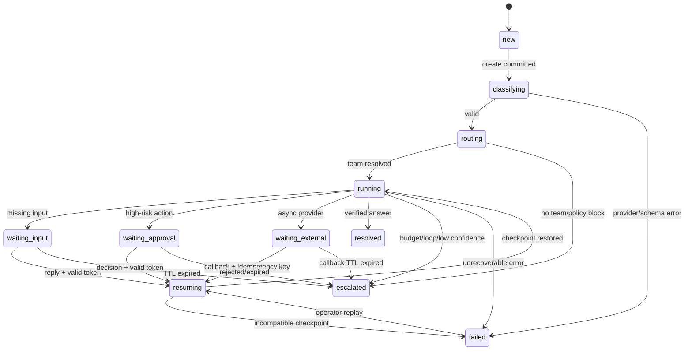

# A-COP 구현계획서·브리핑 냉정 리뷰 및 구현 고도화안

## 0. 리뷰 결론

현재 문서는 `Customer Case → Context Broker → Agent Team → Shared State → 재계획/승인`이라는 발표용 개념 모델까지는 정의하지만, 8~10주에 6명이 구현해야 할 실행 계약을 정의하지 않았다. 이 상태로 시작하면 Core와 Team 개발자가 서로 다른 상태 모델을 만들고 마지막 2주에 통합이 불가능해진다.

- Case 상태와 LangGraph 노드 상태가 분리되어 있지 않다.
- Shared State에 동시 쓰기, 원자적 갱신, 충돌 해결 규칙이 없다.
- WAIT/RESUME가 “노드에서 멈춘다”는 설명뿐이고 외부 이벤트와 재개 지점이 없다.
- Team Contract가 필드 목록일 뿐 JSON Schema, 오류 형식, 버전 호환 정책이 없다.
- Context Broker에 토큰 예산, 우선순위, 출처, PII, 실패 시 축소 전략이 없다.
- Tool/Action Layer에 멱등키의 생성 주체·보관·재시도 의미가 없다.
- 3개 Team, MCP, OAuth2, pgvector/하이브리드 검색, Memory, 운영자 대시보드, VOC clustering을 동시에 하려 한다.
- 평가 지표는 있으나 골든 데이터, 통제 변수, 반복 실행 harness가 없다.

MVP는 다음으로 다시 고정해야 한다.

> 가상의 SaaS 고객 문의 2개 업무 유형을 대상으로, Case 상태를 영속화하고, 서로 다른 권한·도구·지식을 가진 2개 Team이 하나의 Case를 이어서 처리하며, 승인/재개와 정책 근거가 남는 것을 증명한다.

MVP에서 보장할 것은 플랫폼 일반론이 아니라 `Billing/Subscription`과 `Technical Entitlement` 두 Capability의 end-to-end 실행이다. VOC는 고정 규칙 기반 집계 리포트로 축소하고 MCP는 REST API 안정화 후 선택적으로 시연한다.

---

## 1. 원문 기준 범위와 불일치

두 파일의 핵심 내용은 동일하다. 구현계획서는 `Billing`, `Technical Support`, `VOC` Team을 예시로 들고, 브리핑은 여기에 외부 Personal AI, MCP, 운영자 UI, Memory, Message Broker까지 한 화면에 배치한다. 그러나 “Team 이름과 개수는 요구사항 분석 후 결정”이라고 남겨 둔 채 기술 스택과 주차 계획은 이미 3개 Team과 모든 인프라를 전제로 한다.

| 원문 표현 | 구현에 필요한 고정값 |
|---|---|
| Shared State | 공식 테이블, version 증가 조건, 충돌 시 재시도 횟수 |
| Context Pack | 필수/선택 섹션, 최대 토큰, 문서 출처, PII, truncation 순서 |
| Team Contract | 입력/출력 JSON Schema, contract_version, 오류 code, side effect |
| TeamResult | `completed / waiting / escalated / failed` 의미와 다음 행동 구조 |
| WAIT/RESUME | `wait_reason`, `resume_token`, 대기 이벤트, 만료·중복 callback 처리 |
| Agent Run | LLM 호출/Team 실행의 구분, retry와 attempt 관계 |
| Tool/Action | read와 side effect, 승인 전/후 단계, idempotency 키 |
| Registry | 런타임 플러그인인지 정적 등록인지, 버전 교체 시 기존 Case 처리 |

---

## 2. Critical — 이대로 구현하면 반드시 터지는 지점

### C1. Shared State 동시성은 `version` 필드만으로 해결되지 않는다

두 worker가 같은 version을 읽고 각각 append하면 마지막 저장이 앞선 결과를 덮어쓴다. Billing Team의 evidence 갱신과 Technical Team 결과 반영, 승인 callback과 timeout worker, API 재전송이 모두 이 문제를 만든다.

해결 규칙:

- `customer_cases.version`을 optimistic concurrency token으로 사용한다.
- 갱신은 `UPDATE ... WHERE case_id=:id AND version=:expected_version`로 수행한다.
- 영향 행이 0이면 `StateConflict`를 반환하고 최신 상태 재조회 후 최대 2회만 재시도한다.
- 변경 원본은 append-only `case_events`, `state_json`은 projection이다.
- 한 Case의 active run은 DB lock으로 하나만 허용한다.
- 병렬 Team 실행은 proposal을 별도 저장하고 Controller가 한 transaction에서 merge한다.

```sql
UPDATE customer_cases
SET status = :status, state_json = :new_state,
    owner_team_id = :owner_team_id, version = version + 1, updated_at = now()
WHERE case_id = :case_id AND version = :expected_version
RETURNING version;
```

### C2. LangGraph checkpoint와 업무 Case 상태를 혼동한다

LangGraph checkpoint는 graph 재개용 runtime snapshot이고 `customer_cases`는 외부에 약속하는 업무 상태다. 하나의 JSON으로 합치면 graph schema 변경, checkpoint 저장과 DB rollback 불일치, 대형 prompt/검색 결과 누적 문제가 생긴다.

고정 전략:

- `thread_id = case_id`, PostgreSQL checkpointer를 사용한다.
- checkpoint에는 `case_id`, `run_id`, `graph_revision`, `node_name`, 최소 상태만 저장한다.
- 업무 projection은 별도 transaction으로 저장하되 상태 변경과 outbox event를 같은 transaction에 기록한다.
- 실행 중 graph revision을 고정한다. 새 revision은 새 Run에서만 시작한다.
- 1 Case에 동시에 `queued/running/waiting`인 active run을 허용하지 않는다.

### C3. WAIT/RESUME 재개 지점이 없다

추가 정보, 승인, 외부 callback은 서로 다른 대기 이유다. 전체 Team을 처음부터 재실행하면 side effect가 중복된다.

```text
RUNNING
  ├─ missing_customer_input → WAITING_INPUT
  ├─ approval_required      → WAITING_APPROVAL
  ├─ external_async         → WAITING_EXTERNAL
  └─ verified result        → RESOLVED

WAITING_* + matching event + valid resume_token
  → RESUMING → RUNNING(resume_node)
```

- `wait_reason`: `customer_input | human_approval | external_callback`.
- `resume_node`: `validate_input`, `execute_approved_action`, `verify_external_result`처럼 코드로 고정한다.
- `resume_token_hash`만 DB에 저장한다.
- callback은 `event_id`와 `idempotency_key`로 중복 처리한다.
- TTL 만료는 조용히 종료하지 않고 `ESCALATED`로 보낸다.

### C4. Team Contract가 스키마 진화를 견디지 못한다

현재 `input_schema`, `output_schema`는 선언만 있다. Team A가 `decision`을 문자열로 반환하고 Team B가 object를 기대하면 통합 단계까지 발견되지 않는다.

- payload에 `contract_name`, `contract_version`, `schema_version`을 넣는다.
- 같은 major에서 optional field 추가만 호환으로 간주한다.
- Core는 `supported_contract_versions`를 선언한다.
- `next_actions`, outcome, 오류 code를 enum으로 제한한다.
- 자연어 답변으로 status를 바꾸지 않고 validator가 enum과 policy를 검증한다.
- schema 변경 PR에는 fixture와 backward compatibility test를 필수화한다.

### C5. Context Broker의 토큰 초과와 출처 오염

RAG·DB·history·memory를 선택한다고만 되어 있어 context window 초과와 고객 간 memory 혼입이 발생한다. `knowledge_scope` 문자열만으로는 접근 통제도 아니다.

| 항목 | 예산 | 제거 순서 |
|---|---:|---|
| system/instruction | 1,500 | 고정 |
| current state | 2,000 | 최신 우선 |
| tool facts | 2,000 | 구조화 JSON 우선 |
| policy/RAG | 3,000 | 최대 5 chunk |
| similar memory | 1,000 | 최대 2건 |
| output reserve | 1,500 | 모델별 상한 |
| **총 입력 상한** | **9,500** | memory→오래된 history→낮은 score 문서 |

모든 사실에는 `source_type`, `source_id`, `retrieved_at`, `confidence`를 붙이고, `tenant_id/customer_id/case_id/knowledge_scope`를 retrieval 단계에서 검사한다. 호출 전 token count를 계산하고, 초과 시 deterministic truncation을 수행한다. RAG/DB 실패 시 `degraded=true`로 전달하며 정책 판단은 `WAITING/ESCALATED`로 보낸다.

### C6. Tool 호출이 side effect를 중복 실행한다

LLM이 `request_refund`를 호출하고 네트워크 timeout이 나면 재시도 시 환불이 두 번 요청될 수 있다.

- API 요청에서 `idempotency_key`를 받거나 `request_id + action_type + business_subject`로 서버가 생성한다.
- `action_requests`에 `(tenant_id, idempotency_key)` unique constraint를 둔다.
- `PENDING` 재호출은 기존 결과를 반환한다.
- `requested → approved → executing → succeeded/failed/unknown`을 분리한다.
- provider timeout 후 결과를 모르면 `unknown`으로 두고 조회/대사 Tool을 먼저 호출한다.
- Tool 입력은 allowlist Pydantic schema만 받는다.

### C7. LLM 실패와 비용이 전체 workflow를 멈춘다

필수 가드레일은 호출 timeout 20초, Team timeout 90초, Case budget 180초, `429/5xx` exponential backoff 2회, malformed JSON repair 1회, provider fallback 1회, Case당 LLM 8회·Tool 12회·graph loop 3회다. 초과 시 `ESCALATED`한다. 호출마다 provider/model/token/latency/cost/retry를 기록한다.

### C8. “모듈형”이 실제 플러그인 런타임이 아니다

`entrypoint` 임의 import는 보안과 배포 문제를 만든다. MVP는 같은 repository의 Python class를 정적 등록하고, Registry에는 metadata와 active version만 저장한다. 각 Team은 `TeamModule` Protocol과 contract fixture를 통과해야 한다.

---

## 3. Missing — 반드시 추가해야 하는 컴포넌트

| 누락 | MVP 구현 | 완료 증거 |
|---|---|---|
| Request idempotency | request/idempotency key + unique index | 동일 POST 10회가 Case 1개 |
| Outbox | transactional insert + worker | 상태 변경 event 유실 없음 |
| Dead-letter/replay | failed message와 운영자 replay | 실패 task 1회 재실행 |
| LLM adapter | timeout/retry/fallback/structured output wrapper | provider 오류 fixture |
| Tool loop guard | step counter·반복 signature 감지 | 같은 Tool 3회 후 중단 |
| Cost/latency budget | Case/Run/Team 상한 | 초과 시 ESCALATED |
| PII 처리 | redaction·log 금지 필드·보존기간 | trace에 전화/이메일 없음 |
| Tenant isolation | 모든 query에 tenant/customer filter | 타 고객 문서 검색 불가 |
| Prompt/version registry | prompt/model/hash 기록 | 실험 재현 |
| Seed data | 고객·구독·결제·entitlement·정책 fixture | 로컬 즉시 실행 |
| Golden dataset | 60 label + 20 holdout | 자동 평가 실행 |
| Schema validation | Team input/result JSON Schema | invalid result 경계 거절 |
| Audit | actor/action/before-after hash | 승인·실행 추적 |
| Auth 최소 구현 | demo API key + scope | read/write 차단 |
| Observability | structured log·trace·metrics | case_id로 전체 추적 |

PII는 합성 데이터만 사용하고 모델 전송 전 redaction한다. raw feedback과 masked text, trace와 토큰을 분리하며 로그에는 authorization header와 결제 식별자를 남기지 않는다.

Seed 최소 세트:

```text
customers 20 / subscriptions 30 / payment_events 80
entitlements 30 / incidents 10 / policy_documents 12
golden 60 / holdout 20 / demo 10
```

---

## 4. Over-scope — 잘라낼 것과 남길 것

### MVP에 남길 범위

1. 가상 SaaS 도메인 1개.
2. `subscription_billing`, `technical_entitlement` 두 Capability.
3. 두 Team, 각 Team 내부 최대 2개 역할.
4. Case lifecycle, optimistic concurrency, checkpoint WAIT/RESUME.
5. 정책 문서 RAG와 구조화 DB 조회 Tool.
6. 실환불이 아닌 mock refund request + Human Approval.
7. REST/OpenAPI 5개 endpoint.
8. Case 목록/상세·trace·승인 3화면.
9. 동일 데이터로 실행하는 Baseline A/B/Proposed harness.

### 제외 또는 후순위

| 항목 | 판단 | 이유/대체안 |
|---|---|---|
| MCP | MVP 제외, 후순위 read-only 1개 | 클라이언트별 호환성과 인증이 본질이 아님 |
| OAuth2 | MVP 제외, API key + scope | authorization server 자체가 별도 프로젝트 |
| pgvector | 필요할 때만 | 문서 12개면 BM25/SQLite FTS로 충분 |
| 운영자 대시보드 | 최소 3화면 유지 | 전체 운영 UI는 금지 |
| VOC clustering | MVP 제외 | 규칙 기반 intent count 리포트로 대체 |
| 3개 Team | 2개로 축소 | VOC는 batch report |
| 다중 LLM provider | 1개 고정 | adapter interface만 남김 |
| 실결제/계정 연동 | mock API | side effect·보안 위험 제거 |
| 동적 plugin 설치 | 정적 registry | contract 교체 가능성을 test로 증명 |
| Kafka/RabbitMQ | 제외 | in-process/background task로 충분 |
| Episodic Memory | 제외 또는 유사 Case 2건 | 현재 history와 혼동·평가 비용 큼 |

우선순위는 `최소 운영 UI/trace/approval → 검색 품질 → REST 안정화 → MCP read-only → OAuth2 → VOC clustering`이다. OAuth와 MCP가 발표 필수 요구가 아니라면 구현하지 않는다.

---

## 5. Vague → Concrete: Pydantic 계약

```python
from datetime import datetime
from enum import Enum
from typing import Any, Literal
from uuid import UUID
from pydantic import BaseModel, ConfigDict, Field

class CaseStatus(str, Enum):
    NEW="new"; CLASSIFYING="classifying"; ROUTING="routing"; RUNNING="running"
    WAITING_INPUT="waiting_input"; WAITING_APPROVAL="waiting_approval"
    WAITING_EXTERNAL="waiting_external"; RESUMING="resuming"
    RESOLVED="resolved"; ESCALATED="escalated"; FAILED="failed"; CANCELLED="cancelled"

class NextAction(str, Enum):
    CONTINUE="continue"; WAIT_FOR_INPUT="wait_for_input"; WAIT_FOR_APPROVAL="wait_for_approval"
    CALL_TOOL="call_tool"; HANDOFF="handoff"; RESPOND="respond"; ESCALATE="escalate"

class Evidence(BaseModel):
    model_config = ConfigDict(extra="forbid")
    evidence_id: str
    source_type: Literal["customer_message","db","policy","tool_result","case_event"]
    source_id: str
    claim: str
    value: Any
    confidence: float = Field(ge=0, le=1)
    observed_at: datetime

class ContextPack(BaseModel):
    model_config = ConfigDict(extra="forbid")
    pack_id: UUID; case_id: UUID; team_id: str; tenant_id: str
    knowledge_scope: list[str]
    current_state: dict[str, Any]
    evidence: list[Evidence] = Field(default_factory=list, max_length=30)
    history_summary: str = Field(default="", max_length=8000)
    similar_cases: list[dict[str, Any]] = Field(default_factory=list, max_length=2)
    token_budget: int = 9500
    estimated_input_tokens: int
    degraded: bool = False
    omissions: list[str] = Field(default_factory=list)

class TeamTask(BaseModel):
    model_config = ConfigDict(extra="forbid")
    contract_name: Literal["a_cop.team_task"] = "a_cop.team_task"
    contract_version: Literal["1.0"] = "1.0"
    task_id: UUID; run_id: UUID; case_id: UUID; team_id: str
    capability: str; case_version: int
    input_text: str = Field(min_length=1, max_length=12000)
    context: ContextPack; allowed_tools: list[str]; deadline_at: datetime
    resume: bool = False; resume_node: str | None = None

class ActionProposal(BaseModel):
    model_config = ConfigDict(extra="forbid")
    action_type: str; arguments: dict[str, Any]
    idempotency_key: str = Field(min_length=8, max_length=128)
    approval_required: bool
    risk_level: Literal["low","medium","high"]
    rationale_evidence_ids: list[str] = Field(default_factory=list)

class TeamResult(BaseModel):
    model_config = ConfigDict(extra="forbid")
    contract_name: Literal["a_cop.team_result"] = "a_cop.team_result"
    contract_version: Literal["1.0"] = "1.0"
    task_id: UUID; run_id: UUID; team_id: str
    outcome: Literal["completed","waiting","handoff","escalated","failed"]
    answer: str | None = Field(default=None, max_length=6000)
    confidence: float = Field(ge=0, le=1)
    evidence: list[Evidence] = Field(default_factory=list, max_length=30)
    decisions: list[dict[str, Any]] = Field(default_factory=list, max_length=20)
    action_proposals: list[ActionProposal] = Field(default_factory=list, max_length=5)
    next_action: NextAction
    wait_reason: Literal["customer_input","human_approval","external_callback"] | None = None
    required_input_schema: dict[str, Any] | None = None
    handoff_capability: str | None = None
    failure_code: str | None = None
    warnings: list[str] = Field(default_factory=list, max_length=20)

class TeamManifest(BaseModel):
    model_config = ConfigDict(extra="forbid")
    team_id: str; display_name: str
    contract_name: Literal["a_cop.team_task"]
    supported_contract_versions: list[str]
    capabilities: list[str] = Field(min_length=1)
    accepted_case_types: list[str]
    required_context: list[Literal["case_state","policy","db_facts","history"]]
    allowed_tools: list[str]; knowledge_scope: list[str]
    max_steps: int = Field(default=6, ge=1, le=12)
    active: bool = True; implementation_revision: str
```

API 요청/응답도 자연어가 아니라 이 구조를 고정한다.

```json
{"request_id":"req_01J","idempotency_key":"idem_abc","tenant_id":"demo_saas",
 "customer_id":"cust_100","channel":"web","message":"해지했는데 또 결제됐어요.",
 "requested_action":"analyze_and_resolve","scopes":["case:write","subscription:read"]}
```

```json
{"case_id":"8c4","status":"waiting_approval","version":7,
 "resume_token":"opaque-one-time-token","wait_reason":"human_approval",
 "pending_actions":[{"action_id":"a_1","action_type":"refund.request",
 "approval_required":true,"expires_at":"2026-08-15T10:00:00Z"}]}
```

---

## 6. DDL 수준 테이블 정의

```sql
CREATE EXTENSION IF NOT EXISTS pgcrypto;
CREATE TYPE case_status AS ENUM ('new','classifying','routing','running','waiting_input',
 'waiting_approval','waiting_external','resuming','resolved','escalated','failed','cancelled');
CREATE TYPE run_status AS ENUM ('queued','running','waiting','succeeded','failed','cancelled');
CREATE TYPE action_status AS ENUM ('proposed','pending_approval','approved','rejected',
 'executing','succeeded','failed','unknown','cancelled');

CREATE TABLE users (
 user_id uuid PRIMARY KEY DEFAULT gen_random_uuid(),
 tenant_id text NOT NULL DEFAULT 'demo_saas', external_customer_id text NOT NULL,
 email_hash text, display_name text, created_at timestamptz NOT NULL DEFAULT now(),
 UNIQUE (tenant_id, external_customer_id)
);
CREATE TABLE customer_feedback (
 feedback_id uuid PRIMARY KEY DEFAULT gen_random_uuid(), tenant_id text NOT NULL,
 user_id uuid NOT NULL REFERENCES users(user_id), channel text NOT NULL,
 raw_text text NOT NULL, masked_text text NOT NULL, language text NOT NULL DEFAULT 'ko',
 sentiment text, intent text, issue_type text, received_at timestamptz NOT NULL DEFAULT now(),
 metadata jsonb NOT NULL DEFAULT '{}', created_at timestamptz NOT NULL DEFAULT now()
);
CREATE INDEX ix_feedback_user_time ON customer_feedback(tenant_id,user_id,received_at DESC);
CREATE TABLE customer_cases (
 case_id uuid PRIMARY KEY DEFAULT gen_random_uuid(), tenant_id text NOT NULL,
 user_id uuid NOT NULL REFERENCES users(user_id), source_feedback_id uuid REFERENCES customer_feedback(feedback_id),
 channel text NOT NULL, subject text NOT NULL, input_text_masked text NOT NULL,
 capability text, status case_status NOT NULL DEFAULT 'new', owner_team_id text,
 state_json jsonb NOT NULL DEFAULT '{}', version bigint NOT NULL DEFAULT 0,
 active_run_id uuid, wait_reason text, resume_node text, resume_token_hash text,
 expires_at timestamptz, resolved_at timestamptz, created_at timestamptz NOT NULL DEFAULT now(),
 updated_at timestamptz NOT NULL DEFAULT now()
);
CREATE INDEX ix_cases_user_status ON customer_cases(tenant_id,user_id,status);
CREATE TABLE case_events (
 event_id uuid PRIMARY KEY DEFAULT gen_random_uuid(), tenant_id text NOT NULL,
 case_id uuid NOT NULL REFERENCES customer_cases(case_id), event_type text NOT NULL,
 actor_type text NOT NULL, actor_id text, event_version bigint NOT NULL,
 payload jsonb NOT NULL, correlation_id text NOT NULL, idempotency_key text,
 created_at timestamptz NOT NULL DEFAULT now(), UNIQUE(case_id,event_version),
 UNIQUE(tenant_id,idempotency_key)
);
CREATE INDEX ix_case_events_case_time ON case_events(case_id,created_at);
CREATE TABLE agent_team_registry (
 team_id text NOT NULL, implementation_revision text NOT NULL, contract_name text NOT NULL,
 contract_versions jsonb NOT NULL, capabilities jsonb NOT NULL, accepted_case_types jsonb NOT NULL,
 allowed_tools jsonb NOT NULL, knowledge_scope jsonb NOT NULL, active boolean NOT NULL DEFAULT true,
 manifest_json jsonb NOT NULL, created_at timestamptz NOT NULL DEFAULT now(),
 PRIMARY KEY(team_id,implementation_revision)
);
CREATE TABLE agent_runs (
 run_id uuid PRIMARY KEY DEFAULT gen_random_uuid(), case_id uuid NOT NULL REFERENCES customer_cases(case_id),
 team_id text, capability text, parent_run_id uuid REFERENCES agent_runs(run_id),
 status run_status NOT NULL DEFAULT 'queued', attempt_no int NOT NULL DEFAULT 0,
 graph_revision text, checkpoint_id text, current_node text, input_json jsonb NOT NULL DEFAULT '{}',
 result_json jsonb, error_code text, llm_calls int NOT NULL DEFAULT 0, tool_calls int NOT NULL DEFAULT 0,
 input_tokens int NOT NULL DEFAULT 0, output_tokens int NOT NULL DEFAULT 0,
 estimated_cost numeric(12,6) NOT NULL DEFAULT 0, latency_ms int, started_at timestamptz,
 ended_at timestamptz, created_at timestamptz NOT NULL DEFAULT now()
);
CREATE INDEX ix_runs_case_time ON agent_runs(case_id,created_at DESC);
CREATE TABLE action_requests (
 action_id uuid PRIMARY KEY DEFAULT gen_random_uuid(), tenant_id text NOT NULL,
 case_id uuid NOT NULL REFERENCES customer_cases(case_id), run_id uuid REFERENCES agent_runs(run_id),
 action_type text NOT NULL, arguments_json jsonb NOT NULL, status action_status NOT NULL DEFAULT 'proposed',
 risk_level text NOT NULL, approval_required boolean NOT NULL DEFAULT false, idempotency_key text NOT NULL,
 provider_request_id text, result_json jsonb, error_code text, expires_at timestamptz,
 created_at timestamptz NOT NULL DEFAULT now(), updated_at timestamptz NOT NULL DEFAULT now(),
 UNIQUE(tenant_id,idempotency_key)
);
CREATE TABLE action_approvals (
 approval_id uuid PRIMARY KEY DEFAULT gen_random_uuid(), action_id uuid NOT NULL REFERENCES action_requests(action_id),
 requested_at timestamptz NOT NULL DEFAULT now(), decided_at timestamptz, decided_by text,
 decision text CHECK(decision IN ('approved','rejected','expired')), comment text
);
CREATE TABLE knowledge_documents (
 document_id uuid PRIMARY KEY DEFAULT gen_random_uuid(), tenant_id text NOT NULL, namespace text NOT NULL,
 title text NOT NULL, doc_type text NOT NULL, source_uri text, version text NOT NULL,
 content_masked text NOT NULL, metadata jsonb NOT NULL DEFAULT '{}', active boolean NOT NULL DEFAULT true,
 created_at timestamptz NOT NULL DEFAULT now(), UNIQUE(tenant_id,namespace,title,version)
);
CREATE TABLE outbox_events (
 outbox_id bigserial PRIMARY KEY, aggregate_type text NOT NULL, aggregate_id uuid NOT NULL,
 event_type text NOT NULL, payload jsonb NOT NULL, published_at timestamptz,
 attempts int NOT NULL DEFAULT 0, last_error text, created_at timestamptz NOT NULL DEFAULT now()
);
CREATE INDEX ix_outbox_pending ON outbox_events(created_at) WHERE published_at IS NULL;
CREATE TABLE llm_calls (
 call_id uuid PRIMARY KEY DEFAULT gen_random_uuid(), run_id uuid NOT NULL REFERENCES agent_runs(run_id),
 provider text NOT NULL, model text NOT NULL, prompt_version text NOT NULL, request_hash text NOT NULL,
 input_tokens int, output_tokens int, latency_ms int, status text NOT NULL, retry_no int NOT NULL DEFAULT 0,
 estimated_cost numeric(12,6) NOT NULL DEFAULT 0, created_at timestamptz NOT NULL DEFAULT now()
);
```

`memory_items`는 MVP에서 만들지 않는다. 만들 경우 `tenant_id`, `customer_id`, `team_id`, `memory_type`, `source_case_id`, `expires_at`, `content_masked`를 필수로 하며 Case evidence와 별도 namespace를 쓴다.

---

## 7. Case 상태 전이

| 상태 | 의미 | 진입 조건 | 다음 상태 |
|---|---|---|---|
| `new` | 생성 후 미분석 | 유효 요청 저장 | `classifying`, `cancelled` |
| `classifying` | 감성/의도/이슈 추출 | feedback 저장 완료 | `routing`, `failed` |
| `routing` | Capability/Team 결정 | classification 완료 | `running`, `escalated`, `failed` |
| `running` | Team/Tool/검증 실행 | active run 획득 | `waiting_*`, `resuming`, `resolved`, `escalated`, `failed` |
| `waiting_input` | 고객 정보 대기 | 필수 필드 누락 | `resuming`, `escalated` |
| `waiting_approval` | 고위험 action 승인 대기 | proposal 생성 | `resuming`, `escalated` |
| `waiting_external` | provider callback 대기 | async action accepted | `resuming`, `escalated` |
| `resuming` | token/event 검증 후 재개 | matching event | `running`, `failed` |
| `resolved` | 답변·업무 결과 확정 | policy 검증 통과 | terminal |
| `escalated` | 자동화 한계/예산 초과 | retry/loop/budget 초과 | terminal 또는 operator reopen |
| `failed` | 복구 불가 기술 오류 | schema/DB 오류 | `resuming` 또는 terminal |
| `cancelled` | 취소 | 사용자/운영자 취소 | terminal |



상태 전이는 `transition_case(case_id, expected_version, event)` 한 함수로만 수행한다. API, Team, Tool이 직접 status를 update하면 안 된다.

---

## 8. 평가 계획을 실행 가능한 실험으로 전환

### 8.1 비교군

| 비교군 | 방식 | 동일하게 고정할 것 |
|---|---|---|
| Baseline A | 단일 LLM + 고정 context + top-3 정책 retrieval | input, DB snapshot, model, temperature, timeout |
| Baseline B | 분류→검색→생성→검수 고정 pipeline | 위 항목 + 동일 mock Tool |
| Proposed | Case + 2 Team + Shared State + approval/resume | 위 항목 + 같은 Tool budget |

golden 60건과 holdout 20건을 분리한다. deterministic mock mode는 3회, 실제 LLM mode는 1회 실행한다. 모든 run에 `dataset_hash`, `config_hash`, `prompt_version`, `model`, `temperature`, `seed_snapshot`, `git_sha`를 저장한다.

### 8.2 골든 데이터셋

```json
{"case_id":"gold_001","input":"해지했는데 이번 달에도 결제됐어요.",
 "customer_snapshot":"fixtures/customer_001.json",
 "expected":{"capability":"subscription_billing",
 "must_cite_policy_ids":["refund_policy_v2"],
 "must_call_tools":["subscription.read","payment.history"],
 "allowed_action":"refund.request","requires_approval":true,
 "expected_final_status":"waiting_approval",
 "required_facts":["cancellation_at","charge_at","refund_window"]},
 "difficulty":"multi_step"}
```

- Billing 25건, Technical 25건, cross-capability 10건.
- holdout 20건은 같은 정답을 유지하면서 표현·순서·오탈자를 변경한다.
- 2명이 독립 라벨링하고 불일치만 합의한다. 합의율 90% 미만 항목은 제외한다.
- 고객 데이터는 사용하지 않고 템플릿과 seed DB 조합으로 생성한다.

### 8.3 지표

| 지표 | 산식 |
|---|---|
| Case resolution | `resolved / total` |
| Correct routing | expected capability 일치율 |
| Required fact recall | 필수 사실 중 evidence/response 포함 비율 |
| Policy groundedness | 인용 policy ID가 gold와 일치하는 비율 |
| Action safety | 승인 전 실행 0건, 금지 action 0건 |
| Resume success | 유효 approval/callback 후 정확한 node 재개율 |
| State integrity | event gap 0, stale write 0, duplicate side effect 0 |
| Handoff precision | 필요한 사례에만 handoff한 비율 |
| Cost/latency | case당 cost, p50/p95 latency |
| Human intervention | escalation 또는 approval 비율 |

### 8.4 LLM-as-judge 루브릭

Judge는 총평 대신 이 JSON을 출력한다.

```json
{"correctness":0,"policy_grounding":0,"completeness":0,
 "action_safety":0,"personalization":0,"unsupported_claims":[],"reason":"..."}
```

각 항목 0~2점이다. `correctness`는 seed DB와 사실 일치, `policy_grounding`은 정확한 문서 근거, `completeness`는 필요한 조회·질문·승인 누락 여부, `action_safety`는 승인/권한 준수, `personalization`은 고객 상태 반영이다. `action_safety=0`이면 전체 fail이다. Judge에는 gold expected와 실제 tool trace를 제공하고, 사람 blind review 20%로 judge-human 상관을 확인한다.

### 8.5 Harness

```text
experiments/
├─ datasets/golden_cases.jsonl
├─ fixtures/snapshots/*.json
├─ configs/baseline_a.yaml / baseline_b.yaml / proposed.yaml
├─ runner.py
├─ adapters/baseline_a.py / baseline_b.py / proposed.py
├─ judges/rubric.py
└─ reports/raw_runs.jsonl / metrics.csv / comparison.md
```

`python experiments/runner.py --config configs/proposed.yaml` 한 번으로 실행·측정·CSV 생성을 완료한다. Notebook 수작업 결과는 최종 수치로 인정하지 않는다.

---

## 9. 10주 × 6명 실행계획

역할은 `A=Runtime/State`, `B=API/DB/Tool`, `C=Billing Team`, `D=Technical Team`, `E=Data/RAG/Integration`, `F=UI/Eval/QA`로 고정한다.

| 주차 | A Runtime/State | B API/DB/Tool | C Billing | D Technical | E Data/RAG | F UI/Eval/QA | 주말에 동작해야 하는 것 / DoD |
|---|---|---|---|---|---|---|---|
| 1 | 상태 전이·event envelope·contract | ERD·DDL·migration | capability map | capability map | 정책 12문서·seed generator | golden schema·평가계획 | seed DB에서 두 유형 Case 생성, ADR 승인 |
| 2 | transition/version conflict | API key/scope/repository | TeamTask fixture | TeamTask fixture | retrieval interface·masking | CI·contract test | 동일 POST 10회가 Case 1개, stale write 거절 |
| 3 | classify→route→run graph | feedback/case/trace API | mock billing result | mock tech result | RAG v1·ContextPack | Case list/detail skeleton | mock Team으로 `new→resolved` 1건 완주 |
| 4 | checkpoint·retry policy | action/outbox worker | refund proposal | entitlement diagnosis | budget·degraded mode | trace UI | `waiting_approval→resuming` 정확히 재개 |
| 5 | handoff/replan/loop guard | mock action/idempotency | Billing E2E | Technical E2E | policy quality test | Baseline A runner | Billing 10건, duplicate action 0 |
| 6 | conflict/parallel proposal merge | error contract·audit | failure/retry test | failure/retry test | golden 60·seed 90 확정 | Baseline B·judge v1 | handoff 필요한 10건에서만 handoff |
| 7 | external resume·TTL | OpenAPI 5 endpoint | polish | polish | BM25 또는 pgvector 하나 고정 | 3화면 완성 | UI에서 Case→trace→approve→resume |
| 8 | graph revision·replay | Docker smoke deploy | holdout 대응 | holdout 대응 | PII/retrieval audit | Proposed harness·CSV | 3 비교군 동일 60건 자동 실행 |
| 9 | 통합 버그·mini chaos | scope/audit hardening | demo A script | demo B script | VOC 규칙 집계(선택) | human review·polish | resolved/approval/handoff demo 재현 |
| 10 | ADR·rollback 문서 | 배포·README·API spec | golden 수정 | golden 수정 | corpus/version freeze | 최종 report/발표 | 새 환경에서 README만으로 30분 내 재현 |

공통 DoD:

- 모든 변경은 PR과 자동 테스트를 가진다.
- `case_id`로 event, run, LLM call, tool, approval을 추적한다.
- 실패한 호출은 성공처럼 보이지 않는다.
- side effect는 action row와 idempotency key를 가진다.
- 금요일 신규 기능 금지, 토요일 통합/회귀 전용.

---

## 10. 심사위원 질문과 데이터로 증명할 차별화

### “그냥 LLM 파이프라인에 이름만 붙인 것 아닌가?”에 대한 답

> 아닙니다. 단계별 프롬프트를 Agent라고 부른 것이 아니라, 결제와 기술지원처럼 서로 다른 업무 목표·권한·도구·지식 범위를 가진 두 Team을 Case 단위로 실행합니다. 각 Team의 자연어 답변을 이어 붙이지 않고 TeamResult와 근거를 검증한 뒤 공유 상태를 원자적으로 갱신합니다. 고객 입력이나 승인이 필요하면 checkpoint를 남기고 정확한 node부터 재개합니다. 환불 같은 side effect는 Tool Gateway의 승인과 idempotency를 거쳐 한 번만 실행됩니다. 핵심은 Agent 수가 아니라 업무 경계·권한 경계·상태 전이·재개 가능성입니다.

반드시 다음 trace를 보여 준다.

```text
CASE-001
  classification: subscription_billing
  BillingTeam: payment.history + subscription.read
  evidence: charge_after_cancel, refund_window
  decision: refund_eligible
  action: refund.request (approval_required=true, not executed)
  case: waiting_approval, checkpoint=execute_approved_action
  approval: approved → resume exact node
  action: succeeded exactly once
  final: resolved
```

### 멀티에이전트 당위성 실험

| 실험 | 질문 | 보여 줄 데이터 |
|---|---|---|
| Baseline A vs Proposed | 단일 답변보다 업무 결과가 정확한가 | routing, fact recall, policy, safety |
| Baseline B vs Proposed | 고정 pipeline보다 동적 협업이 필요한가 | handoff precision, replan, resume |
| Proposed ablation | Shared State/Context/approval 제거 시 무엇이 깨지는가 | stale state, 근거 누락, 승인 전 action, 재개 실패 |

```text
metric                         A        B        Proposed
correct routing                ...      ...      ...
required fact recall           ...      ...      ...
policy groundedness            ...      ...      ...
action safety pass             ...      ...      ...
resume success                 n/a      0/..     ...
duplicate side effect          n/a      ...      0
case cost p50                  ...      ...      ...
latency p95                    ...      ...      ...
```

정확도가 오르더라도 비용과 지연이 과도하면 성공이 아니다. `action safety=100%`, `resume success`, `duplicate side effect=0`과 cost/latency trade-off를 함께 공개해야 한다.

---

## 11. 최종 구현 기준

- 2개 Team이 정적 Registry로 등록되고 동일 Contract fixture를 통과한다.
- Case 60건을 seed 데이터로 재현할 수 있다.
- stale version write가 거절되고 event version이 누락되지 않는다.
- WAIT/RESUME가 `resume_node`부터 재개된다.
- 승인 전 high-risk action이 실행되지 않는다.
- 동일 idempotency key의 side effect가 한 번만 발생한다.
- Context Pack이 9,500 input token 예산을 넘지 않는다.
- LLM timeout, malformed JSON, Tool timeout, DB conflict 테스트가 있다.
- Baseline A/B/Proposed 평가를 명령 한 번으로 재실행한다.
- 운영자는 3화면에서 Case·trace·approval을 확인한다.
- resolved, approval/resume, handoff/escalation 세 trace를 발표한다.

결론적으로 현재 문서의 문제는 기술 선택 부족이 아니라 성공 조건 없이 선택지를 열어 둔 것이다. 먼저 `2 Team + 1 domain + REST + mock Tool + persistent Case + approval/resume + reproducible evaluation`을 얼리고, 나머지는 핵심 동작을 해치지 않을 때만 추가해야 한다. 그렇지 않으면 MCP·OAuth·pgvector·대시보드가 완성되어도 “상태 기반 다중 Agent Team 협업”을 증명하지 못한다.
