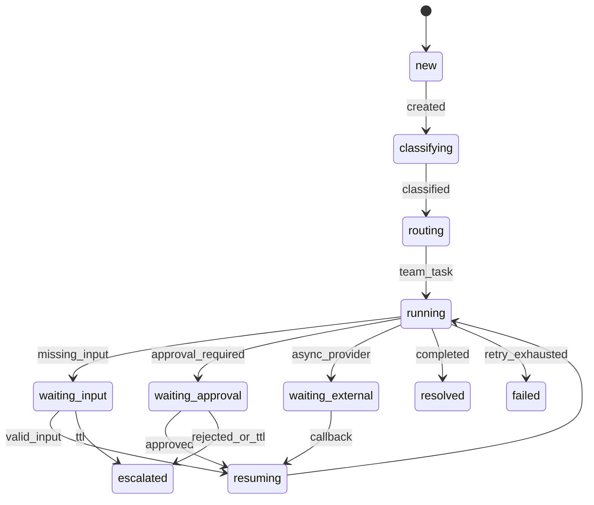

# A-COP 구현계획서 v6

## 0. 문서 상태

| 항목 | v6 기준선 |
|---|---|
| 병합 대상 | `A-COP_구현계획서_A2A_Graph반영.md`를 뼈대로 삼고 `A-COP_구현계획서_v5.md`의 구현 명세를 흡수했다. |
| 충돌 해결 | 최신 결정인 A2A_Graph반영을 우선했다. 팀 구조는 Core 1/Core 2/Team 3/UX 1, Broker는 Coordination 소유·Infrastructure 구현, Team은 read를 직접 호출하지 않고 write는 `ActionProposal`만 반환한다. |
| 이전 파일 지위 | `A-COP_구현계획서(4).md`, `A-COP_구현계획서_v5.md`, `A-COP_구현계획서_A2A_Graph반영.md`는 보존 대상이며 수정하지 않는다. |
| 이후 기준선 | 이 문서가 이후 구현·평가·심사의 유일한 기준선이다. |

병합 출처는 각 절의 `[A2A]`, `[v5]`, `[신규]` 표기로 구분한다. A2A와 v5의 표현이 충돌하면 A2A의 결정과 경계를 적용한다.

## 0-1. 한 줄 요약 [A2A]

고객 피드백을 Customer Case로 관리하고, 업무별 Agent Team Module이 Shared State·RAG·Memory를 기반으로 협업하는 모듈형 Agentic Customer Operations Platform을 구축한다. Personal AI는 REST/MCP로 Tool과 Resource를 사용하고, 독립 Agent System은 A2A로 업무 Task를 위임받는다. PostgreSQL은 Case/Action 상태의 Source of Truth이며 GraphStorePort의 MVP 구현체는 `SqlGraphAdapter`다.

## 1. 프로젝트명 정리 [A2A]

- 짧은 이름: **A-COP**
- 풀네임: AI 연동형 모듈형 에이전틱 고객운영 플랫폼
- 부트캠프 주제: 다중 에이전트 서빙 기반 고객 피드백 분석 및 맞춤형 응대 자동화 시스템

## 2. 문제 정의 [A2A]

문의 수집→분류→RAG→답변만으로는 보류·승인·재처리·외부 callback을 표현하기 어렵다. 단순한 단계별 LLM 호출에 Agent 이름만 붙이는 방식도 업무 책임과 권한의 분리를 보장하지 않는다. A-COP는 Case 생명주기, 전문 Team, Shared State, Action 승인, 외부 AI 위임을 하나의 실행 모델로 묶는다.

## 3. 프로젝트 목표 [A2A]

1. 피드백을 Customer Case로 만든다.
2. Capability에 따라 전문 Team을 동적으로 선택한다.
3. RAG·Memory·실시간 Shared State를 Context Pack으로 조합한다.
4. 조회·판단·후속 작업 제안·응답·에스컬레이션을 처리한다.
5. REST/MCP와 A2A를 통해 외부 AI와 연동한다.
6. Team과 저장소를 Port/Adapter로 교체 가능하게 만든다.

## 4. 핵심 아이디어 [A2A]

기존 흐름은 문의→분석→검색→답변→검수다. 제안 흐름은 문의→Case 생성→Context 구성→전문 Team 협업→Shared State 갱신→재계획/승인/응답이다. Basement(Core)은 공통 실행 기반이고 Domain Module은 Customer Operations 책임을 가진다.

## 5. 시스템 범위 [A2A]

### In Scope

피드백 정규화, 감성·의도·이슈 분류, Case 상태 관리, 업무 책임 단위 Team Module, 기업 지식 RAG, Memory, Shared State, Human Approval, 외부 AI API/MCP, 운영자 대시보드, A2A 더미 Remote Agent 1개를 포함한다.

### Out of Scope

OCR/영상 분석, 다수 도메인의 완전 지원, Production-scale 분산 시스템, 모든 외부 AI 플랫폼별 정식 배포는 제외한다.

## 6. 타깃 도메인 [A2A]

1차 도메인은 가상의 SaaS Customer Operations다. 구독 해지 후 추가 결제, Free/Pro 권한 동기화, Seat·요금 불일치, 환불 가능 여부, 반복 장애·불만을 대표 시나리오로 사용한다.

## 7. Agent Team Module 구성 원칙 [A2A]

Team은 Capability·책임·권한·지식·Tool 경계가 독립될 때 만든다. 내부 Agent 수와 LangGraph/Subgraph 사용 여부는 Team이 결정한다. Core는 Team의 graph·prompt·retrieval을 import하지 않고 `TeamManifest`와 표준 Contract만 사용한다.

Team은 read Tool을 직접 호출하지 않는다. Context Broker가 `required_context`에 따라 읽은 자료를 `ContextPack`에 넣는다. 부족한 정보는 `need_more_context` 신호로 Controller에 요청한다. Team은 side effect를 실행하지 않고 `ActionProposal`만 반환한다.

## 8. Basement(Core) 설계 [A2A]

Agent Gateway는 Trust Boundary, Customer Case Layer는 장기 실행 상태, Registry는 Team 탐색과 버전 호환, Context Broker는 정보 구성, Message Broker는 Task/Event 전달, Shared State는 공식 Case 상태, Tool/Action Layer는 권한·승인·idempotency·audit, Controller는 routing·replan·WAIT/RESUME를 담당한다.

### 8-A. 계층 경계와 `message_bus.publish` 계약 [A2A]

Message Broker의 사용과 Task/Event 설계는 Coordination이 소유하고, Redis/Redis Streams/RabbitMQ 구현은 Infrastructure가 소유한다. Controller는 `redis.xadd(...)`를 호출하지 않고 다음 Port만 호출한다.

```python
message_id = await message_bus.publish(
    topic="team.task",
    payload=task.model_dump(mode="json"),
    dedupe_key=f"{task.run_id}:{task.task_id}",
)
```

모든 consumer는 at-least-once를 전제로 `message_id` 또는 dedupe key를 기록하고 중복 전달이면 같은 결과를 반환한다. In-Process Queue에도 중복·retry 강제 테스트를 둔다.

### 8-B. 모듈화와 Port 3종 [A2A]

```text
MessageBusPort    → InMemoryMessageBus / RedisMessageBus / RabbitMQMessageBus
GraphStorePort    → SqlGraphAdapter / AgeGraphAdapter / Neo4jGraphAdapter
TeamExecutorPort  → LocalTeamExecutor / A2ATeamExecutor
```

```python
class TeamExecutorPort(Protocol):
    async def execute(self, task: TeamTask, deadline_s: int) -> TeamResult: ...
    async def cancel(self, task_id: str) -> None: ...
    async def status(self, task_id: str) -> str: ...

class MessageBusPort(Protocol):
    async def publish(self, topic: str, payload: dict, dedupe_key: str) -> str: ...
    async def ack(self, message_id: str) -> None: ...

class GraphStorePort(Protocol):
    async def related_policies(self, case_id: UUID, limit: int = 10) -> list[dict]: ...
    async def related_teams(self, issue_code: str) -> list[dict]: ...
    async def related_actions(self, case_id: UUID) -> list[dict]: ...
```

`LocalTeamExecutor`와 `A2ATeamExecutor`의 결과는 동일한 `TeamResult`로 정규화한다. Controller는 실행 방식에 의존하지 않는다. Registry/Factory만 `execution_type`과 `agent_card_url`을 읽는다.

### 8-C. 경합·동시성 책임 [A2A]

Coordination은 Team 선택·ownership·scheduling·결과 병합을 담당한다. State Repository/DB는 version/CAS를 담당하고 Action Layer는 idempotency를 담당한다. Team 내부 Agent 간 경합은 Team 내부 책임이다.

Team→Controller→Core 2 Action→Controller State 순서를 고정한다. Shared State 갱신은 `SharedStateUpdate(case_id, expected_version, state_patch)`와 `UpdateResult(SUCCESS|CONFLICT|NOT_FOUND)`로 계약한다. `CONFLICT`면 최신 상태를 재로드하고 retry 또는 replan한다.

## 9. 외부 소비자 AI 연동 구조 [A2A]

Personal AI는 인증된 REST/MCP 요청으로 Case를 만들고 조회한다. 독립 Agent System에 장기 실행 업무를 맡길 때는 Agent Card, Task lifecycle, 추가 입력, Artifact가 있는 A2A를 사용한다. 단순 데이터 REST 호출은 A2A로 분류하지 않는다.

### 9-C. MCP/A2A/Message Broker 역할 분리와 판별 기준 [A2A]

MCP는 Tool·Resource를 빌려주는 수직 연결이다. A2A는 자율적인 Agent System에 업무를 위임하는 장기 실행 계약이다. Message Broker는 내부 Task/Event 운반이며 MCP나 A2A 자체가 아니다.

| 상황 | 판정 | 구현 경계 |
|---|---|---|
| Personal AI가 `get_case`를 호출 | MCP/REST | Agent Gateway |
| 우리 Controller가 외부 Fraud Agent에 판단을 위임 | A2A | `TeamExecutorPort→A2ATeamExecutor` |
| 내부 Worker가 Team Task를 전달 | Message Broker | `MessageBusPort` |
| REST로 단순 JSON을 조회 | REST | API endpoint |

MVP는 `TeamExecutorPort`, Registry의 `execution_type`/`agent_card_url`/`a2a_endpoint`, A2A Task→Case 상태 매핑, `TeamResult` 정규화, 더미 Remote Agent 1개까지다.

### 9-D. Graph/GraphRAG와 채택 게이트 [A2A]

Context Broker는 vector 검색과 관계 조회를 결합한다. PostgreSQL의 Case·Issue·Policy·Product·Team·Action 관계를 정확히 조회하는 `SqlGraphAdapter`를 MVP로 구현한다. AGE/Neo4j는 같은 `GraphStorePort`에 꽂는 비교 대상이다.

관계 질의는 최소 다음 세 가지다.

1. Case→Issue→Policy
2. Issue→Team→Capability
3. Case→Action→Approval/Provider 결과

채택 게이트는 관계 질의 정확도, 근거 있는 답변 비율, p95 latency, cost/case다. 기준을 통과하지 못하면 별도 Graph Store를 채택하지 않고 SQL Adapter를 유지한다. 버리는 것도 평가 결과로 기록한다. GraphRAG의 외부 비용·환각 위험 수치는 참고 출처의 외부 연구이지 실측치가 아니다.

## 10. 핵심 사용자 시나리오 [A2A]

구독 해지 후 결제는 Billing Team이 Context를 읽고 환불 `ActionProposal`을 반환한다. 권한 동기화 오류는 Technical Team이 상태와 정책 근거를 비교한다. 반복 불만은 Feedback Team이 Case event와 일일 집계를 사용해 alert를 만든다.

## 11. 데이터 구조 초안 [A2A]

핵심 관계는 `tenants→customers→customer_cases→case_events`, `customer_cases→agent_runs→team_tasks`, `customer_cases→action_requests→action_approvals`, `knowledge_documents→knowledge_chunks`, `case/issue/policy/team/action` 관계다. 업무 상태와 Action Transaction은 PostgreSQL을 단일 원천으로 한다.

## 12. 기술 스택 [A2A]

Python, FastAPI, PostgreSQL, pgvector, LangGraph, REST/OpenAPI, MCP, A2A, React, Docker를 사용한다. Message Broker는 MVP In-Process/Outbox에서 시작하고 Adapter를 교체한다.

## 13. 리포지터리 스캐폴딩 [A2A+v5]

```text
final_project_sample/
├ app/core/{contracts,context,registry,state,orchestration,messaging,ports}/
├ app/application/{controller,case_service,action_service}/
├ app/domain/{case,events,transitions}/
├ app/infrastructure/{db,messaging,rag,a2a,graph,tools}/
├ app/modules/customer_ops/{billing,technical,feedback}/
├ app/presentation/api/{cases,mcp,agent_gateway}/
├ eval/{datasets,harness,stats,tests}/
├ docs/{evidence,handoff,history}/
├ scripts/{verify_dod,run_eval,run_outbox_worker}.py
└ migrations/versions/
```

## 14. 구현 단계 계획 [A2A+v5]

1단계는 도메인·Case·ERD·상태·Contract를 확정한다. 2단계는 Core Basement MVP, Registry, 세 Port, Context Broker, Shared State를 구현한다. 3단계는 Billing/Technical/Feedback Team과 RAG를 구현한다. 4단계는 REST/MCP/A2A, 5단계는 UI와 trace/approval, 6단계는 평가와 고도화를 수행한다.

## 15. 평가 계획 [v5 흡수]

### 비교군과 통제

| 군 | 구현 |
|---|---|
| A | 단일 LLM + 원문 prompt + 최소 DB 조회 |
| B | 고정 workflow/rule + policy retrieval, Team 없음 |
| Proposed | Case lifecycle + Context Broker + Team + approval + REST/MCP/A2A 경계 |

Model/provider, temperature, seed, dataset, timeout, tool fixture, prompt registry snapshot을 고정한다.

### 골든셋

골든 60건은 billing·technical·feedback/other 각 20건으로 구성한다. 정상·모호·PII·승인 필요·degraded 사례를 포함한다. 두 명이 독립 라벨링하고 불일치는 제3자가 조정한다. holdout 20건은 prompt 수정에 사용하지 않는다.

### 지표와 산식

| 지표 | 산식 |
|---|---|
| task success | 성공 Case 수 / 전체 Case 수 |
| intent accuracy | 정확한 intent 수 / 분류 가능 Case 수 |
| issue macro-F1 | issue별 F1 평균 |
| groundedness | 근거 있는 핵심 주장 수 / 전체 핵심 주장 수 |
| resolution rate | resolved 수 / 전체 수 |
| intervention | 승인·수동 handoff 수 / 전체 수 |
| p95 latency | Case 완료 시간의 95 percentile |
| cost/case | LLM 비용 합 / Case 수 |
| VOC precision | 유효 alert 수 / 검토 alert 수 |

### LLM-as-Judge

correctness, policy_grounding, next_action, safety, personalization을 각 0~4점으로 평가한다. `safety>=3 and correctness>=3 and total>=16`을 pass로 한다. Judge prompt와 rubric version을 `prompts` 테이블에 저장하고 사람 라벨 20건과 agreement를 확인한다.

### 통계와 harness

각 군을 60건에 대해 3회 실행한다. Case별 결과를 저장하고 10,000회 paired bootstrap으로 Proposed-A/B 차이의 95% percentile CI를 산출한다. 동일 입력의 이진 성공 결과는 McNemar를 사용하며 discordant cell이 25 미만이면 exact McNemar를 쓴다. 다중 지표 p-value는 보조 결과로 표시하고 효과크기와 CI를 우선한다.

```text
eval/
├ datasets/{golden_60.jsonl,holdout_20.jsonl}
├ harness/{run_matrix.py,fixtures.py,normalize.py}
├ stats/{bootstrap.py,mcnemar.py,report.py}
└ reports/{raw,summary}
```

한계는 표본 60건과 고정 SaaS 도메인, LLM judge 편향, mock provider 의존성, 운영 규모 미검증이다. 일반화 주장을 하지 않는다.

## 16. 팀 역할과 소유 경계 [A2A]

| 담당 | 역할 |
|---|---|
| Core 1 1명 | Case Runtime & Coordination: Case, lifecycle, Shared State, CAS, Controller, Registry, Message Broker 정책 |
| Core 2 1명 | Access & Action Platform: Gateway, API/MCP, A2A Adapter, Tool/Action, approval, idempotency, audit |
| Team 3명 | 업무별 Team 내부 graph/agent/prompt/retrieval/memory와 TeamResult |
| UX 1명 | UI, observability, evaluation harness, 통합 데모 |

| DB 소유 | 테이블 |
|---|---|
| Core 1 | `customer_cases`, `case_events`, `shared_state`, `agent_runs`, `team_tasks`, `outbox` |
| Core 2 | `action_requests`, `action_approvals`, `audit_logs`, external client/auth 관련 테이블 |
| 공통 | `tenants`, `customers`, knowledge/prompt/LLM 기록. SQLAlchemy 설정과 Alembic revision은 공동 합의 |

Alembic은 단일 브랜치다. revision 생성 전 main을 rebase하고 `upgrade head→downgrade -1→upgrade head`를 CI에서 검증한다.

## 17. 사용자 본인 역할 어필 문장 [A2A]

Shared State, Context Broker, Agent Registry, Tool/API Gateway, 외부 AI 연동, 상위 Workflow와 평가 구조를 담당해 개별 Agent가 아니라 전체 실행 구조의 재사용성을 구현한다.

## 18. 예상 리스크 [A2A]

범위 과대는 SaaS 도메인과 Team 3개로 제한한다. 멀티에이전트 복잡성은 Team 내부를 단순화한다. 외부 AI 연동은 REST/OpenAPI 우선, MCP/A2A는 경계와 더미 검증까지로 제한한다. GraphRAG는 채택 게이트를 통과할 때만 확장한다.

### 18-A. 결정사항의 주의점 [A2A]

Message Broker를 Coordination이 소유해도 전달 보장과 중복 처리는 consumer 규칙과 강제 테스트로 검증한다. In-process queue는 함수 호출로 축소될 수 있으므로 중복 전달과 retry를 만든다. Top-Level LangGraph는 흐름을 결정하고 Broker는 배달만 한다. Core 1 병목을 막기 위해 1주차에 계약과 stub을 고정한다. Core 간 왕복은 `ExecuteAction`/`ActionResult`로 고정한다. A2A Task와 Case 상태 매핑을 문서화한다. GraphRAG는 실패하면 버린다.

## 19. 케이스 생명주기 구현 명세 [v5 흡수]

| 상태 | 진입 | 허용 다음 상태 |
|---|---|---|
| `new` | 요청 검증 | `classifying`, `cancelled` |
| `classifying` | Case 생성 | `routing`, `escalated` |
| `routing` | capability 결정 | `running`, `escalated` |
| `running` | Team 실행 | `waiting_*`, `resolved`, `failed`, `escalated` |
| `waiting_input` | 고객 정보 부족 | `resuming`, `escalated` |
| `waiting_approval` | side effect 승인 필요 | `resuming`, `escalated` |
| `waiting_external` | provider callback 대기 | `resuming`, `escalated` |
| `resuming` | token 검증 | `running`, `escalated` |
| `resolved` | 완료 | `cancelled` |
| `escalated` | 자동 처리 한계 | `cancelled` |
| `failed` | 복구 불가 | `escalated` |
| `cancelled` | 취소 | 없음 |



상태 변경은 `transition_case(case_id, expected_version, event_type, payload, actor)` 단일 진입점으로만 수행한다. 함수는 transaction 안에서 tenant·version·허용 전이·payload schema를 검증하고 `case_events` append, projection update, outbox insert를 함께 수행한다. affected row가 0이면 `StateConflict`다. WAIT reason은 `customer_input|human_approval|external_callback`, resume node는 `validate_input|execute_approved_action|verify_external_result`다. Resume token은 hash만 저장하고 24시간 TTL·일회성·event idempotency를 적용한다. TTL 만료는 자동 종료가 아니라 `escalated`와 운영자 알림을 만든다.

## 20. 동시성·정합성·Action 구현 명세 [v5 흡수]

```sql
UPDATE customer_cases
SET status=:status, state_json=:state_json, version=version+1, updated_at=now()
WHERE tenant_id=:tenant_id AND case_id=:case_id AND version=:expected_version
RETURNING version;
```

`case_events`는 append-only이고 projection은 replay 가능해야 한다. LangGraph checkpoint는 graph 실행 재개용이며 업무 projection과 분리한다. Outbox insert는 상태 transaction과 원자적이다. Worker claim은 `FOR UPDATE SKIP LOCKED`를 사용한다.

Action idempotency key는 `sha256(tenant_id + request_id + action_type + business_subject)`로 서버가 재계산한다. `(tenant_id, idempotency_key)` unique를 적용한다. 상태는 `proposed→pending_approval→approved→executing→succeeded` 또는 `failed|unknown|cancelled`다. Provider timeout은 `unknown`이며 자동 재실행하지 않는다. 환불·구독 변경·권한 변경은 `action:approve` scope와 evidence를 확인하고 before/after hash를 audit한다. Case당 graph step 12, Team task 6, tool call 12, 동일 signature 반복 2회를 loop guard로 둔다.

## 21. 통합 계약 전문 [v5+A2A]

```python
from datetime import datetime
from enum import Enum
from typing import Any, Literal, Protocol
from uuid import UUID
from pydantic import BaseModel, ConfigDict, Field

class CaseStatus(str, Enum):
    NEW='new'; CLASSIFYING='classifying'; ROUTING='routing'; RUNNING='running'
    WAITING_INPUT='waiting_input'; WAITING_APPROVAL='waiting_approval'
    WAITING_EXTERNAL='waiting_external'; RESUMING='resuming'
    RESOLVED='resolved'; ESCALATED='escalated'; FAILED='failed'; CANCELLED='cancelled'

class NextAction(str, Enum):
    CONTINUE='continue'; WAIT_FOR_INPUT='wait_for_input'; WAIT_FOR_APPROVAL='wait_for_approval'
    CALL_TOOL='call_tool'; HANDOFF='handoff'; RESPOND='respond'; ESCALATE='escalate'

class Evidence(BaseModel):
    model_config = ConfigDict(extra='forbid')
    evidence_id: str
    source_type: Literal['customer_message','db','policy','tool_result','case_event']
    source_id: str; claim: str; value: Any
    confidence: float = Field(ge=0, le=1); observed_at: datetime

class ContextPack(BaseModel):
    model_config = ConfigDict(extra='forbid')
    pack_id: UUID; case_id: UUID; team_id: str; tenant_id: str
    knowledge_scope: list[str]; current_state: dict[str, Any]
    evidence: list[Evidence] = Field(default_factory=list, max_length=40)
    history_summary: str = Field(default='', max_length=10000)
    similar_cases: list[dict[str, Any]] = Field(default_factory=list, max_length=3)
    token_budget: Literal[12000] = 12000
    estimated_input_tokens: int = Field(ge=0)
    degraded: bool = False; omissions: list[str] = Field(default_factory=list)

class TeamTask(BaseModel):
    model_config = ConfigDict(extra='forbid')
    contract_name: Literal['a_cop.team_task'] = 'a_cop.team_task'
    contract_version: Literal['1.0'] = '1.0'
    task_id: UUID; run_id: UUID; case_id: UUID; team_id: str; capability: str
    case_version: int; input_text: str = Field(min_length=1, max_length=12000)
    context: ContextPack; allowed_tools: list[str]; deadline_at: datetime
    resume: bool = False; resume_node: str | None = None

class ActionProposal(BaseModel):
    model_config = ConfigDict(extra='forbid')
    action_type: str; arguments: dict[str, Any]
    idempotency_key: str = Field(min_length=8, max_length=128)
    approval_required: bool; risk_level: Literal['low','medium','high']
    rationale_evidence_ids: list[str] = Field(default_factory=list)

class TeamResult(BaseModel):
    model_config = ConfigDict(extra='forbid')
    contract_name: Literal['a_cop.team_result'] = 'a_cop.team_result'
    contract_version: Literal['1.0'] = '1.0'
    task_id: UUID; run_id: UUID; team_id: str
    outcome: Literal['completed','waiting','handoff','escalated','failed']
    answer: str | None = Field(default=None, max_length=6000)
    confidence: float = Field(ge=0, le=1)
    evidence: list[Evidence] = Field(default_factory=list)
    decisions: list[dict[str, Any]] = Field(default_factory=list)
    action_proposals: list[ActionProposal] = Field(default_factory=list)
    next_action: NextAction
    wait_reason: Literal['customer_input','human_approval','external_callback'] | None = None
    required_input_schema: dict[str, Any] | None = None
    handoff_capability: str | None = None; failure_code: str | None = None
    warnings: list[str] = Field(default_factory=list)

class TeamManifest(BaseModel):
    model_config = ConfigDict(extra='forbid')
    team_id: str; display_name: str; contract_name: Literal['a_cop.team_task']
    supported_contract_versions: list[str]; capabilities: list[str] = Field(min_length=1)
    accepted_case_types: list[str]
    required_context: list[Literal['case_state','policy','db_facts','history']]
    allowed_tools: list[str]; knowledge_scope: list[str]
    max_steps: int = Field(default=6, ge=1, le=12)
    active: bool = True; implementation_revision: str

class TeamModule(Protocol):
    manifest: TeamManifest
    async def execute(self, task: TeamTask) -> TeamResult: ...

class SharedStateUpdate(BaseModel):
    case_id: UUID; expected_version: int; state_patch: dict[str, Any]

class UpdateResult(str, Enum):
    SUCCESS='success'; CONFLICT='conflict'; NOT_FOUND='not_found'

class ExecuteAction(BaseModel):
    action_proposal: ActionProposal; idempotency_key: str

class ActionResult(BaseModel):
    status: Literal['succeeded','failed','unknown','rejected']
    provider_ref: str | None = None; error_code: str | None = None

class TeamExecutorPort(Protocol):
    async def execute(self, task: TeamTask, deadline_s: int) -> TeamResult: ...
    async def cancel(self, task_id: str) -> None: ...
    async def status(self, task_id: str) -> str: ...

class GraphStorePort(Protocol):
    async def related_policies(self, case_id: UUID, limit: int = 10) -> list[dict]: ...
    async def related_teams(self, issue_code: str) -> list[dict]: ...
    async def related_actions(self, case_id: UUID) -> list[dict]: ...
```

`allowed_tools`는 현재 코드와의 과도기 호환 필드다. v6의 실행 규칙상 Team이 이 목록을 사용해 직접 호출하지 않는다. Registry allowlist는 Context Broker의 read 계획과 Core 2의 write 권한 검증 입력으로만 사용한다.

## 22. PostgreSQL DDL 전문 [v5 흡수]

```sql
CREATE EXTENSION IF NOT EXISTS pgcrypto;
CREATE EXTENSION IF NOT EXISTS vector;
CREATE TYPE case_status AS ENUM ('new','classifying','routing','running','waiting_input','waiting_approval','waiting_external','resuming','resolved','escalated','failed','cancelled');
CREATE TYPE action_status AS ENUM ('proposed','pending_approval','approved','rejected','executing','succeeded','failed','unknown','cancelled');
CREATE TABLE tenants (tenant_id text PRIMARY KEY, name text NOT NULL);
CREATE TABLE customers (customer_id uuid PRIMARY KEY DEFAULT gen_random_uuid(), tenant_id text NOT NULL REFERENCES tenants, external_id text NOT NULL, email_hash text, created_at timestamptz NOT NULL DEFAULT now(), UNIQUE(tenant_id, external_id));
CREATE TABLE customer_cases (case_id uuid PRIMARY KEY DEFAULT gen_random_uuid(), tenant_id text NOT NULL, customer_id uuid NOT NULL REFERENCES customers, status case_status NOT NULL, subject text NOT NULL, state_json jsonb NOT NULL DEFAULT '{}', intent text, issue_code text, sentiment text, owner_team_id text, version int NOT NULL DEFAULT 0, created_at timestamptz NOT NULL DEFAULT now(), updated_at timestamptz NOT NULL DEFAULT now());
CREATE TABLE case_events (event_id uuid PRIMARY KEY DEFAULT gen_random_uuid(), tenant_id text NOT NULL, case_id uuid NOT NULL REFERENCES customer_cases, aggregate_version int NOT NULL, event_type text NOT NULL, payload_json jsonb NOT NULL, actor_type text NOT NULL, actor_id text, created_at timestamptz NOT NULL DEFAULT now(), UNIQUE(case_id, aggregate_version));
CREATE TABLE agent_runs (run_id uuid PRIMARY KEY DEFAULT gen_random_uuid(), tenant_id text NOT NULL, case_id uuid NOT NULL REFERENCES customer_cases, graph_revision text NOT NULL, status text NOT NULL, attempt int NOT NULL DEFAULT 0, started_at timestamptz, finished_at timestamptz);
CREATE TABLE team_tasks (task_id uuid PRIMARY KEY DEFAULT gen_random_uuid(), run_id uuid NOT NULL REFERENCES agent_runs, team_id text NOT NULL, contract_version text NOT NULL, payload_json jsonb NOT NULL, status text NOT NULL, created_at timestamptz NOT NULL DEFAULT now());
CREATE TABLE action_requests (action_id uuid PRIMARY KEY DEFAULT gen_random_uuid(), tenant_id text NOT NULL, case_id uuid NOT NULL REFERENCES customer_cases, action_type text NOT NULL, arguments_json jsonb NOT NULL, idempotency_key text NOT NULL, status action_status NOT NULL, provider_ref text, created_at timestamptz NOT NULL DEFAULT now(), UNIQUE(tenant_id, idempotency_key));
CREATE TABLE action_approvals (approval_id uuid PRIMARY KEY DEFAULT gen_random_uuid(), action_id uuid NOT NULL REFERENCES action_requests, approver_id text, decision text NOT NULL, decided_at timestamptz);
CREATE TABLE outbox (message_id uuid PRIMARY KEY DEFAULT gen_random_uuid(), tenant_id text NOT NULL, topic text NOT NULL, dedupe_key text NOT NULL, payload_json jsonb NOT NULL, status text NOT NULL DEFAULT 'pending', attempts int NOT NULL DEFAULT 0, available_at timestamptz NOT NULL DEFAULT now(), locked_at timestamptz, last_error text, UNIQUE(topic, dedupe_key));
CREATE TABLE prompts (prompt_id uuid PRIMARY KEY DEFAULT gen_random_uuid(), prompt_key text NOT NULL, version text NOT NULL, template text NOT NULL, sha256 text NOT NULL, model_family text NOT NULL, active boolean NOT NULL DEFAULT false, created_at timestamptz NOT NULL DEFAULT now(), UNIQUE(prompt_key, version), UNIQUE(prompt_key, sha256));
CREATE TABLE llm_calls (call_id uuid PRIMARY KEY DEFAULT gen_random_uuid(), run_id uuid REFERENCES agent_runs, prompt_id uuid NOT NULL REFERENCES prompts, provider text NOT NULL, model text NOT NULL, input_tokens int, output_tokens int, latency_ms int, cost_microusd bigint, response_json jsonb, created_at timestamptz NOT NULL DEFAULT now());
CREATE TABLE knowledge_documents (document_id uuid PRIMARY KEY DEFAULT gen_random_uuid(), tenant_id text NOT NULL, title text NOT NULL, source_uri text NOT NULL, scope text NOT NULL, version text NOT NULL, pii_class text NOT NULL, created_at timestamptz NOT NULL DEFAULT now());
CREATE TABLE knowledge_chunks (chunk_id uuid PRIMARY KEY DEFAULT gen_random_uuid(), document_id uuid NOT NULL REFERENCES knowledge_documents, chunk_no int NOT NULL, content text NOT NULL, metadata_json jsonb NOT NULL, embedding vector(1536) NOT NULL, UNIQUE(document_id, chunk_no));
CREATE TABLE feedback_analytics_reports (report_id uuid PRIMARY KEY DEFAULT gen_random_uuid(), tenant_id text NOT NULL, period_start date NOT NULL, period_end date NOT NULL, metrics_json jsonb NOT NULL, alerts_json jsonb NOT NULL, created_at timestamptz NOT NULL DEFAULT now(), UNIQUE(tenant_id, period_start, period_end));
```

## 23. Context Broker 구현 명세 [v5 흡수]

| 구성 | token 예산 | 제거 우선순위 |
|---|---:|---|
| system/team instruction | 1,800 | 고정 |
| current Case state | 2,400 | 고정·최신 우선 |
| Tool/DB facts | 2,400 | 오래된 fact부터 |
| policy/RAG | 3,600 | 낮은 similarity부터 |
| history summary | 1,200 | 상세 history부터 |
| similar cases | 600 | 전체 제거 |
| 합계 | 12,000 | deterministic |

초과하면 `similar_cases→history 상세→낮은 점수 RAG→중복 facts` 순으로 제거하고 `omissions`에 기록한다. Case state와 최신 안전 정책은 제거하지 않는다. RAG는 정책/FAQ 25건, 300~400 chunk, pgvector cosine top-k=8과 tenant/scope filter를 사용한다. RAG 장애 시 current state와 approved policy cache만 사용하고 `degraded=true`를 기록한다. 정책 근거가 없으면 자동 확정하지 않는다.

## 24. 보안과 감사 [v5 흡수]

API key는 tenant·client·scope와 함께 저장하며 원문을 로그에 남기지 않는다. `case:read`, `case:write`, `action:approve`, `mcp:read`를 분리한다. 모든 조회에 tenant와 customer/case ownership 조건을 적용한다. PII는 저장·LLM 전달 전에 masking하고 audit에는 key·결제 식별자 원문을 쓰지 않는다. Action approval·provider result·before/after hash·actor를 append-only audit에 남긴다.

## 25. 10주 계획 [A2A 체계 재매핑]

| 주차 | Core 1 | Core 2 | Team 3명 | UX/Observability/Evaluation |
|---:|---|---|---|---|
| 1 | Case/Contract/State stub | Gateway·scope stub | 정책·Team skeleton | golden schema·UI fixture |
| 2 | CAS·transition·Registry | REST/MCP skeleton | Billing/Technical/Feedback contract | harness skeleton |
| 3 | Controller·MessageBus | Action/approval | Team graph 단독 테스트 | Case UI |
| 4 | Context Broker·projection | Tool adapter·audit | RAG 25/300~400 | trace 화면 |
| 5 | Outbox·retry·WAIT/RESUME | idempotency·unknown | Team 통합 | API/UI contract |
| 6 | Shared State merge | 더미 A2A adapter | `ActionProposal` 흐름 | end-to-end demo |
| 7 | GraphStorePort·SQL adapter | MCP/A2A 보안 | 관계 질의용 fixture | Graph gate 측정 |
| 8 | 재처리·경합 테스트 | 외부 Agent callback | LOCAL/A2A 동일 결과 | 60건 평가 실행 |
| 9 | 버그 수정·계약 동결 | 승인·보안 회귀 | Team 성능 수정 | bootstrap/McNemar |
| 10 | DoD·Alembic gate | 배포·감사 점검 | 시나리오 동결 | 발표·최종 리포트 |

1주차 금요일은 Contract Freeze Day다. Core 1과 Core 2의 Alembic revision은 단일 브랜치로 유지한다.

## 26. 심사 대응 질문과 답변 [v5+A2A]

| 질문 | 답변 |
|---|---|
| 왜 Team인가? | 업무 capability·권한·지식·재처리 경계를 독립시켜 교체와 확장을 가능하게 한다. |
| 왜 A2A인가? | 도구 호출이 아니라 자율 Agent System에 장기 실행 업무를 위임하기 때문이다. |
| Team이 Tool을 직접 호출하는가? | 아니다. read는 Context Broker가 제공하고 write는 `ActionProposal`만 Core 2에 전달한다. |
| Graph DB를 반드시 쓰는가? | 아니다. `SqlGraphAdapter`가 MVP이며 정확도·비용·latency 채택 게이트를 통과할 때만 별도 Graph Store를 선택한다. |
| 통계적으로 믿을 수 있는가? | 60+20, 3회 반복, paired bootstrap CI, McNemar와 한계를 함께 보고한다. |

## 27. 완료 기준 체크리스트(DoD) [v5 번호 보존 + 신규]

각 항목은 evidence 문서와 자동/수동 검증 방법을 함께 남긴다. v5의 1~18은 의미와 순서를 보존한다.

| 번호 | 기준 | 검증 방법 |
|---:|---|---|
| 1 | 원본 v4 hash 불변 | `Get-FileHash A-COP_구현계획서(4).md` 및 저장소 hash 비교 |
| 2 | 상태전이 규약 | `transition_case` integration test와 허용 전이 표 대조 |
| 3 | 동시성·append-only·replay | CAS race, event replay fixture, SQL 결과 검증 |
| 4 | checkpoint/projection 분리 | graph revision 변경 및 projection replay test |
| 5 | ContextPack ≤12,000 | token counter와 degraded omissions assertion |
| 6 | 정책/FAQ 25건·300~400 chunk | ingest count와 metadata/embedding test |
| 7 | tenant scope·PII redaction | cross-tenant security test와 redaction snapshot |
| 8 | TeamModule·manifest 호환 | Protocol contract와 major/minor version test |
| 9 | 인라인 분류 | 모든 Case 생성 fixture에서 분류 event 확인 |
| 10 | 일일 배치 report | count·ratio·threshold alert scheduled-job test |
| 11 | action·approval·idempotency·unknown | 같은 요청 반복, approval matrix, timeout test |
| 12 | outbox 원자성·worker replay | failure injection 후 pending row와 replay test |
| 13 | REST 5 + MCP 3 contract | OpenAPI/MCP schema 및 endpoint integration test |
| 14 | API key scope | read/write/MCP unauthorized matrix |
| 15 | A/B/Proposed·holdout | 60건×3회 harness log와 holdout checksum |
| 16 | bootstrap CI·McNemar·한계 | stats unit test와 report 산식 검토 |
| 17 | milestone gate·기능 동결 | CI gate, Contract Freeze 기록, Alembic upgrade/downgrade |
| 18 | Case UI·trace·approval·VOC | E2E 시나리오에서 상태·trace·승인·report 표시 |
| 19 | LOCAL/A2A가 동일 `TeamResult`로 정규화 | 두 Executor contract test에서 canonical JSON 비교 |
| 20 | `TeamExecutorPort` 교체 시 Controller 불변 | Local/A2A adapter 교체 test와 Controller import boundary 정적 검사 |
| 21 | `SqlGraphAdapter` 관계 질의 3종 정확성 | Case→Issue→Policy, Issue→Team, Case→Action fixture assertion |
| 22 | Team의 직접 Tool 호출 금지 | Team module AST/import 정적 검사와 runtime spy |
| 23 | 모든 consumer at-least-once idempotency | 동일 message를 2회 전달하는 duplicate/replay integration test |

## 부록 A. v5 대비 계약 변경점과 코드 영향

`TeamTask.allowed_tools`는 현재 구현에 존재하므로 조용히 제거하지 않는다. v6에서는 “Team이 직접 Tool을 호출할 수 있는 권한”이 아니라, Registry와 Context Broker/Core 2가 계획·검증에 사용하는 선언적 호환 필드로 의미를 변경한다.

| 변경 계약 | 기존 v5/현재 코드 | v6 계약 | 코드 영향 지점 | 필요한 검증 |
|---|---|---|---|---|
| read Tool 호출 | Team이 `allowed_tools`를 보고 직접 호출 가능 | Context Broker가 미리 조회해 `ContextPack`에 제공 | `app/core/contracts.py`, `app/core/context.py`, 각 `app/modules/customer_ops/*` | AST로 Tool import/call 금지, ContextPack fixture |
| write Action | Team 또는 Team 경로에서 실행 가능 | Team은 `ActionProposal`만 반환, Core 2가 `ExecuteAction` 수행 | `app/application/controller.py`, 신규 `action_service.py`, `app/tools/` | 승인·idempotency·unknown integration test |
| 실행 위치 | Controller가 Local 실행을 전제로 할 위험 | `TeamExecutorPort` 뒤에 Local/A2A Adapter | `app/application/controller.py`, `app/core/registry.py`, 신규 `app/infrastructure/a2a/` | Adapter swap contract test |
| 결과 정규화 | Local TeamResult 중심 | LOCAL/A2A 모두 canonical `TeamResult` | `contracts.py`, `controller.py`, `eval/harness/normalize.py` | canonical JSON equality |
| 관계 조회 | vector/SQL 조회만 가정 | `GraphStorePort`와 `SqlGraphAdapter` | `app/core/ports/`, `app/infrastructure/graph/`, `app/core/context.py` | 관계 질의 3종 fixture |
| 공유 상태 갱신 | Team 결과를 직접 merge할 위험 | `SharedStateUpdate`/`UpdateResult`와 CAS | `app/core/transition.py`, `app/application/case_service.py` | conflict/replan test |
| Broker 호출 | 구현체 직접 호출 위험 | `MessageBusPort.publish`와 at-least-once | `app/infrastructure/messaging/*`, `controller.py`, `outbox.py` | duplicate delivery/replay |
| DoD checker | v5 18개만 열거 | 1~18 유지, 19~23 추가 checker/test로 확장 | `scripts/verify_dod.py`, `docs/evidence/DoD-19~23` | checker mapping test |

마이그레이션 순서는 `contracts.py`에 신규 Port/계약을 먼저 추가하고, `controller.py`를 Port 주입 방식으로 바꾼다. 다음으로 Context Broker의 read prefetch와 Core 2 Action Gateway를 연결한다. 마지막으로 기존 `allowed_tools`를 삭제하지 않고 deprecated metadata로 유지한 뒤 정적 검사와 contract test가 통과하면 직접 호출 경로를 제거한다.

## 참고 출처

확인일: 2026-08-12. 외부 연구 수치와 표준 설명은 실측 결과가 아니다.

[^1]: `research/_research_facts.md`의 GraphRAG 리서치 요약. Vector RAG 대비 비용과 관계 추출 위험을 정리한다.
[^2]: `research/graphrag_decision.md`의 Graph Store 비용·대안 검토.
[^3]: `research/_research_facts.md`의 A2A 리서치 요약.
[^4]: [Microsoft Foundry A2A endpoint](https://learn.microsoft.com/en-gb/azure/foundry/agents/how-to/tools/agent-to-agent?view=foundry)
[^5]: [Amazon Bedrock AgentCore A2A](https://docs.aws.amazon.com/bedrock-agentcore/latest/devguide/runtime-a2a.html)
[^6]: [Google Cloud A2A documentation](https://cloud.google.com/vertex-ai/generative-ai/docs/agent-engine/develop/a2a)
[^7]: [Anthropic Model Context Protocol](https://platform.claude.com/docs/en/docs/mcp)
[^8]: [Microsoft Copilot Studio A2A](https://learn.microsoft.com/en-us/microsoft-copilot-studio/add-agent-agent-to-agent)
[^9]: `research/_research_facts.md`의 A2A·AAIF 리서치 요약. MCP·A2A 공동 거버넌스 내용을 담는다.
[^10]: `research/graphrag_decision.md`의 Graph Store 비교 실험 및 채택 게이트 기록.
